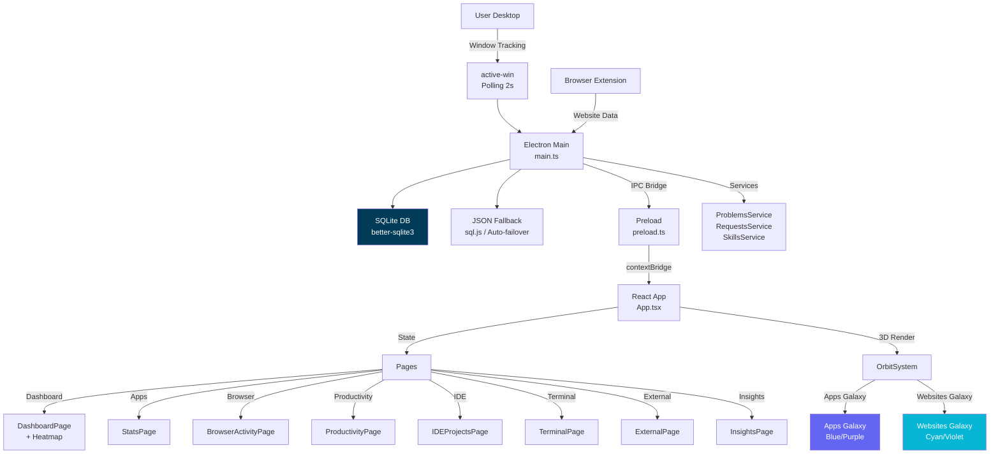

# 🌌 DeskFlow - AI-Powered Productivity Tracker

> Electron desktop app that visualizes your app and browser usage as an interactive 3D galaxy with real-time tracking. Now includes AI agent usage tracking, external activity tracking, integrated terminal workspace with Tracker Mind system, insights dashboard, and knowledge graph architecture visualization.

[](https://electronjs.org/)
[](https://reactjs.org/)
[](https://typescriptlang.org/)
[](https://threejs.org/)
[](https://sqlite.org/)
[](https://tailwindcss.com/)
[](LICENSE)
[]()

---

## 🚀 Quick Start

### Option 1: Use the Desktop App (Recommended)

1. **Double-click** `DeskFlow.lnk` on your desktop
2. The app will launch with a window
3. Click the **system tray icon** (blue circle) to show/hide the window

That's it! The app runs in the background and tracks your active applications.

### Option 2: Run from Source Code

If you want to modify or develop the app:

```bash
# 1. Clone or download this repository
cd "App Tracker"

# 2. Install dependencies
npm install

# 3. Run in development mode
npm run dev
```

The app will open in your browser with hot reload.

---

## 📦 Installation

### Building the Executable

If you need to create a fresh executable:

```bash
# Install dependencies (first time only)
npm install

# Build the app
npm run build

# Package as Windows executable
npx electron-builder --win portable
```

The executable will be created at:
```
release/win-unpacked/DeskFlow.exe
```

### Adding to Desktop

1. Go to `release/win-unpacked/`
2. Right-click `DeskFlow.exe`
3. Send to > Desktop (create shortcut)

Or use the auto-created shortcut on your desktop.

---

## ✨ Key Features

| Feature | Description |
|---------|-------------|
| **🌌 Two-Galaxy System** | Apps Galaxy (blue/purple spiral) + Websites Galaxy (cyan/violet nebula) with smooth camera transitions |
| **📊 Real-time Dashboard** | Focus time, productivity scores, interactive heatmap with week navigation and solar system view |
| **📊 Insights Dashboard** | Heatmap grid, stat cards with trends, day/week/activity tabs, sleep & recovery charts |
| **🌐 Browser Tracking** | Track websites in Chrome/Firefox via browser extension with smart categorization |
| **🔍 Deep Search** | Query your usage history across all apps and websites |
| **⚡ Auto-start** | Launch on system boot |
| **🔔 System Tray** | Runs in background, click to show/hide |
| **🎯 Focus Tracking** | Categorize apps as Productive/Neutral/Distracting |
| **🎨 Custom Colors** | Per-app, per-website, and per-category color customization |
| **📱 Category Overrides** | Override automatic categorization for any app/website |
| **💤 External Activities** | Track non-laptop activities: Sleep, Exercise, Gym, Commute, Reading, Studying — with glass-styled usage charts |
| **🖥️ Terminal Workspace** | Integrated terminal with PTY support, presets, session history, resizable sidebar, and problem/file browser |
| **🤖 AI Agent Tracking** | Track Claude Code, Cursor, OpenCode usage with tokens, cost, and session metrics |
| **🧠 Tracker Mind** | Integrated problem tracking (PROBLEMS.md), terminal binding, and agent orchestration |
| **📈 Graphify Knowledge Graph** | Codebase architecture visualization with clustered communities and audit reports |
| **🧠 AI Color Magic** | Auto-generate brand-appropriate colors using OpenRouter AI |
| **🏷️ AI Categorization** | Auto-categorize apps/websites using AI |
| **🏷️ Custom Categories** | Create custom app/website categories in Settings, auto-assigned to Neutral tier |

---

## 📖 How to Use

### First Launch

1. **Grant permissions** when prompted (for window tracking)
2. The app starts tracking immediately
3. Use the app normally - it runs in the background

### System Tray

| Action | Result |
|--------|--------|
| Click tray icon | Show/hide DeskFlow window |
| Right-click tray | Context menu (Show/Toggle Tracking/Quit) |

### Navigation

| Page | Access | Features |
|------|--------|----------|
| **Dashboard** | Sidebar | Focus time, productivity, solar system, heatmap with week navigation, stats cards |
| **Productivity** | Sidebar | Apps vs Websites comparison, productivity scores |
| **Applications** | Sidebar | Detailed breakdown by app with time totals |
| **Browser Activity** | Sidebar | Website tracking, hourly charts, category breakdown |
| **IDE Projects** | Sidebar | AI agent tracking, project management, Git metrics |
| **External** | Sidebar | Track non-laptop activities with glass-styled charts |
| **Insights** | Sidebar | Heatmap grid, stat cards, tabs, sleep & activity charts |
| **Terminal** | IDE Workspace | Terminal workspace with resizable sidebar, presets, sessions, problem/file browser |
| **Database** | Sidebar | Raw data viewer with JSON fallback |
| **Settings** | Sidebar | Categories, custom categories, colors, preferences |

### Galaxy Navigation

| Action | Result |
|--------|--------|
| Drag left | Return to Apps Galaxy |
| Drag right | Visit Websites Galaxy |
| Click planet | Fly camera to that planet |
| Click legend item | Fly camera to that planet |

### Timeline Selection

Use the timeline buttons (Today/Week/Month/All) to filter data on:
- Applications page
- Browser Activity page
- Galaxy view
- Productivity page

### Auto-Start

To start DeskFlow automatically when you turn on your computer:

1. Open DeskFlow
2. Go to Settings
3. Enable "Start on system boot"

---

## 🛠️ Troubleshooting

### "Active-win" error on startup

The app needs `active-win` native module. If you see errors:

```bash
# Rebuild native modules
npm run postinstall
# Or manually:
npx electron-rebuild
```

### App not tracking

1. Make sure tracking is enabled (click tray icon > Toggle Tracking)
2. Check that no other window tracking app is running
3. Restart the app

### Browser tracking not working

1. Make sure the DeskFlow browser extension is installed
2. Enable "Allow in incognito" in Chrome/Firefox extensions page
3. Enable "Allow access to file URLs" if using file:// protocol
4. Click the extension icon to confirm it's tracking
5. Check that the extension shows a green indicator when visiting sites

### Storage shows "Loading..."

The database may be initializing. Wait a few seconds. If it persists:

1. Check the app has write permissions to its data folder
2. Clear data in Settings > General > Clear Data
3. Restart the app

---

## 📁 Project Structure

```
App Tracker/
├── src/
│   ├── main.ts              # Electron main process (tracking, DB, IPC)
│   ├── preload.ts           # IPC bridge (contextBridge)
│   ├── main.tsx             # React entry point
│   ├── App.tsx              # Main app (routing, state, computation)
│   ├── components/
│   │   └── OrbitSystem.tsx  # 3D galaxy visualization
│   ├── services/
│   │   ├── ProblemsService.ts      # Markdown-based problem management
│   │   ├── ProblemsParser.ts       # Parse PROBLEMS.md format
│   │   ├── ProblemsSyncService.ts  # Bidirectional markdown↔DB sync
│   │   ├── RequestsService.ts      # Request tracking service
│   │   ├── SkillsService.ts        # Skill template management
│   │   └── SessionContextService.ts  # Terminal output parsing
│   └── pages/
│       ├── DashboardPage.tsx        # Main dashboard with 3D orbit + heatmap
│       ├── StatsPage.tsx           # Applications breakdown
│       ├── ProductivityPage.tsx    # Productivity scores & trends
│       ├── BrowserActivityPage.tsx  # Website tracking
│       ├── InsightsPage.tsx        # Reports and insights
│       ├── IDEProjectsPage.tsx     # AI agent & project tracking
│       ├── TerminalPage.tsx        # Terminal workspace
│       ├── ExternalPage.tsx        # External activities
│       ├── SettingsPage.tsx        # Category/colors/settings
│       └── DatabasePage.tsx        # DB viewer
├── browser-extension/       # Chrome/Firefox extension
├── agent/                 # AI agent resources & docs
├── graphify-out/          # Knowledge graph output
├── public/                 # Static assets
├── dist/                   # Built renderer
├── dist-electron/          # Built Electron main/preload
├── release/win-unpacked/    # Packaged executable
│   └── DeskFlow.exe
└── README.md
```

---

## 🧰 Tech Stack

### Core Technologies
| Component | Technology |
|-----------|------------|
| **Desktop Wrapper** | Electron ^41.1.1 |
| **UI Framework** | React ^19.2.0 |
| **Language** | TypeScript ~5.9.3 |
| **Build Tool** | Vite ^7.3.1 |
| **Styling** | Tailwind CSS ^4.2.1 |
| **Navigation** | React Router ^7.13.1 |

### 3D & Visualization
| Component | Technology |
|-----------|------------|
| **3D Engine** | Three.js ^0.183.2 |
| **React Bridge** | @react-three/fiber ^9.5.0 |
| **3D Helpers** | @react-three/drei ^10.7.7 |
| **Post-Processing** | @react-three/postprocessing ^3.0.4 |
| **Effects Library** | postprocessing ^6.39.0 |
| **Perf Monitor** | r3f-perf ^7.2.3 |

### Data & Storage
| Component | Technology |
|-----------|------------|
| **Database** | better-sqlite3 ^12.9.0 |
| **Window Tracking** | active-win ^8.2.1 |
| **Terminal** | node-pty ^0.11.0 |
| **Date Handling** | date-fns ^4.1.0 |
| **DB Fallback** | sql.js ^1.14.1 |

### UI & Animation
| Component | Technology |
|-----------|------------|
| **Animations** | Framer Motion ^12.35.0 |
| **Icons** | Lucide React ^0.577.0 |
| **Charts** | Chart.js ^4.5.1 & recharts ^3.8.1 |
| **React Charts** | react-chartjs-2 ^5.3.1 |
| **Celebrations** | canvas-confetti ^1.9.4 |
| **Drag & Drop** | @dnd-kit ^6.3.1 |

---

## 🌟 Advanced Features

### 3D Galaxy Visualization
- **Two-Galaxy System** - Apps Galaxy and Websites Galaxy are separate 3D worlds
- **Apps Galaxy** - Spiral galaxy with 4,000+ particles, blue/purple color theme
- **Websites Galaxy** - Nebula-style dust cloud with cyan/violet colors
- **Camera-Based Detection** - Drag right to visit Websites Galaxy, left for Apps Galaxy
- **Spiral Galaxy Rendering** - Particles with custom color gradients
- **Solar System View** - Animated planets with orbits, rings, and moons
- **Custom Shaders** - GLSL shaders for particle systems and effects
- **Post-Processing** - Bloom, tone mapping, vignette, chromatic aberration
- **Performance Optimization** - Adaptive quality with PerformanceMonitor

### AI Agent Integration
- **Claude Code Tracking** - Parse ~/.claude/projects for token usage
- **Cursor Tracking** - Query cursorDiskKV for chat data
- **OpenCode Tracking** - Read SQLite sessions table
- **Usage Analytics** - Tokens, cost, sessions per agent
- **Project Breakdown** - Which projects each AI is used on
- **Model Tracking** - Which models were used and how much

### Terminal Workspace
- **PTY Support** - Full terminal with node-pty
- **xterm.js** - Terminal emulator in React
- **Presets** - Save and execute command presets
- **Sessions** - Track terminal sessions with resume capability
- **Split View** - Multi-pane terminal layout
- **Resizable Sidebar** - Drag-resizable left sidebar (200-600px) with 7 tool tabs
- **Send Instructions** - Send prompts directly to active terminal from the UI

### External Activities
- **Timed Activities** - Stopwatch mode for Exercise, Gym, Studying
- **Check-in Mode** - Quick activities (Commute, Eating, Short Break)
- **Sleep Tracking** - Sleep deficit calculation with 8h target
- **Wake-up Reminder** - Optional wake-up time picker
- **Glass-Styled Charts** - Daily usage trend, activity distribution (conic doughnut), weekly trend comparison

### Tracker Mind System
- **Problem Tracking** - Markdown-based issue tracker using agent/PROBLEMS.md with status workflow
- **Terminal Binding** - Bind problems to active terminals for AI agent orchestration
- **File Browser** - Browse agent/ markdown files from terminal sidebar
- **Workspace Setup** - Initialize agent/ directory structure for any project
- **Send Instructions** - Send prompts to active terminal from the UI with input bar
- **Request Tracking** - Track feature requests via agent/REQUESTS.md
- **Skill Templates** - Reusable skill definitions for AI agents

### Visual Effects
- **Bloom/Glow** - HDR bloom for emissive objects
- **ACES Filmic Tone Mapping** - Cinematic color grading
- **Atmospheric Scattering** - Fresnel effects for planet atmospheres
- **Layered Corona** - Multi-layer sun glow with additive blending
- **Vignette & Chromatic Aberration** - Cinematic lens effects

### AI Features
- **Magic Color** - Auto-generate brand-appropriate colors
- **Magic Category** - Auto-categorize apps/websites
- **OpenRouter API** - AI integration with multiple model fallbacks

### Electron Features
- **System Tray** - Background operation with show/hide toggle
- **Window Tracking** - Native active window detection
- **Browser Extension** - Chrome/Firefox website tracking
- **SQLite Storage** - Persistent local data with JSON fallback
- **Auto-Start** - Launch on system boot

---

## 🧠 Core Computer Science Concepts

| Concept | Where It's Used |
|---------|----------------|
| **Event-Driven Architecture** | IPC between main process and renderer |
| **Real-time Data Polling** | 30-second interval for live dashboard |
| **Caching Strategies** | Single source of truth pattern |
| **Procedural Texture Generation** | Canvas-based planet textures |
| **GPU-Accelerated Rendering** | Three.js WebGL pipeline |
| **SQLite with Fallback** | Hybrid storage with failover |
| **Delta-Based Updates** | Browser extension incremental updates |
| **PTY Process Management** | Terminal pseudo-terminal spawning |
| **Agentic AI Parsing** | Multi-format AI log parsing |

---

## 🤖 For Developers

### Running in Development

```bash
npm run dev
```

### Building for Production

```bash
npm run build
```

### Packaging

```bash
# Portable exe (single file)
npx electron-builder --win portable

# Installer
npx electron-builder --win nsis
```

---

## 🏗️ Architecture



---

## 📚 Documentation

- **Quick Start Guide** - Above
- **Development** - [`agent/`](agent/)
- **Project State** - [`agent/state.md`](agent/state.md)
- **Architecture** - Graphify knowledge graph
- **Known Issues** - [`agent/PROBLEMS.md`](agent/PROBLEMS.md)
- **Browser Extension** - [`browser-extension/`](browser-extension/)

---

## 🔄 Version History

| Version | Date | Changes |
|---------|------|---------|
| 1.0 | 2026-04-04 | Initial release |
| 1.1 | 2026-04-05 | Fixed data persistence |
| 1.12 | 2026-04-15 | App colors persistence |
| 1.18 | 2026-04-16 | Two-galaxy system |
| 1.44 | 2026-04-19 | Terminal + AI integration |
| 1.50 | 2026-04-20 | External activities |
| 1.55 | 2026-04-21 | Browser extension + IDE fixes |
| 1.60 | 2026-05-05 | Self-heal SQLite, database hardening, heatmap fixes |
| 1.70 | 2026-05-06 | Weekly productivity charts, solar system sync, useMemo→useState fix |
| 1.80 | 2026-05-07 | Tracker Mind Phase 1-3: problem tracking, terminal binding, end-to-end flow |
| 2.0 | 2026-05-08 | Custom categories, glass-styled charts, terminal resizable sidebar |
| 2.2 | 2026-05-09 | Insights page redesign, orbit system research, project-aware problems |
| 2.4 | 2026-05-09 | AGENTS.md restructure, graphify rebuild, build system updates |

---

## 🚀 Development Highlights

### v2.4 (2026-05-09)
- **AGENTS.md Restructure** - Prime state checklist, behavioural guidelines, protection rules
- **Graphify Rebuild** - Full knowledge graph regeneration with analysis
- **Build System** - rollupOptions without hashing, new deps (recharts, sql.js)
- **State.md Restructure** - "Since Last Commit" tracking section added

### v2.2 (2026-05-09)
- **Insights Page Redesign** - Complete overhaul: heatmap grid, stat cards with trends, day/week/activity tabs, sleep & recovery charts, activity breakdown
- **Orbit System Research** - Logarithmic planet spacing, visual balance factor (0.65), sun texture enhancements
- **Project-Aware Problems** - ProblemsService reads from project-specific agent/ directory
- **Tailwind CSS v4** - Migrated to Tailwind CSS ^4.2.1 with @tailwindcss/vite

### v2.0 (2026-05-08)
- **Custom Categories** - Create custom app/website categories in Settings with persistent storage
- **Glass-Styled Charts** - External page: daily usage bar, activity distribution doughnut, weekly trend
- **Resizable Terminal Sidebar** - Drag-resizable left sidebar (200-600px) with 7 tabs
- **Always-Visible Timer** - External page shows "00:00:00" with "Click to start tracking"

### v1.80 (2026-05-07)
- **Tracker Mind Phase 1-3** - Full problem tracking with markdown-based PROBLEMS.md
- **Terminal Binding** - Bind problems to terminals via IPC with status workflow
- **End-to-End Flow** - Dashboard → assign problem → terminal receives prompt
- **TrackerMindSetup Modal** - Initialize agent/ directory structure for any project
- **SessionContextService** - Parse terminal output for context extraction

### v1.70 (2026-05-06)
- **Weekly Productivity Charts** - Period navigation with prev/next, stacked device+external bars
- **Solar System Sync** - Solar system now syncs with heatmap week selector
- **useMemo→useState Fix** - Fixed React TDZ initialization error with complex object deps
- **Database Page** - JSON mode support with virtual "logs" table when SQLite fails
- **Database Hardening** - 5 critical functions now use getDb() self-heal pattern

### v1.60 (2026-05-05)
- **Self-Heal SQLite** - getDb() function auto-reconnects on each API call
- **Database Connection Hardening** - 5 critical functions null-safe
- **Heatmap Redesign** - 7-day heatmap with external/device/combined modes
- **Startup Fix** - refreshStats error fixed, window always shows on startup
- **Database Page** - Shows JSON data when SQLite fails

### v1.55 (2026-04-21)
- **Open in IDE Fix** - Full path to IDE executable
- **Browser Extension ID** - Extension identifies browser name
- **Tracking Browser Setting** - Configure which browser has extension
- **External Activities** - Sleep, Exercise, Gym tracking with modes

### v1.50 (2026-04-20)
- **External Page** - Track non-laptop activities
- **Sleep Tracking** - With wake-up time picker
- **Timed Activities** - Stopwatch mode

### v1.44 (2026-04-19)
- **Terminal Window** - Full PTY with xterm.js
- **Terminal Presets** - Save and execute commands
- **Terminal Sessions** - Session history with resume
- **AI Magic Color** - OpenRouter AI color generation
- **AI Magic Category** - Auto-categorization

### v1.40 (2026-04-19)
- **IDE Projects Page** - AI agent tracking
- **Claude/Cursor/OpenCode Parsing** - Multi-format support
- **Project Health** - Git metrics per project

### v1.18 (2026-04-16)
- **Two-Galaxy System** - Separate Apps + Websites galaxies
- **Data Consistency** - Galaxy matches Applications page
- **Category Override Persistence** - Saves across restarts

---

## 🔧 Debugging & Development

### Opening DevTools
Press **Ctrl+Shift+I** to open the developer console.

### Performance Monitoring
The app includes PerformanceMonitor that:
- Monitors FPS during 3D rendering
- Automatically reduces quality if FPS drops below 30
- Can increase quality when performance improves

### Console Logs
- `[DeskFlow]` - App state and loading
- `[OrbitSystem]` - 3D visualization
- Errors appear in red

---

## 📞 Support

If you encounter issues:

1. Check the [Troubleshooting](#-troubleshooting) section
2. Check [`PROBLEMS.md`](PROBLEMS.md) for known issues
3. Restart the app
4. Clear data in Settings if needed

---

<div align="center">

**Built with ❤️ using Electron + React + Three.js**

[Report Bug](https://github.com/anomalyco/deskflow/issues) · [Request Feature](https://github.com/anomalyco/deskflow/issues)

</div>

**Last Updated:** 2026-05-09

**Maintained By:** DeskFlow Team