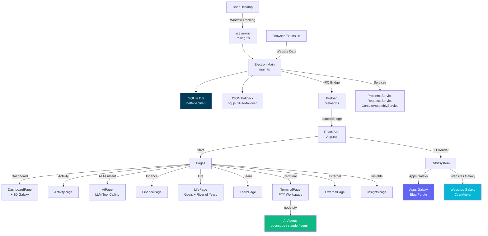
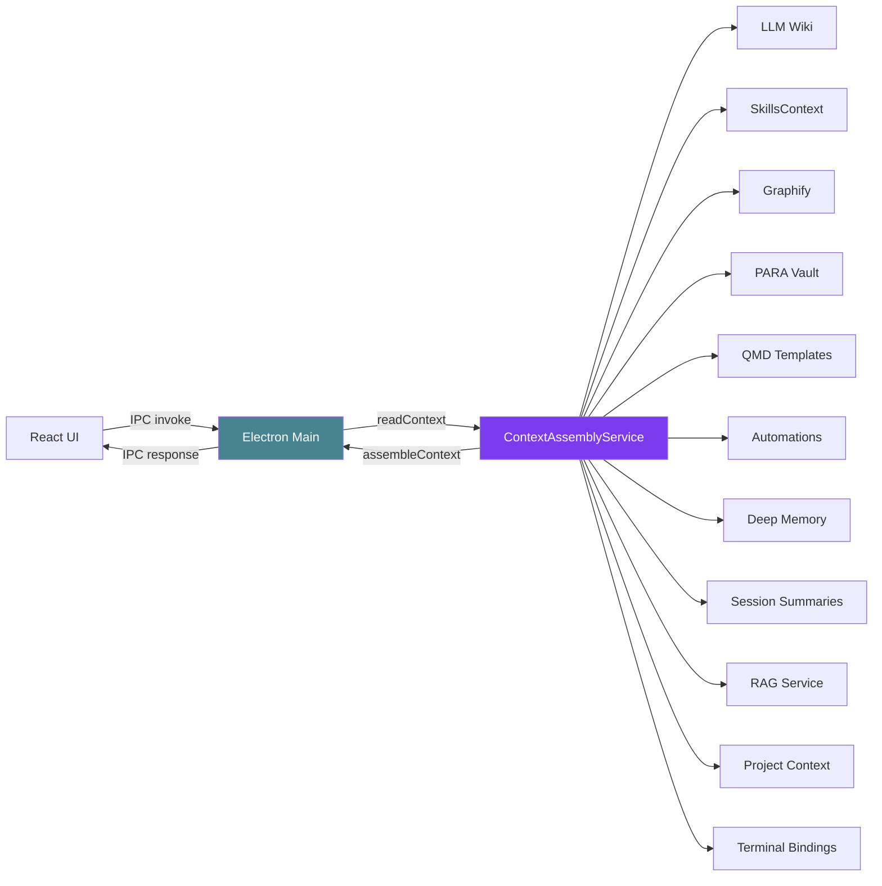

# 🌊 RHEO — Daily-Driver AI Orchestration

> RHEO (formerly DeskFlow) is your daily-driver AI orchestration desktop app. It tracks every minute of your digital life — apps, websites, IDE/AI agent usage, and real-world activities — then orchestrates AI agents inside a full terminal workspace to act on that data: tracking problems, executing missions, managing goals, finance, learning, and life admin — all in one always-on Electron app.

[](https://electronjs.org/)
[](https://reactjs.org/)
[](https://typescriptlang.org/)
[](https://threejs.org/)
[](https://sqlite.org/)
[](https://tailwindcss.com/)
[](LICENSE)
[]()

---

## What is RHEO?

RHEO is a **daily driver** — it lives in your system tray, silently tracking what you do, and turns that data into action:

- **🛰️ Always-on tracking** — apps, websites (via browser extension), IDE/AI agent usage, and non-laptop activities like sleep, exercise, and commute. Auto-detects sleep gaps and fills the blanks in your day.
- **🤖 AI orchestration** — a real terminal workspace (PTY + xterm.js) where AI agents (Claude, OpenCode, Gemini, Codex) get full project context — problems, requests, skills, knowledge graphs — and execute. Tracker Mind tracks problems/requests; Conductor runs multi-agent swarms (director/planner/worker/QA) on your projects.
- **🧭 Life admin in one place** — Finance (budget & expenses, subscriptions, follow-through), Life (goals, "River of Years" timeline), Learn (Lyceum), and a full Resume Builder.
- **🔮 Intelligence** — AI Assistant with real LLM tool calling, an automation DSL engine, focus groups with daily goals, smart gap-filling, RAG semantic search over your history, and a deep analytics suite.

---

## 🚀 Quick Start

### Option 1: Use the Desktop App (Recommended)

1. **Double-click** `RHEO.lnk` on your desktop
2. The app will launch with a window
3. Click the **system tray icon** (blue circle) to show/hide the window

That's it! The app runs in the background and tracks your active applications.

### Option 2: Run from Source Code

If you want to modify or develop the app:

```bash
# 1. Clone or download this repository
cd "App Tracker"

# 2. Install dependencies
npm install

# 3. Run in development mode
npm run dev
```

The app will open in your browser with hot reload.

---

## 📦 Installation

### Building the Executable

If you need to create a fresh executable:

```bash
# Install dependencies (first time only)
npm install

# Build the app
npm run build

# Package as Windows installer
npx electron-builder --win
```

The executable will be created at:
```
release/win-unpacked/RHEO.exe
```

### Adding to Desktop

1. Go to `release/win-unpacked/`
2. Right-click `RHEO.exe`
3. Send to > Desktop (create shortcut)

Or use the auto-created shortcut on your desktop.

---

## ✨ Key Features

| Feature | Description |
|---------|-------------|
| **🌌 3D Galaxy Dashboard** | Interactive two-galaxy system (apps + websites) with solar-system view, particles, bloom, and custom shaders |
| **📊 Real-time Tracking** | Live foreground-window detection (2s polling), website tracking via browser extension, live stopwatches |
| **🤖 AI Assistant** | Multi-agent chat with real LLM tool calling, change history/undo, compositions, slash commands |
| **🖥️ Terminal Workspace** | Full PTY terminal (node-pty + xterm.js) with 5-group workspace sidebar (Setup/Work/Insights/Studio/Context), split panes, session resume |
| **🧠 Tracker Mind** | Problem/request orchestration — markdown-synced problems, checklists, terminal binding, context delta messages |
| **🧭 Conductor Swarms** | Multi-agent orchestration (director/planner/worker/QA/auditor/resolver) with missions and autonomy levels |
| **📈 AI Agent Usage Tracking** | Parse Claude Code, Cursor, and OpenCode usage — tokens, cost, sessions, per-project breakdown |
| **💰 Finance Suite** | Budget & expenses with deep analytics, subscription management with renewal countdowns, "Follow Through" (on-behalf-of) tracking, privacy masks |
| **🌳 Life & Goals** | Gold page: daily/weekly goals, The Vault long-term goals, "River of Years" life-phases timeline, day journal |
| **🎓 Learn (Lyceum)** | Learning module with spaced repetition, stats, and progress tracking |
| **📄 Resume Builder** | Guided builder with phase tracking, live preview, import/export — progress persisted across restarts |
| **💤 External Activities** | Track sleep, exercise, gym, commute, reading with glass-styled charts, sleep deficit & latency detection |
| **🧩 Smart Gap Fill** | Auto-detect empty time gaps in your day and fill them with apps/websites/external activities |
| **🎯 Focus Groups** | Configurable focus groups with daily goals, streak tracking, and usage analytics |
| **🖼️ Canvas System** | Freeform card canvas with drag/resize/grouping, floating canvas navigation mode, AI-generated cards |
| **⚙️ Automation DSL** | Declarative automation engine — compositions and automation rules with real execution |
| **🎨 Design Studio** | Registry browser (Cult UI, React Bits, shadcn), motion explorer, taste knobs, style references |
| **📊 Insights & Analytics** | Heatmap grids, day/week/activity tabs, sleep & recovery charts, DORA metrics, database analytics (5 stat cards, 8 charts) |
| **🔍 RAG Semantic Search** | Cosine-similarity vector search over your entire session history |
| **🌐 Browser Extension** | Chrome/Firefox extension with smart categorization, incognito support, force-flush sync |
| **🔔 System Tray + Auto-start** | Runs in the background, click to show/hide, launches on system boot |

---

## 📖 How to Use

### First Launch

1. **Grant permissions** when prompted (for window tracking)
2. The app starts tracking immediately
3. Use the app normally - it runs in the background

### System Tray

| Action | Result |
|--------|--------|
| Click tray icon | Show/hide RHEO window |
| Right-click tray | Context menu (Show/Toggle Tracking/Quit) |

### Navigation

| Page | Access | Features |
|------|--------|----------|
| **Dashboard** | Sidebar | Focus time, timer, 3D galaxy, heatmap with week navigation, stats cards |
| **Activity** | Sidebar | Unified apps/websites/productivity with tabs and deep search |
| **AI Assistant** | Sidebar | Multi-agent chat, tool calling, change history, compositions |
| **Learn** | Sidebar | Lyceum learning module with spaced repetition |
| **Resume** | Sidebar | Resume builder suite (build/preview/import/export) |
| **IDE Projects** | Sidebar | AI agent usage tracking, AI Tools subpage, Git metrics |
| **External** | Sidebar | Non-laptop activities, Smart Gap Fill, sleep tracking |
| **Finance** | Sidebar | Budget & expenses, subscriptions, follow-through |
| **Insights** | Sidebar | Heatmap grid, day/week/activity tabs, sleep & recovery |
| **Database** | Sidebar | Analytics dashboard + raw table browser with CSV export |
| **Life** | Sidebar | Gold goals, River of Years timeline, day journal |
| **Settings** | Sidebar | Categories, colors, tracking, browser activity, system prompts |
| **Guide** | Sidebar | Feature walkthrough and onboarding |
| **Terminal** | IDE Workspace | Terminal workspace with 5-group sidebar, PTY panes, presets, sessions, Conductor swarms |

### Galaxy Navigation

| Action | Result |
|--------|--------|
| Drag left | Return to Apps Galaxy |
| Drag right | Visit Websites Galaxy |
| Click planet | Fly camera to that planet |
| Click legend item | Fly camera to that planet |

### Timeline Selection

Use the timeline buttons (Today/Week/Month/All) to filter data on:
- Activity page
- Galaxy view
- Insights page
- External page

### Auto-Start

To start RHEO automatically when you turn on your computer:

1. Open RHEO
2. Go to Settings
3. Enable "Start on system boot"

---

## 🛠️ Troubleshooting

### "Active-win" error on startup

The app needs `active-win` native module. If you see errors:

```bash
# Rebuild native modules
npm run postinstall
# Or manually:
npx electron-rebuild
```

### App not tracking

1. Make sure tracking is enabled (click tray icon > Toggle Tracking)
2. Check that no other window tracking app is running
3. Restart the app

### Browser tracking not working

1. Make sure the RHEO browser extension is installed
2. Enable "Allow in incognito" in Chrome/Firefox extensions page
3. Enable "Allow access to file URLs" if using file:// protocol
4. Click the extension icon to confirm it's tracking
5. Check that the extension shows a green indicator when visiting sites

### Storage shows "Loading..."

The database may be initializing. Wait a few seconds. If it persists:

1. Check the app has write permissions to its data folder
2. Clear data in Settings > General > Clear Data
3. Restart the app

---

## 📁 Project Structure

```
App Tracker/
├── src/
│   ├── main.ts              # Electron main process (tracking, DB, IPC, orchestrators)
│   ├── preload.ts           # IPC bridge (contextBridge)
│   ├── main.tsx             # React entry point
│   ├── App.tsx              # Main app (routing, state, computation)
│   ├── components/
│   │   ├── OrbitSystem.tsx         # 3D galaxy visualization
│   │   ├── TerminalWindow.tsx      # xterm.js terminal
│   │   ├── GapFillDrawer.tsx       # Smart Gap Fill drawer
│   │   ├── canvas/                 # Freeform canvas system (cards, grouping)
│   │   ├── conductor/              # Conductor swarm orchestration UI
│   │   ├── life-river/             # River of Years timeline components
│   │   ├── workspace/              # Design workspace subcomponents
│   │   └── ui/                     # shadcn/base-ui primitives
│   ├── features/
│   │   └── warmth/gold/            # Gold goals page (DayRing, WeekBoard, TheVault…)
│   ├── hooks/
│   │   ├── useLifePhases.ts        # River of Years CRUD
│   │   └── useTransactionForm.ts   # Finance transaction form
│   ├── lib/
│   │   ├── riverMath.ts            # River of Years math/types
│   │   ├── focusHelpers.ts         # Focus group daily progress/streaks
│   │   └── external/               # External activity + gap logic
│   ├── services/
│   │   ├── ProblemsService.ts      # Markdown-based problem management
│   │   ├── RequestsService.ts      # Request tracking service
│   │   ├── SkillsService.ts        # Skill template management
│   │   ├── SessionContextService.ts  # Terminal output parsing
│   │   ├── ContextAssemblyService.ts  # assembleContext() pipeline
│   │   ├── CompactionService.ts    # LLM summarization (OpenRouter)
│   │   ├── RAGService.ts           # Cosine similarity search
│   │   ├── focusGroupManager.ts    # Focus group persistence
│   │   └── WorkspaceRegistry.ts    # Workspace + terminal bindings
│   └── pages/
│       ├── DashboardPage.tsx        # Main dashboard with 3D orbit + heatmap
│       ├── ActivityPage.tsx         # Unified activity (apps/websites/productivity)
│       ├── AiPage.tsx               # AI Assistant with tool calling
│       ├── LearnPage.tsx            # Lyceum learning module
│       ├── ResumeBuilderPage.tsx    # Resume builder suite
│       ├── IDEProjectsPage.tsx      # AI agent & project tracking
│       ├── ExternalPage.tsx         # External activities + gap fill
│       ├── FinancePage.tsx          # Budget, subscriptions, follow-through
│       ├── LifePage.tsx             # Gold goals + River of Years
│       ├── InsightsPage.tsx         # Reports and insights
│       ├── TerminalPage.tsx         # Terminal workspace (5-group sidebar)
│       ├── DatabasePage.tsx         # DB viewer + analytics dashboard
│       ├── SettingsPage.tsx         # Category/colors/settings
│       └── GuidePage.tsx            # Feature walkthrough
├── browser-extension/       # Chrome/Firefox extension
├── agent/                 # AI agent resources & docs
├── graphify-out/          # Knowledge graph output
├── public/                 # Static assets
├── dist/                   # Built renderer
├── dist-electron/          # Built Electron main/preload
├── release/win-unpacked/    # Packaged executable
│   └── RHEO.exe
└── README.md
```

---

## 🧰 Tech Stack

### Core Technologies
| Component | Technology |
|-----------|------------|
| **Desktop Wrapper** | Electron ^41.1.1 |
| **UI Framework** | React ^19.2.0 |
| **Language** | TypeScript ~5.9.3 |
| **Build Tool** | Vite ^7.3.1 |
| **Styling** | Tailwind CSS ^4.2.1 |
| **Navigation** | React Router ^6.30.4 |
| **UI Primitives** | @base-ui/react ^1.6.0 |

### 3D & Visualization
| Component | Technology |
|-----------|------------|
| **3D Engine** | Three.js ^0.183.2 |
| **React Bridge** | @react-three/fiber ^9.5.0 |
| **3D Helpers** | @react-three/drei ^10.7.7 |
| **Post-Processing** | @react-three/postprocessing ^3.0.4 |
| **Effects Library** | postprocessing ^6.39.0 |
| **Perf Monitor** | r3f-perf ^7.2.3 |

### Data & Storage
| Component | Technology |
|-----------|------------|
| **Database** | better-sqlite3 ^12.9.0 |
| **Window Tracking** | active-win ^8.2.1 |
| **Terminal** | node-pty ^1.1.0 |
| **Date Handling** | date-fns ^4.1.0 |
| **DB Fallback** | sql.js ^1.14.1 |
| **CalDAV/Email** | tsdav ^2.3.0, node-imap ^0.9.6 |

### AI & Orchestration
| Component | Technology |
|-----------|------------|
| **LLM Provider** | @openrouter/sdk ^0.12.16 |
| **HTTP Client** | axios ^1.18.1 |
| **Diagrams** | mermaid ^11.16.0 |
| **Spaced Repetition** | ts-fsrs ^5.4.1 |
| **Semantic Search** | Custom cosine-similarity RAG (Float32Array) |

### UI & Animation
| Component | Technology |
|-----------|------------|
| **Animations** | Framer Motion ^12.35.0 |
| **Icons** | Lucide React ^0.577.0 |
| **Charts** | Chart.js ^4.5.1, recharts ^3.10.1, lightweight-charts ^5.2.0 |
| **Tables** | tabulator-tables ^6.5.2 |
| **Drag & Drop** | @dnd-kit ^6.3.1 |
| **Math Rendering** | KaTeX ^0.17.0, PrismJS ^1.30.0 |

---

## 🌟 Advanced Features

### 3D Galaxy Visualization
- **Two-Galaxy System** - Apps Galaxy and Websites Galaxy are separate 3D worlds
- **Apps Galaxy** - Spiral galaxy with 4,000+ particles, blue/purple color theme
- **Websites Galaxy** - Nebula-style dust cloud with cyan/violet colors
- **Camera-Based Detection** - Drag right to visit Websites Galaxy, left for Apps Galaxy
- **Solar System View** - Animated planets with orbits, rings, and moons
- **Custom Shaders** - GLSL shaders for particle systems and effects
- **Post-Processing** - Bloom, tone mapping, vignette, chromatic aberration
- **Performance Optimization** - Adaptive quality with PerformanceMonitor

### AI Orchestration
- **AI Assistant** - Multi-agent chat with real LLM tool calling (OpenRouter, Nemotron safety layer)
- **Change History/Undo** - Roll back AI edits and see what changed
- **Compositions** - Reusable prompt/action compositions
- **Conductor Swarms** - Director/planner/worker/QA/auditor/resolver agents with L2-L4 autonomy
- **Real TUI Agent Interaction** - True opencode/claude/gemini/codex terminal sessions with phase detection
- **AI Agent Usage Tracking** - Parse Claude Code, Cursor, OpenCode for tokens, cost, sessions
- **RAG Semantic Search** - Cosine-similarity vector search over session history

### Terminal Workspace
- **PTY Support** - Full terminal with node-pty
- **xterm.js** - Terminal emulator in React
- **5-Group Sidebar** - Setup / Work / Insights / Studio / Context with accent colors and subtabs
- **Presets** - Save and execute command presets
- **Sessions** - Track terminal sessions with resume capability
- **Split View** - Multi-pane terminal layout with mini-map
- **Swarm Subtab** - Conductor mission list per selected project

### Tracker Mind System
- **Problem Tracking** - Markdown-synced issue tracker with status workflow (NEW → Fixed)
- **Request Tracking** - Feature requests with checklists and cross-linking
- **Terminal Binding** - Bind problems to active terminals for AI agent orchestration
- **Context Deltas** - Real-time notifications written to active terminal on context change
- **Context Assembly** - 12+ context sources (LLM Wiki, Skills, Graphify, PARA, QMD, Automations)
- **Session Compaction** - OpenRouter LLM summarization with extractive fallback

### Finance Suite
- **Budget & Expenses** - Budget tracking with category analytics, transactions with modals
- **Subscriptions** - Full management: renewal countdowns, Record Payment, cancel links
- **Follow Through** - On-behalf-of transactions ("they'll pay me back") with person breakdown
- **Privacy Masks** - Number masking for shared-screen privacy
- **CSV Export** - Export transactions and tables

### Life & Goals
- **Gold Goals** - Daily/weekly goal ledger, streaks, deadline radar
- **The Vault** - Long-term goals with progress rings and priority
- **River of Years** - Life-phases timeline canvas with era trends, reflections, and AI summaries
- **Day Journal** - Daily reflection entries

### External Activities & Gap Fill
- **Timed Activities** - Stopwatch mode for Exercise, Gym, Studying
- **Check-in Mode** - Quick activities (Commute, Eating, Short Break)
- **Sleep Tracking** - Sleep deficit calculation, latency picker, auto-detection (45+ min gaps)
- **Smart Gap Fill** - Detect empty time holes and fill with apps/websites/external segments
- **Glass-Styled Charts** - Daily usage trend, activity distribution, weekly trend comparison

### Canvas System
- **Freeform Cards** - Drag, resize, arrange, group cards on an infinite canvas
- **Grouping** - Combine cards into resized group containers preserving real card content
- **Floating Canvas Navigation** - Canvas mode overlay navigation (Stitch)
- **AI Cards** - Spawn cards from chat messages with dedup by message ID

### Automation & Design
- **Automation DSL Engine** - Declarative automation rules and compositions with real execution
- **Design Studio** - Registry browser (Cult UI, React Bits, shadcn MCP), Motion Explorer, taste knobs
- **Focus Groups** - Configurable groups with daily goals and streak tracking

### Electron Features
- **System Tray** - Background operation with show/hide toggle
- **Window Tracking** - Native active window detection
- **Browser Extension** - Chrome/Firefox website tracking
- **SQLite Storage** - Persistent local data with JSON fallback
- **Auto-Start** - Launch on system boot
- **Self-Healing DB** - getDb() reconnects on each call, WAL mode, guarded migrations

---

## 🧠 Core Computer Science Concepts

| Concept | Where It's Used |
|---------|----------------|
| **Event-Driven Architecture** | IPC between main process and renderer |
| **Real-time Data Polling** | 2-second foreground detection, live dashboard |
| **Caching Strategies** | Single source of truth pattern |
| **Procedural Texture Generation** | Canvas-based planet textures |
| **GPU-Accelerated Rendering** | Three.js WebGL pipeline |
| **SQLite with Fallback** | Hybrid storage with failover |
| **Delta-Based Updates** | Browser extension incremental updates |
| **PTY Process Management** | Terminal pseudo-terminal spawning |
| **Agentic AI Parsing** | Multi-format AI log parsing |
| **Cosine Similarity Search** | RAG semantic search over session history |
| **FSRS Spaced Repetition** | Learn module scheduling algorithm |
| **State Machines** | Agent phases (launching → ready → busy → attention → error) |

---

## 🤖 For Developers

### Running in Development

```bash
npm run dev
```

### Building for Production

```bash
npm run build
```

### Packaging

```bash
# Installer
npx electron-builder --win nsis

# Portable exe (single file)
npx electron-builder --win portable
```

---

## 🏗️ Architecture


```mermaid
graph TD
    A[User Desktop] -->|Window Tracking| B[active-win<br/>Polling 2s]
    B --> C[Electron Main<br/>main.ts]
    C --> D[SQLite DB<br/>better-sqlite3]
    C --> E[JSON Fallback<br/>sql.js / Auto-failover]
    C -->|IPC Bridge| F[Preload<br/>preload.ts]
    F -->|contextBridge| G[React App<br/>App.tsx]

    G -->|State| H[Pages]
    G -->|3D Render| I[OrbitSystem]

    C -->|Services| S[ProblemsService<br/>RequestsService<br/>ContextAssemblyService]

    H -->|Dashboard| J[DashboardPage<br/>+ 3D Galaxy]
    H -->|Activity| K[ActivityPage]
    H -->|AI Assistant| K2[AiPage<br/>LLM Tool Calling]
    H -->|Finance| L[FinancePage]
    H -->|Life| L2[LifePage<br/>Goals + River of Years]
    H -->|Learn| L3[LearnPage]
    H -->|Terminal| O[TerminalPage<br/>PTY Workspace]
    H -->|External| P[ExternalPage]
    H -->|Insights| Q[InsightsPage]

    I -->|Apps Galaxy| R[Apps Galaxy<br/>Blue/Purple]
    I -->|Websites Galaxy| S2[Websites Galaxy<br/>Cyan/Violet]

    T[Browser Extension] -->|Website Data| C
    O -->|node-pty| U[AI Agents<br/>opencode / claude / gemini]

    style R fill:#6366f1,color:#fff
    style S2 fill:#06b6d4,color:#fff
    style D fill:#003B57,color:#fff
    style U fill:#10b981,color:#fff
```

### Context Assembly Pipeline


```mermaid
graph LR
    UI[React UI] -->|IPC invoke| BE[Electron Main]
    BE -->|readContext| CAS[ContextAssemblyService]
    CAS --> C1[LLM Wiki]
    CAS --> C2[SkillsContext]
    CAS --> C3[Graphify]
    CAS --> C4[PARA Vault]
    CAS --> C5[QMD Templates]
    CAS --> C6[Automations]
    CAS --> C7[Deep Memory]
    CAS --> C8[Session Summaries]
    CAS --> C9[RAG Service]
    CAS --> C10[Project Context]
    CAS --> C11[Terminal Bindings]
    CAS -->|assembleContext| BE
    BE -->|IPC response| UI

    style CAS fill:#7c3aed,color:#fff
    style BE fill:#47848F,color:#fff
```

---

## 📚 Documentation

- **Quick Start Guide** - Above
- **Development** - [`agent/`](agent/)
- **Project State** - [`agent/state.md`](agent/state.md)
- **Architecture** - Graphify knowledge graph
- **Known Issues** - [`agent/PROBLEMS.md`](agent/PROBLEMS.md)
- **Browser Extension** - [`browser-extension/`](browser-extension/)

---

## 🔄 Version History

| Version | Date | Changes |
|---------|------|---------|
| 1.0 | 2026-04-04 | Initial release |
| 1.1 | 2026-04-05 | Fixed data persistence |
| 1.12 | 2026-04-15 | App colors persistence |
| 1.18 | 2026-04-16 | Two-galaxy system |
| 1.44 | 2026-04-19 | Terminal + AI integration |
| 1.50 | 2026-04-20 | External activities |
| 1.55 | 2026-04-21 | Browser extension + IDE fixes |
| 1.60 | 2026-05-05 | Self-heal SQLite, database hardening, heatmap fixes |
| 1.70 | 2026-05-06 | Weekly productivity charts, solar system sync, useMemo→useState fix |
| 1.80 | 2026-05-07 | Tracker Mind Phase 1-3: problem tracking, terminal binding, end-to-end flow |
| 2.0 | 2026-05-08 | Custom categories, glass-styled charts, terminal resizable sidebar |
| 2.2 | 2026-05-09 | Insights page redesign, orbit system research, project-aware problems |
| 2.4 | 2026-05-09 | AGENTS.md restructure, graphify rebuild, build system updates |
| 3.50 | 2026-05-22 | Context assembly pipeline, ChecklistService, ProjectContextService, WorkspaceRegistry |
| 3.55 | 2026-05-25 | Terminal Context system, SkillsTab, Analytics tab, session detail panel |
| 3.58 | 2026-05-27 | Context maintenance tab wired, 4 new IPC endpoints |
| 3.61 | 2026-05-27 | Design workspace tab, IPC wiring, build verification |
| 3.62 | 2026-05-27 | Database analytics dashboard (5 stat cards, 8 charts) |
| 3.63 | 2026-05-27 | Init system redesign (16-step modal), Setup vs Initialize split |
| 3.65 | 2026-05-27 | ContextSidebar, TutorialPage, backend gaps fixed (DORA/LLM/RAG/IPC) |
| 4.0 | 2026-06-06 | AI Assistant revamp, tracking overhaul, cross-session sync, context monitoring, 27 new components, 50+ fixes |
| 4.5 | 2026-06-16 | Complete AI agent system with real LLM tool calling + Nemotron safety layer |
| 5.0 | 2026-07-11 | Massive release: AI system, Finance overhaul, Lyceum Learn module, workspace redesign, startup fix |
| 6.0 | 2026-08-06 | Automation DSL engine, canvas grouping + floating nav, Gold goals & River of Years, Resume Builder persistence, Finance Budget & Subscriptions, Smart Gap Fill, Design Studio, TUI agent interaction, IPC allowlist, 100+ features |

---

## 🚀 Development Highlights

### v6.0 (2026-08-06) — Latest
- **Automation DSL Engine** - Declarative automation rules + compositions with real execution
- **Canvas System** - Card grouping preserving real card content, floating canvas navigation mode
- **Gold Goals + River of Years** - Life page: daily/weekly goals, The Vault, life-phases timeline with AI era trends & summaries
- **Resume Builder Persistence** - Progress now survives restarts (localStorage + disk sync)
- **Finance Suite** - Budget & Expenses with analytics, Subscriptions management, Follow Through tracking
- **Smart Gap Fill** - Drawer entry point restored, mixed app/website/external gap filling
- **Focus Groups Overhaul** - Prominent, goal-configurable focus groups with daily goals + streaks
- **Design Studio** - Registry browser, motion explorer, taste knobs
- **Real TUI Agent Interaction** - True agent terminal sessions with phase detection
- **IPC Allowlist** - Hardened preload bridge with allowed-channels list

### v5.0 (2026-07-11)
- **AI System Expansion** - Real LLM tool calling pipeline, multi-model support
- **Finance Overhaul** - Full budget/expense tracking with category analytics
- **Lyceum Learn Module** - Learning with spaced repetition (ts-fsrs)
- **Workspace Redesign** - 5-group workspace sidebar, conductor integration
- **Startup Fix** - Window always shows on launch

### v4.5 (2026-06-16)
- **Real LLM Tool Calling** - AI Assistant can invoke tools with a Nemotron safety layer
- **Flex Layout Fixes** - AI page layout hardening

### v4.0 (2026-06-06)
- **AI Assistant Revamp** - AiPage with planning.md integration, context management, checklist parsing
- **Tracking Overhaul** - Improved foreground/browser tracking accuracy
- **Cross-Session Sync** - Terminal sessions sync across views
- **27 New Components** - Comprehensive UI expansion
- **50+ Fixes** - Across all pages and services

### v3.65 (2026-05-27)
- **ContextSidebar** - 832-line sidebar replacing WorkspaceSettingsDialog, 6 sections, auto-save debounce
- **TutorialPage** - Feature inventory with 12 items, spotlight overlay walkthrough, progress persistence
- **Backend Gaps Fixed** - Real DORA CFR/MTTR calculation, LLM summarization via OpenRouter, RAG cosine similarity search
- **New Services** - RAGService (proper cosine similarity), CompactionService (OpenRouter + extractive fallback)

### v3.63 (2026-05-27)
- **Init System Redesign** - 16-step animated InitializeProgressModal with real trackerMind IPC
- **Setup vs Initialize Split** - Green "Initialize" opens progress modal, amber "Setup" opens settings dialog

### v3.62 (2026-05-27)
- **Database Analytics** - Full analytics view with 5 stat cards, 8 charts, period selector (7D/30D/All)
- **View Toggle** - Analytics/Tables header tabs, preserves existing table browser with CSV export

### v3.61 (2026-05-27)
- **Design Workspace Tab** - Moved from standalone page → terminal sidebar tab, reads SKILL.md + DESIGN.md
- **Send to Terminal** - Design context (taste/skills/references) sent to active terminal via IPC

### v3.58 (2026-05-27)
- **Context Maintenance Tab** - 6 sub-components wired (MemoryStatusCard, ActiveContextsList, etc.)
- **4 New IPC Endpoints** - get-context-systems, get-session-summaries, get-deep-memory, get-rag-stats

### v3.55 (2026-05-25)
- **SkillsTab** - Full inline CRUD (~400 lines): list, create, edit, delete skills
- **Analytics Tab** - Period selector, agent breakdown bars, top sessions by cost
- **Session Detail Panel** - Click-to-detail with metadata grid, message viewer, focus/open buttons
- **Map Tab** - Group-based terminal layout display merged into MiniMap

### v3.50 (2026-05-22)
- **Context Assembly Pipeline** - 12+ context sources with modular typed services
- **ChecklistService** - Full CRUD IPC for task checklists with progress tracking
- **ProjectContextService** - File tree scanning, git-aware context
- **WorkspaceRegistry** - Workspace registration, terminal binding persistence
- **Prompt Design Dialog** - Rich prompt composition with skills context
- **Prompt History Tab** - Full CRUD with search and reuse

### v2.4 (2026-05-09)
- **AGENTS.md Restructure** - Prime state checklist, behavioural guidelines, protection rules
- **Graphify Rebuild** - Full knowledge graph regeneration with analysis
- **Build System** - rollupOptions without hashing, new deps (recharts, sql.js)
- **State.md Restructure** - "Since Last Commit" tracking section added

### v2.2 (2026-05-09)
- **Insights Page Redesign** - Complete overhaul: heatmap grid, stat cards with trends, day/week/activity tabs, sleep & recovery charts
- **Orbit System Research** - Logarithmic planet spacing, visual balance factor (0.65), sun texture enhancements
- **Project-Aware Problems** - ProblemsService reads from project-specific agent/ directory
- **Tailwind CSS v4** - Migrated to Tailwind CSS ^4.2.1 with @tailwindcss/vite

### v2.0 (2026-05-08)
- **Custom Categories** - Create custom app/website categories in Settings with persistent storage
- **Glass-Styled Charts** - External page: daily usage bar, activity distribution doughnut, weekly trend
- **Resizable Terminal Sidebar** - Drag-resizable left sidebar (200-600px) with 7 tabs
- **Always-Visible Timer** - External page shows "00:00:00" with "Click to start tracking"

### v1.80 (2026-05-07)
- **Tracker Mind Phase 1-3** - Full problem tracking with markdown-based PROBLEMS.md
- **Terminal Binding** - Bind problems to terminals via IPC with status workflow
- **End-to-End Flow** - Dashboard → assign problem → terminal receives prompt
- **TrackerMindSetup Modal** - Initialize agent/ directory structure for any project
- **SessionContextService** - Parse terminal output for context extraction

### v1.70 (2026-05-06)
- **Weekly Productivity Charts** - Period navigation with prev/next, stacked device+external bars
- **Solar System Sync** - Solar system now syncs with heatmap week selector
- **useMemo→useState Fix** - Fixed React TDZ initialization error with complex object deps
- **Database Page** - JSON mode support with virtual "logs" table when SQLite fails
- **Database Hardening** - 5 critical functions now use getDb() self-heal pattern

### v1.60 (2026-05-05)
- **Self-Heal SQLite** - getDb() function auto-reconnects on each API call
- **Database Connection Hardening** - 5 critical functions null-safe
- **Heatmap Redesign** - 7-day heatmap with external/device/combined modes
- **Startup Fix** - refreshStats error fixed, window always shows on startup
- **Database Page** - Shows JSON data when SQLite fails

### v1.55 (2026-04-21)
- **Open in IDE Fix** - Full path to IDE executable
- **Browser Extension ID** - Extension identifies browser name
- **Tracking Browser Setting** - Configure which browser has extension
- **External Activities** - Sleep, Exercise, Gym tracking with modes

### v1.50 (2026-04-20)
- **External Page** - Track non-laptop activities
- **Sleep Tracking** - With wake-up time picker
- **Timed Activities** - Stopwatch mode

### v1.44 (2026-04-19)
- **Terminal Window** - Full PTY with xterm.js
- **Terminal Presets** - Save and execute commands
- **Terminal Sessions** - Session history with resume
- **AI Magic Color** - OpenRouter AI color generation
- **AI Magic Category** - Auto-categorization

### v1.40 (2026-04-19)
- **IDE Projects Page** - AI agent tracking
- **Claude/Cursor/OpenCode Parsing** - Multi-format support
- **Project Health** - Git metrics per project

### v1.18 (2026-04-16)
- **Two-Galaxy System** - Separate Apps + Websites galaxies
- **Data Consistency** - Galaxy matches Applications page
- **Category Override Persistence** - Saves across restarts

---

## 🔧 Debugging & Development

### Opening DevTools
Press **Ctrl+Shift+I** to open the developer console.

### Performance Monitoring
The app includes PerformanceMonitor that:
- Monitors FPS during 3D rendering
- Automatically reduces quality if FPS drops below 30
- Can increase quality when performance improves

### Console Logs
- `[RHEO]` / `[DeskFlow]` - App state and loading
- `[OrbitSystem]` - 3D visualization
- Errors appear in red

---

## 📞 Support

If you encounter issues:

1. Check the [Troubleshooting](#-troubleshooting) section
2. Check [`PROBLEMS.md`](PROBLEMS.md) for known issues
3. Restart the app
4. Clear data in Settings if needed

---

<div align="center">

**Built with ❤️ using Electron + React + Three.js**

[Report Bug](https://github.com/RCZ88/RHEO/issues) · [Request Feature](https://github.com/RCZ88/RHEO/issues)

</div>

**Last Updated:** 2026-08-06

**Maintained By:** DeskFlow Team
