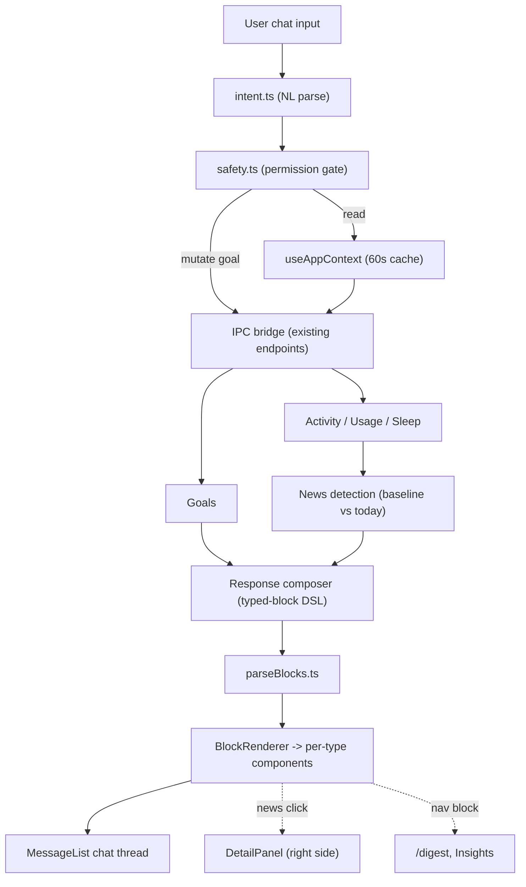

## Overview

This plan produces a single, implementation-ready **RESULT.md** design document for transforming the DeskFlow `/ai` page from a 9-card statistics dashboard into a genuine, AI-oriented **conversational chat interface** that reads app data, renders beautiful parseable responses, and performs Goal CRUD via conversation — scoped to **Phase 1 (News + Goals)** as you requested.

<aside>
🧭

**Architecture recommendation (committed, not optional): Option C — Hybrid.**

The AiPage becomes a *pure chat surface*. Goal CRUD happens entirely in conversation (per Constraint 6), "news" is surfaced as inline accent cards inside the thread, and clicking a card opens a **lightweight right-side detail panel** rather than a full statistics view. A separate browsable historical feed (the old cards' new home) lives on a dedicated `/digest` page — honoring your "put the daily digest + goals in a separate page" instinct while keeping the AiPage strictly AI-driven and free of duplicated raw-number dashboards.

</aside>

The document will be **specific** — exact Tailwind v4 classes against the galaxy-dark palette (zinc/pink/emerald/amber), a typed-block response DSL with a frontend parser contract, component hierarchies under `src/components/AiChat/`, a safety/permission matrix, a staged migration that coexists with the current cards, and a **complete mock chat session** (3–5 turns) demonstrating every response type.

<aside>
⚠️

I don't have access to the contents of the uploaded files (`prompt.md`, `FEATURE_TRACKER.md`, `PAGE_CONTEXT.md`) or the referenced `CONTEXT_BUNDLE.md`. I'll design against a **clearly-labeled inferred IPC contract** (e.g. `getGoals`, `saveGoal`, `deleteGoal`, `getActivitySummary`, `getUsageStats`, `navigate`) and call out exactly where real endpoint names must be substituted from your CONTEXT_BUNDLE. No new IPC endpoints or backend changes will be proposed.

</aside>

## Your Preferences

**Hard constraints (from the prompt):**

- No new IPC endpoints — reuse existing ones only (substitute real names from CONTEXT_BUNDLE)
- No backend changes — purely frontend React + IPC calls
- Tailwind CSS v4 only (`@import "tailwindcss"`, no v3 `@tailwind` directives)
- Dark theme only — galaxy-dark palette (zinc / pink / emerald / amber)
- No external chat packages — build from scratch on existing patterns
- Goal CRUD must work **via chat** — no custom goal input forms
- Must coexist with the current card layout during migration (phased)

**Scope & tone:**

- Phase 1 only: **News** (AI data summaries/notable-event detection) + **Goals** (conversational CRUD). App navigation, workspace boot/management, and config control are Phase 2 (designed-for, not built).
- Detail level 8/10, low creativity (25/100) — favor precise, conventional engineering over novel flourishes.
- AI-oriented feel: responses must read like "the AI is doing the work," never like a static dashboard.

**Deliverable format:**

- Output as the prescribed `RESULT.md` section structure, authored as a Notion page in this workspace.

## Implementation Plan

### Step 1: Architecture Decision & Page Strategy

Open RESULT.md with the committed recommendation and its justification.

- **Decision: Option C (Hybrid).** AiPage = pure chat; news = inline cards that expand into a lightweight right-side detail panel; goals = conversational CRUD; old statistic cards relocate to a new browsable `/digest` page.
- **Justification points:**
    - *Duplication:* Insights/Dashboard already show raw numbers — the AiPage must not repeat them; it *interprets* data, not display it.
    - *Goal CRUD in chat* is natural ("create goal X for today") and satisfies Constraint 6 (no forms).
    - *News as a feed* makes sense for history/browsing → belongs on `/digest`, while *fresh* notable events surface inline in chat.
    - *Navigation pattern:* the chatbot emits `navigation` response blocks (clickable page links) to route users to `/digest`, Insights, etc.
- A short comparison table (A vs B vs C) showing why A is too cramped and B loses the conversational summarization loop.

### Step 2: Data Pipeline & News Detection

Specify how the chatbot acquires and caches context.

- **Fetch strategy:** on mount, batch-call read endpoints (inferred: `getGoals(today)`, `getActivitySummary(today)`, `getUsageStats(range)`, `getSleep`, `getExternalActivity`) → store in a `useAppContext()` hook with a 60s TTL cache to avoid refetch on every message.
- **When to call:** lazy + on-demand. Reads on page focus and before composing any data-dependent answer; writes only on confirmed user intent.
- **News detection engine (pure frontend heuristic):**
    - Compute per-metric baseline (rolling 7-day mean) vs today.
    - Flag `notable` when |today − mean| > threshold (e.g. ≥1.5× or ≥2σ).
    - Rank by deviation magnitude; emit top N as `news-item` blocks ("3h in VS Code — 2× your usual").
- A data-flow table: endpoint → cache key → consuming response type.
- Mermaid diagram of the pipeline included at the page level.

### Step 3: Response Format Specification (typed-block DSL)

Define the **beautiful + parseable** response contract.

- A line-based typed-block grammar the AI must emit, e.g.:

```
[type: goal-list]
[title: Today's Goals]
[items:
  - [x] Complete project proposal (work)
  - [ ] Review pull request (work)
]
[summary: 1/3 completed]
```

- **Parser contract:** a `parseBlocks(raw: string): Block[]` function — tokenizes `[type: ...]` headers, captures key/value fields and nested `items:` lists, tolerates plain prose between blocks (rendered as markdown), and falls back to a raw text bubble on parse failure.
- **Block schema** (TypeScript `type Block = { type: BlockType; fields: Record<string,string|Item[]> }`) with the full enum: `goal-list | goal-create | goal-delete | news-item | data-summary | error | navigation | text`.
- Rendering rules: each block type → one React renderer component; unknown types degrade gracefully to text.
- Consistency rule: every AI turn is a sequence of ≥1 typed blocks.

### Step 4: Message Thread Architecture & Chat UI Shell

Specify the chat container, header, input, and states with exact Tailwind v4 classes.

- **Component tree:** `AiChat/`  → `ChatHeader`, `MessageList` → `MessageBubble` → `BlockRenderer` → per-type renderers, `ChatInput`, `DetailPanel` (right-side news expander).
- **Header:** mode pill (amber `bg-amber-500/10 text-amber-300` morning / emerald in-progress / pink review), date (`text-zinc-400 text-sm`), status dot (thinking pulse / ready / error).
- **Message list:** flex-col, `gap-4 px-4 py-6 overflow-y-auto`; auto-scroll to bottom on new message via `useEffect` + ref, suppressed when user has scrolled up (track `isPinnedToBottom`).
- **Persistence:** messages saved to `localStorage` (or existing store) keyed by date; survive reload, with a "Clear conversation" affordance.
- **Input area:** multiline `textarea` (Enter sends, Shift+Enter newline), placeholder `"Ask about your day, manage goals…"`, send button (`bg-pink-500/90 hover:bg-pink-400`), context-aware suggested quick-action chips.
- **Empty state** (AI greeting) + **typing indicator** (3 animated dots, `animate-pulse` / streaming) specified.

### Step 5: Goal CRUD Flow & Safety / Permission System

Define the App Control Layer and restriction layer.

- **Intent parsing:** map natural text → intent (`create | toggle | edit | delete | list`) + entity extraction (title, category, date). Show parse → confirm → execute pipeline.
- **Mutation flow:** validate (non-empty title, valid date) → render a confirm block → on user confirm call `saveGoal` / `deleteGoal` → render `goal-create` / `goal-delete` success block → refresh cache. Error → `error` block with retry action.

**Permission matrix (table):**

| Action | Policy |
| --- | --- |
| Read data, suggest, summarize | Autonomous (no confirm) |
| Create / edit goal | Single confirm (inline button or "yes") |
| Delete goal | **Two-step**: AI asks "Delete goal X?", user types `yes`, then execute |
| `executeCommand` / shell | **Blocked entirely** in Phase 1 (allowlist only, none enabled) |
| Config changes (sleep/external activity) | Phase 2 — designed, gated behind confirm |
- **Injection hardening:** treat chat input as data, never as executable instructions; strip/escape control sequences; never pass raw input to shell; whitelist intents; cap input length (e.g. 2000 chars).

### Step 6: Special Response Type Visuals + Mock Session

Pixel-level visual treatment for every block type, then a full demo.

- **Per-type visual spec table** (When → Visual → key Tailwind classes):
    - `goal-list`: checkbox list + progress bar (`bg-emerald-500` fill on `bg-zinc-800` track)
    - `goal-create`: emerald success badge + goal preview
    - `goal-delete`: amber/red warning badge + struck-through name
    - `news-item`: left accent border card (`border-l-2 border-pink-500/60 bg-zinc-900/60`) + icon + summary, clickable → DetailPanel
    - `data-summary`: metric rows with ▲▼ trend indicators (emerald up / pink down)
    - `error`: red-toned card (`bg-red-500/10 border-red-500/40`) + Retry button
    - `navigation`: clickable page link chip with icon + path
- **Complete mock session (3–5 turns)** rendered in the DSL: e.g. (1) "how was my day?" → `data-summary` + `news-item`; (2) "what are my goals?" → `goal-list`; (3) "create goal 'Review PR' for today" → confirm → `goal-create`; (4) "delete the morning run goal" → two-step `goal-delete`; (5) "take me to my digest" → `navigation`.

### Step 7: Migration Plan (3 stages)

Staged, coexistence-first rollout.

- **Stage 1 (now) — Coexistence:** mount `<AiChat />` *above* the existing 9 cards on `/ai`; chat is additive, cards untouched. Feature-flag the chat. Validate parser + Goal CRUD against live data.
- **Stage 2 (next) — Chat primary:** relocate the statistic cards to a new `/digest` page (their proper home); `/ai` becomes pure chat; news inline + DetailPanel; navigation blocks link to `/digest` & Insights. Remove duplicated displays.
- **Stage 3 (future) — Full control:** Phase 2 app-navigation, saved-workspace boot, and config mutations (sleep, external activity) behind the same permission layer; `executeCommand` only via a strict allowlist.
- Include a checklist (- [ ]) of migration tasks per stage and rollback notes.

### Step 8: Implementation Files Appendix

Concrete file-level changes closing out RESULT.md.

- **`src/pages/AiPage.tsx` — Changes:** import and render `<AiChat />`; wrap existing cards in a flag-gated section (Stage 1); later replace card grid with chat-only layout (Stage 2). Note exact insertion points and props.
- **`src/components/AiChat/` — New components** (with one-line responsibilities each):
    - `index.tsx` (container + layout)
    - `ChatHeader.tsx`
    - `MessageList.tsx`
    - `MessageBubble.tsx`
    - `BlockRenderer.tsx` + `blocks/` (one renderer per type)
    - `ChatInput.tsx`
    - `DetailPanel.tsx`
    - `useAppContext.ts` (data pipeline + cache)
    - `parseBlocks.ts` (DSL parser)
    - `intent.ts` (NL → intent) and `safety.ts` (permission gate)
- **Inferred IPC contract callout:** list each assumed endpoint with a ⚠️ note to swap in the real name from CONTEXT_BUNDLE before implementation.

## Architecture

