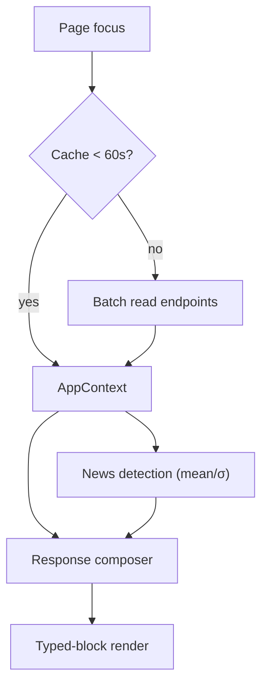
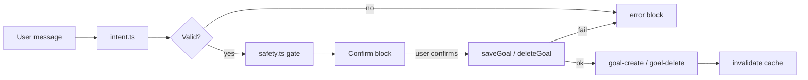

<aside>
🤖

**RESULT.md — AiPage Chatbot Revamp.** Phase 1 design (News + Goals) for transforming `/ai` from a 9-card statistics dashboard into an AI-oriented conversational chat surface. Detail 8/10 · Creativity 25/100 · Dark theme only · No new IPC, no backend changes, Tailwind v4, no external chat packages.

</aside>

<aside>
⚠️

**Inferred IPC contract.** I don't have access to `CONTEXT_BUNDLE.md` or the uploaded files, so every endpoint name below (e.g. `getGoals`, `saveGoal`, `deleteGoal`, `getActivitySummary`, `getUsageStats`, `getSleep`, `getExternalActivity`, `navigate`) is a **placeholder** to be replaced with the real name from CONTEXT_BUNDLE §2–3. No new endpoints are introduced — each placeholder maps 1:1 to an existing read or write channel.

</aside>

---

## Architecture Decision: C (Hybrid) — justified

**Recommendation: Option C.** The AiPage becomes a *pure chat surface*. Goal CRUD happens entirely in conversation. "News" (notable-event summaries) surfaces as **inline accent cards inside the thread**; clicking one opens a **lightweight right-side detail panel** rather than a full statistics view. The 9 statistic cards relocate to a new browsable `/digest` page — their proper home — which the chatbot links to via `navigation` blocks.

### Why not A or B

| Option | What it is | Verdict |
| --- | --- | --- |
| **A** — everything in chat | News + goals + detail all rendered inline only | ❌ Cramped. Long news detail and historical browsing don't fit a linear thread; users lose the ability to scan. |
| **B** — fully separate `/news` page, chat stays pure | Chat has zero data surfacing; all summaries on another page | ❌ Breaks the "AI is doing the work" feel. The summarization loop ("how was my day?") is the whole point and must live in chat. |
| **C** — Hybrid *(chosen)* | Chat surfaces fresh summaries inline → click expands a slim side panel; deep/historical browsing lives on `/digest` | ✅ Conversational loop stays in chat; no raw-number duplication; honors the "put digest + goals on a separate page" instinct while keeping `/ai` AI-driven. |

**Justification pillars**

- **No duplication.** Insights/Dashboard already render raw numbers. The AiPage must *interpret* data, not re-display it. Detail panel shows interpretation + one drill-link, not a dashboard.
- **Goal CRUD is natural in chat.** "create goal 'Review PR' for today" reads better than a form and satisfies Constraint 6 (no custom goal forms).
- **News-as-feed belongs on `/digest`.** Fresh, notable events surface inline (top-N, ranked by deviation); the full browsable history is one click away.
- **Navigation pattern.** The chatbot emits `navigation` blocks (clickable page chips) to route users to `/digest`, Insights, etc. — the chat *directs*, it doesn't absorb.

---

## Phase 1: Chatbot Design

### Data Pipeline

**Fetch strategy.** On page focus, batch the read endpoints once into a single context object held by a `useAppContext()` hook with a **60s TTL cache** (so individual messages don't refetch):

```tsx
// useAppContext.ts (inferred endpoint names — swap per CONTEXT_BUNDLE §2)
type AppContext = {
  goals: Goal[]            // getGoals({ date: today })
  activity: ActivitySummary // getActivitySummary({ date: today })
  usage: UsageStat[]       // getUsageStats({ range: '7d' })
  sleep: SleepRecord | null // getSleep({ date: today })
  external: ExternalActivity[] // getExternalActivity({ date: today })
  fetchedAt: number
}
```

- **Reads:** on focus + before composing any data-dependent answer (cache hit if `< 60s`).
- **Writes:** only on confirmed user intent (see Goal CRUD Flow). After a successful write, **invalidate** the cache so the next `getGoals` reflects the change.
- **No polling, no websockets** — pull-on-demand keeps it purely frontend.

**News detection (pure frontend heuristic).** Runs over the cached `usage`/`activity`/`sleep` arrays:

1. For each metric, compute a **rolling 7-day baseline** (mean μ and std σ).
2. Flag a metric `notable` when `|today − μ| ≥ max(1.5·μ, 2σ)` (configurable threshold).
3. Rank flagged metrics by absolute deviation; emit the **top 3** as `news-item` blocks (e.g. *"3h in VS Code — 2× your usual."*).
4. Suppress already-acknowledged items per day (store dismissed ids in `localStorage`).

**Data-flow table**

| Endpoint (inferred) | Cache key | Feeds response type(s) |
| --- | --- | --- |
| `getGoals` | `goals:{date}` | `goal-list`, `goal-create`, `goal-delete` |
| `getActivitySummary` | `activity:{date}` | `data-summary`, `news-item` |
| `getUsageStats` | `usage:7d` | `data-summary`, `news-item` |
| `getSleep` | `sleep:{date}` | `data-summary`, `news-item` |
| `getExternalActivity` | `external:{date}` | `news-item` |



### Response Format Specification

A **line-based typed-block DSL** — markdown-friendly, but with explicit typed headers the frontend maps to React components. Every AI turn is a sequence of **one or more** typed blocks; free prose between blocks renders as markdown.

```
[type: goal-list]
[title: Today's Goals]
[items:
  - [x] Complete project proposal (work)
  - [ ] Review pull request (work)
  - [ ] Morning run (health)
]
[summary: 1/3 completed]
```

**Grammar rules**

- A block opens with `[type: <block-type>]` on its own line.
- Each subsequent `[key: value]` line is a field; values may be single-line or a multi-line bracketed list (`[items:` … `]`).
- `items:` entries use markdown checkbox syntax `- [ ]` / `- [x]`; a trailing `(category)` is parsed into the item's category.
- A blank line or the next `[type: …]` ends the current block.
- Unrecognized lines outside a block render as markdown prose.

**Parser contract** — `parseBlocks(raw: string): Block[]`

```tsx
type BlockType =
  | 'goal-list' | 'goal-create' | 'goal-delete'
  | 'news-item' | 'data-summary' | 'error'
  | 'navigation' | 'text'

type Item = { checked: boolean; label: string; category?: string }
type Block = { type: BlockType; fields: Record<string, string | Item[]> }

// Behavior:
// 1. Tokenize on lines; detect [type: X] headers.
// 2. Accumulate [key: value] fields; parse nested [items: ...] into Item[].
// 3. Prose with no enclosing block -> { type: 'text', fields: { body } }.
// 4. On any parse error -> single { type: 'text' } fallback (never throw).
```

- **Rendering rules:** each `BlockType` → exactly one renderer in `blocks/`. Unknown types degrade gracefully to a `text` bubble.
- **Consistency rule:** the model is system-prompted to *always* wrap structured output in typed blocks; the parser tolerates malformed output rather than failing.

### Message Thread Architecture

- **Component tree:** `AiChat/` → `ChatHeader` · `MessageList` → `MessageBubble` → `BlockRenderer` → per-type renderers · `ChatInput` · `DetailPanel` (right-side news expander).
- **Scroll behavior:** auto-scroll to bottom on each new message via a `bottomRef` + `useEffect`; **suppressed** when the user has scrolled up (track `isPinnedToBottom` from the scroll handler). A "Jump to latest" chip appears when unpinned.
- **Persistence:** messages saved to `localStorage` keyed by date (`aichat:thread:{date}`); they survive reload. A "Clear conversation" control wipes the day's thread.
- **Input area:** multiline `<textarea>` — **Enter sends**, **Shift+Enter** = newline; placeholder *"Ask about your day, manage goals…"*; send button; context-aware suggested quick-action chips (e.g. *"How was my day?"*, *"Show today's goals"*).

### Goal CRUD Flow

**Intent parsing** (`intent.ts`): map natural text → `{ intent: 'create'|'toggle'|'edit'|'delete'|'list', title?, category?, date? }` via lightweight pattern matching (verbs + quoted title + date keywords like *today/tomorrow*).

**Mutation pipeline**



- **Validate:** non-empty title, valid/parseable date, category in allowed set.
- **Confirm:** render a confirm block before any write.
- **Execute:** call `saveGoal` / `deleteGoal`; on success render the matching success block and **invalidate** `goals:{date}`.
- **Error handling:** failed save → `error` block with a **Retry** action that re-runs the same mutation.

### Safety Rules

| Action | Policy |
| --- | --- |
| Read data, suggest, summarize | **Autonomous** (no confirm) |
| Create / edit goal | **Single confirm** (inline button or typing "yes") |
| Delete goal | **Two-step**: AI asks "Delete goal X?", user types `yes`, then execute |
| `executeCommand` / shell | **Blocked entirely** in Phase 1 (allowlist exists but is empty) |
| Config changes (sleep / external activity) | **Phase 2** — designed, gated behind explicit confirm |

**Concrete rules**

- *Goal deletion requires two-step confirmation:* AI asks "Delete goal X?", user types `yes`, AI executes. Any other reply cancels.
- **Injection hardening:** treat all chat input as **data, never instructions**. Strip/escape control sequences, never interpolate raw input into a shell or IPC string, whitelist intents, and cap input at **2000 chars**.
- **Fail safe:** unknown intent → ask a clarifying question, never guess-execute a write.

---

## UI/UX Specification

> Palette: galaxy-dark — `zinc` neutrals, `pink` primary accent, `emerald` success/positive, `amber` morning/warning. Tailwind v4 (`@import "tailwindcss"`).
> 

### Chat Header

- Container: `flex items-center justify-between px-4 h-12 border-b border-zinc-800 bg-zinc-950/80 backdrop-blur`.
- **Mode pill** (time-of-day): morning `bg-amber-500/10 text-amber-300 ring-1 ring-amber-500/20`; in-progress `bg-emerald-500/10 text-emerald-300 ring-1 ring-emerald-500/20`; review `bg-pink-500/10 text-pink-300 ring-1 ring-pink-500/20`. Shape: `rounded-full px-2.5 py-0.5 text-xs font-medium`.
- **Date:** `text-zinc-400 text-sm`.
- **Status dot:** thinking `bg-amber-400 animate-pulse`; ready `bg-emerald-400`; error `bg-red-400` — all `size-2 rounded-full`.

### Message Bubbles (by type)

- **AI bubble:** `max-w-[85%] rounded-2xl rounded-tl-sm bg-zinc-900/70 ring-1 ring-zinc-800 px-4 py-3 text-zinc-100`. Token accents per block type below.
- **User bubble:** `ml-auto max-w-[85%] rounded-2xl rounded-tr-sm bg-pink-500/15 ring-1 ring-pink-500/25 px-4 py-3 text-zinc-100`.

### Input Area

- Wrapper: `border-t border-zinc-800 bg-zinc-950/80 p-3`.
- Textarea: `w-full resize-none bg-zinc-900 ring-1 ring-zinc-800 focus:ring-pink-500/40 rounded-xl px-3 py-2 text-sm text-zinc-100 placeholder:text-zinc-500`, auto-grow to 6 lines.
- Send button: `bg-pink-500/90 hover:bg-pink-400 disabled:bg-zinc-700 rounded-lg px-3 py-2 text-sm font-medium text-white`.
- Quick-action chips: `rounded-full bg-zinc-800 hover:bg-zinc-700 ring-1 ring-zinc-700 px-3 py-1 text-xs text-zinc-300`.

### Empty & Loading States

- **Empty state:** AI greeting bubble — *"Morning, CZ. I've scanned today — ask me how your day's going, or tell me a goal to track."* plus 3 quick-action chips.
- **Typing indicator:** three dots `size-1.5 rounded-full bg-zinc-500` with staggered `animate-bounce` (`[animation-delay:0ms/150ms/300ms]`) inside an AI bubble shell.

### Special Response Type Visuals

| Type | When | Visual | Key classes |
| --- | --- | --- | --- |
| `goal-list` | Show today's goals | Checkbox list + progress bar | track `bg-zinc-800 h-1.5 rounded-full`, fill `bg-emerald-500` |
| `goal-create` | Goal created | Emerald success badge + goal preview | `bg-emerald-500/10 text-emerald-300 ring-1 ring-emerald-500/20` |
| `goal-delete` | Goal removed | Amber/red warning badge + struck name | `bg-red-500/10 text-red-300` · label `line-through text-zinc-500` |
| `news-item` | Notable event | Left accent border card, icon + summary, clickable → DetailPanel | `border-l-2 border-pink-500/60 bg-zinc-900/60 rounded-r-lg px-3 py-2 hover:bg-zinc-900` |
| `data-summary` | "How was my day?" | Metric rows w/ ▲▼ trend | up `text-emerald-400`, down `text-pink-400` |
| `error` | Something failed | Red-toned card + Retry | `bg-red-500/10 ring-1 ring-red-500/40` · button `bg-red-500/80 hover:bg-red-400` |
| `navigation` | Suggest another page | Clickable page-link chip, icon + path | `inline-flex items-center gap-1.5 rounded-lg bg-zinc-800 hover:bg-zinc-700 px-2.5 py-1 text-sm text-zinc-200` |

### Complete Mock Session

```
USER: how was my day?

AI:
[type: data-summary]
[title: Today at a glance]
[metrics:
  - Focus time: 4h 20m ▲ +35% vs avg
  - VS Code: 3h 02m ▲ 2.0x your usual
  - Sleep: 6h 10m ▼ -18% vs avg
]
Solid focus day, but sleep is running low — worth an earlier wind-down.

[type: news-item]
[icon: ⚡]
[summary: 3h in VS Code — 2x your normal. Mostly DeskFlow's AiChat work.]
[detail: Peak block 13:40–16:42, longest uninterrupted session this week.]

---
USER: what are my goals?

AI:
[type: goal-list]
[title: Today's Goals]
[items:
  - [x] Complete project proposal (work)
  - [ ] Review pull request (work)
  - [ ] Morning run (health)
]
[summary: 1/3 completed]

---
USER: create goal 'Review PR #482' for today

AI: I'll add a work goal "Review PR #482" for today. Confirm?
[type: text]
[body: Reply "yes" to create, or tell me to change it.]

USER: yes

AI:
[type: goal-create]
[title: Goal created]
[goal: Review PR #482 (work) — today]
[summary: Now tracking 4 goals today]

---
USER: delete the morning run goal

AI: Delete goal "Morning run"? This can't be undone. Type "yes" to confirm.

USER: yes

AI:
[type: goal-delete]
[title: Goal removed]
[goal: Morning run (health)]
[summary: Back to 3 goals today]

---
USER: take me to my digest

AI:
[type: navigation]
[label: Daily Digest]
[path: /digest]
[icon: 📊]
Full stats and history live here — opening it for you.
```

---

## Migration Plan

### Stage 1 (coexistence) — now

- Mount `<AiChat />` **above** the existing 9 cards on `/ai`; cards untouched.
- Put the chat behind a feature flag (`featureFlags.aiChat`).
- Validate `parseBlocks`, news detection, and Goal CRUD against live data.
- [ ]  Add `AiChat/` component tree
- [ ]  Wire `useAppContext` to existing read endpoints
- [ ]  Flag-gate render in `AiPage.tsx`
- [ ]  QA parser fallback + Goal CRUD confirm flows
- *Rollback:* flip the flag off — cards remain the default.

### Stage 2 (chat primary) — next

- Create `/digest` page; **move** the 9 statistic cards there.
- `/ai` becomes pure chat; news inline + `DetailPanel`; `navigation` blocks link to `/digest` & Insights.
- Remove duplicated displays from `/ai`.
- [ ]  Build `/digest` route + relocate cards
- [ ]  Remove card grid from `AiPage.tsx`
- [ ]  Add navigation blocks → `/digest`, Insights
- *Rollback:* re-enable the card grid behind the flag while keeping `/digest`.

### Stage 3 (future)

- Phase 2 app-navigation, saved-workspace boot, and config mutations (sleep, external activity) behind the **same permission layer**.
- `executeCommand` only via a strict, explicitly-populated allowlist.
- [ ]  App-navigation intents
- [ ]  Workspace boot/management
- [ ]  Config CRUD with confirm gates

---

## Implementation Files

### `src/pages/AiPage.tsx` — Changes

- Import and render `<AiChat />`.
- **Stage 1:** wrap existing cards in a flag-gated `<section>`; render `<AiChat />` above it.
- **Stage 2:** replace the card grid with a chat-only layout (`h-full flex flex-col`); cards now live on `/digest`.
- Pass `mode` (time-of-day) and `date` props down to `ChatHeader`.

### `src/components/AiChat/` — New components

| File | Responsibility |
| --- | --- |
| `index.tsx` | Container + layout (`flex flex-col h-full`), owns thread state |
| `ChatHeader.tsx` | Mode pill, date, status dot |
| `MessageList.tsx` | Scroll mgmt, auto-scroll + `isPinnedToBottom` |
| `MessageBubble.tsx` | AI/user bubble shell, delegates to `BlockRenderer` |
| `BlockRenderer.tsx`  • `blocks/` | One renderer per `BlockType`; unknown → text |
| `ChatInput.tsx` | Textarea, send, quick-action chips |
| `DetailPanel.tsx` | Right-side expander for `news-item` detail |
| `useAppContext.ts` | Data pipeline + 60s TTL cache + invalidation |
| `parseBlocks.ts` | DSL parser (never throws) |
| `intent.ts` | NL → intent + entity extraction |
| `safety.ts` | Permission gate + injection hardening |

<aside>
⚠️

Before implementation, replace every inferred endpoint (`getGoals`, `saveGoal`, `deleteGoal`, `getActivitySummary`, `getUsageStats`, `getSleep`, `getExternalActivity`, `navigate`) with the real channel name from **CONTEXT_BUNDLE.md §2–3**. No new endpoints are required — each maps to an existing read/write channel.

</aside>