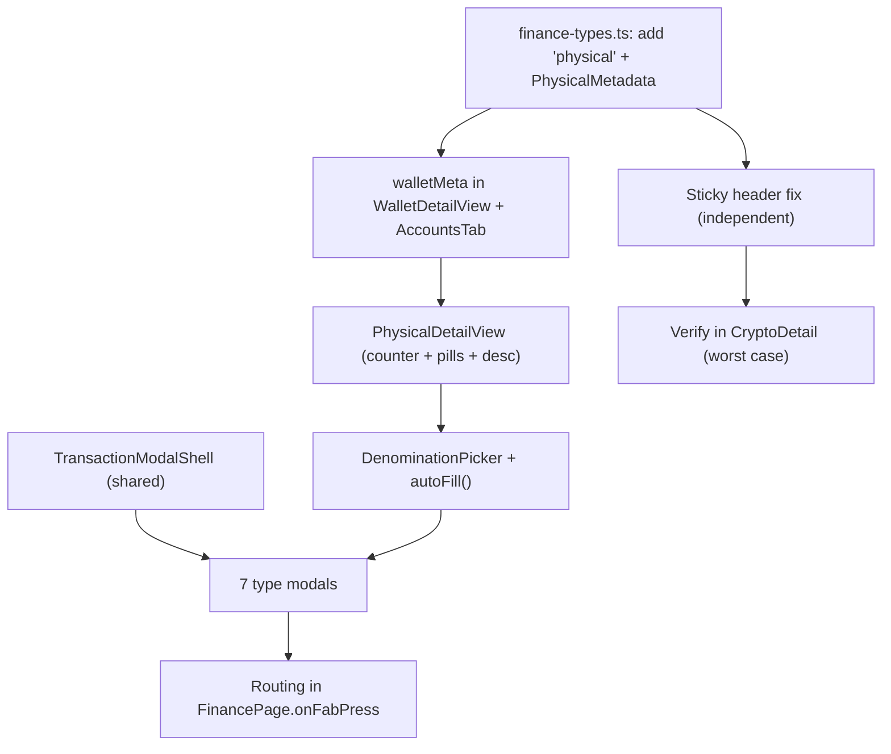

<aside>
🎯

**Scope** — (1) Fix the net-worth sticky-header scroll oscillation, (2) add a `physical` wallet type with a denomination-counter detail view, (3) replace the generic `QuickAddModal` with **7 wallet-type-tailored transaction modals**. Frontend-only — no new IPC. Files: `FinanceStickyHeader.tsx`, `FinancePage.tsx`, `WalletDetailView.tsx`, `AccountsTab.tsx`, `finance-types.ts`, and a new `components/finance/modals/` folder.

</aside>

## 1. Fix — Sticky Header Scroll Glitch

### 1.1 Root cause (the oscillation loop)

The glitch is a **layout feedback loop**, not a flaky observer:

1. Shrink state is driven by an `IntersectionObserver` watching a sentinel at `top-24`.
2. The header is **in normal document flow** and animates `height` between `h-28` (112px) and `h-16` (64px) over `650ms`.
3. When the header shrinks it removes ~48px of flow height → content below shifts up ~48px → the sentinel crosses back over the `top-24` line → observer flips state → header grows → content shifts down → sentinel crosses again. 🔁
4. CryptoDetail amplifies it: Chart.js mounts asynchronously and injects height *after* first paint, nudging scroll offset across the threshold mid-transition.

A single boundary with no dead-zone means any sub-pixel jitter near the line toggles the state.

### 1.2 Chosen fix — hysteresis + flow decoupling + transform crossfade

Three changes, each cutting one link in the chain.

**(a) Replace the single sentinel with a `scrollY` reader that has a hysteresis band.** Shrink only when `scrollY > 96`; expand only when `scrollY < 48`. Between 48–96px the state is sticky, so jitter cannot toggle it.

```tsx
// FinanceStickyHeader.tsx
const SHRINK_AT = 96   // collapse past here
const EXPAND_AT = 48   // expand below here (dead-zone 48..96)

const [shrunk, setShrunk] = useState(false)
const shrunkRef = useRef(false)
const ticking = useRef(false)

useEffect(() => {
  const scroller = scrollRef.current
  if (!scroller) return
  const onScroll = () => {
    if (ticking.current) return
    ticking.current = true
    requestAnimationFrame(() => {
      const y = scroller.scrollTop
      if (!shrunkRef.current && y > SHRINK_AT) { shrunkRef.current = true;  setShrunk(true) }
      else if (shrunkRef.current && y < EXPAND_AT) { shrunkRef.current = false; setShrunk(false) }
      ticking.current = false
    })
  }
  scroller.addEventListener('scroll', onScroll, { passive: true })
  return () => scroller.removeEventListener('scroll', onScroll)
}, [])
```

**(b) Take the header out of normal flow so its size change never reflows content.** Header becomes `sticky` with a constant footprint; the scroll container gets a fixed `pt-28` equal to the expanded height. Collapsing now changes only the header's own visual size, not document height — the threshold can no longer be pushed across by the header itself.

```tsx
<header className="sticky top-0 z-30 h-28 pointer-events-none"> ... </header>
<div ref={scrollRef} className="overflow-y-auto pt-28"> ...content... </div>
```

**(c) Stop animating `height`; cross-fade two pre-sized layers with `transform` + `opacity`** (also satisfies the “no height/width animation” rule). Both net-worth layouts stay mounted and render the same value.

```tsx
const T = { duration: 0.22, ease: [0.16, 1, 0.3, 1] as const }
const largeAnim = shrunk ? { opacity: 0, y: -8 } : { opacity: 1, y: 0 }
const smallAnim = shrunk ? { opacity: 1, y: 0 } : { opacity: 0, y: 8 }

<div className="relative h-28">
  <motion.div className="absolute inset-0 flex items-end px-6 pb-4"
    animate={largeAnim} transition={T}>
    <NetWorthLarge value={netWorth} />
  </motion.div>
  <motion.div className="absolute inset-x-0 top-0 h-16 flex items-center px-6"
    animate={smallAnim} transition={T}>
    <NetWorthCompact value={netWorth} />
  </motion.div>
</div>
```

<aside>
✅

**Why it's robust:** (a) removes threshold jitter, (b) removes the reflow that *moved* the threshold, (c) removes the slow `height` transition that let async chart mounts interleave with the toggle. Net worth is never unmounted — both layers render the same `netWorth`, so the display cannot break.

</aside>

**Line-level checklist**

- [ ]  Delete the `IntersectionObserver` + `top-24` sentinel element.
- [ ]  Add the `scrollRef` rAF handler with `SHRINK_AT`/`EXPAND_AT` hysteresis.
- [ ]  Change header from `transition-[height] duration-650` `h-28`↔`h-16` to a constant `h-28` sticky container.
- [ ]  Add `pt-28` to the scroll container; delete the dynamic spacer.
- [ ]  Replace the single net-worth block with the two stacked `motion.div` layers.

## 2. Feature — Physical Wallet Type

### 2.1 Type system changes (exact)

`finance-types.ts`:

```tsx
// 1. extend the wallet type union
export type WalletType =
  | 'bank' | 'debit_card' | 'credit_card'
  | 'crypto' | 'cash' | 'ewallet'
  | 'physical'            // <-- NEW
  | 'other'

// 2. reuse the existing denomination shape (already defined)
export interface CashDenomination { value: number; count: number }

// 3. new metadata variant
export interface PhysicalMetadata {
  type: 'physical'
  denominations?: CashDenomination[]
  description?: string      // "Brown leather bifold"
  notes?: string
}

// 4. add to the discriminated union
export type WalletMetadata =
  | BankMeta | DebitMeta | CreditMeta | CryptoMeta
  | CashMeta | EwalletMeta
  | PhysicalMetadata        // <-- NEW
```

`walletMeta` map — add the **same entry in both** `WalletDetailView.tsx` **and** `AccountsTab.tsx`:

```tsx
import { WalletCards } from 'lucide-react'
physical: { icon: WalletCards, label: 'Physical', color: '#F97316' },
```

`balance` for `physical` is **derived** = sum of `denomination.value × count` — identical rule to `cash`, so net worth and account rollups need no math change.

### 2.2 Physical Wallet Detail View

Vertical stack of tier-2 `GlassSurface` cards, `gap-3` (12px). Accent `#F97316`.

```
┌─ Header card ────────────────────────┐
│ [WalletCards] (Physical)        edit name │
│ IDR · Rp                  [Save] [Delete] │
├─ Denomination counter ──────────────┐
│ Rp 100,000   [-] 6 [+]      Rp 600,000  │
│ Rp  50,000   [-] 1 [+]      Rp  50,000  │
│ Total                       Rp 650,000  │
├─ Quick add pills ──────────────────┐
│ (+Rp100K)(+Rp50K)(+Rp20K)(+Rp10K)(+Rp5K)│
├─ Description ─────────────────────┐
│ Where is this wallet? [Brown bifold    ]│
│ Notes [...]                              │
├─ Transactions ──────────────────┐
│ Jun 21 · Lunch · spent · -Rp 45,000     │
└────────────────────────────┘
```

**Header card** — `flex items-center justify-between p-4 rounded-xl bg-zinc-900/50 border border-zinc-700/50`. Badge: `inline-flex items-center gap-1.5 px-2 py-1 rounded-md text-[11px] font-medium text-[#F97316] bg-[#F97316]/10 border border-[#F97316]/20`. Name is inline-editable `input` (`bg-transparent text-lg font-semibold focus-visible:ring-2 ring-[#F97316]/50`). Save = accent fill; Delete = `text-zinc-400 hover:text-red-400` with confirm.

**Denomination counter** — each row `grid grid-cols-[1fr_auto_auto] items-center gap-3 h-12`:

- Label: `text-sm text-zinc-300 tabular-nums`.
- Stepper `[-]`/`[+]`: `h-11 w-11` (≥44px) `rounded-lg bg-zinc-800 hover:bg-zinc-700 active:scale-95`; count is `w-12 text-center tabular-nums` editable.
- Subtotal: `text-sm tabular-nums text-zinc-400`, live.
- Total row: `text-xl font-bold tabular-nums text-white`, `border-t border-zinc-700/50 pt-3`.
- **Empty:** all counts 0 → “No cash counted yet. Add bills using the controls below.” (`text-zinc-600 text-sm`).

**Quick-add pills** — `flex flex-wrap gap-2`; pill `h-11 px-4 rounded-full bg-[#F97316]/10 text-[#F97316] border border-[#F97316]/20 hover:bg-[#F97316]/20 active:scale-95`; tap increments that denomination by 1.

**Description** — “Where is this wallet?” `input` + “Notes” `textarea`, debounced autosave into `metadata.description` / `metadata.notes`.

**Transactions** — wallet-scoped; row `date · description · type · amount · running balance`. Spent `text-red-400`, deposited `text-emerald-400`. Empty: “No transactions yet. Tap + to add one.”

| Section | Loading | Empty | Error |
| --- | --- | --- | --- |
| Counter | Skeleton rows (label + dashes) | "No cash counted yet…" | "Couldn't load denominations" + retry |
| Transactions | 3 skeleton rows | "No transactions yet. Tap +…" | Inline error + retry |

## 3. Feature — Per-Wallet Transaction Modals (7 types)

### 3.0 Shared modal shell

All seven share one `TransactionModalShell` (overlay, container, header, footer, submit lifecycle); only **context band** + **fields** differ. The wallet accent color is passed in as `accent`.

- **Overlay:** `fixed inset-0 bg-black/70 backdrop-blur-sm` + `motion` fade (`opacity` only).
- **Container:** `bg-zinc-900/95 backdrop-blur-xl border border-zinc-700/50 rounded-xl` sliding up via `transform: translateY` + `opacity`, `ease [0.16,1,0.3,1]`, 240ms. Max `rounded-xl`, no box-shadow, no spring.
- **Header:** accent icon chip + type badge + title (e.g. “Add transaction”), close `X`.
- **Footer / submit lifecycle (all types):** primary button `bg-{accent}` → on submit shows **spinner** → **success checkmark** (scale/opacity pop) → auto-close after **800ms**. **Error:** inline message above the button (`text-red-400 text-sm`) with a **Retry**; fields stay filled.
- **Type toggles:** pill buttons `h-9 px-3 rounded-lg`; selected = `bg-{accent}/15 text-{accent} border border-{accent}/30`, idle = `text-zinc-400 border-zinc-700/50`.
- **Amount input:** `text-3xl font-semibold tabular-nums`, currency-symbol prefix, **auto-focused**.
- **Focus rings everywhere:** `focus-visible:ring-2 ring-{accent}/50 ring-offset-2 ring-offset-zinc-950`.
- **Keyboard / Tab order (all modals):** type toggle → amount → description → category → date → advanced toggle → Cancel → Submit. `Enter` submits when valid; `Esc` closes (with confirm if dirty).

### 3.1 Bank · accent `#3B82F6`

- **Context band:** Balance (e.g. “Balance: $4,320.50”) · Institution · `••••4247`.
- **Types:** Income | Expense | Transfer.
- **Fields:** type toggle → amount (auto-focus) → description → category chip-grid (filtered by type) → date (defaults today) → `+ Add notes` collapsible textarea (progressive disclosure).
- **Flow:** tap + → type pre-set to last-used (default Expense) → amount → description → category → submit → spinner → check → close.

### 3.2 Debit Card · accent `#10B981`

- **Context band:** `Visa ••••4247` · daily limit · **today-vs-limit progress bar** (`h-1.5 rounded-full bg-zinc-800`, fill `bg-[#10B981]`, turns amber/red as it nears limit).
- **Types:** Expense (default) | Income (refund).
- **Fields:** type toggle → amount (auto-focus) → description → category → date.
- **Flow:** tap + → Expense pre-set, amount focused → progress bar shows used portion of daily limit → fill → submit.

### 3.3 Credit Card · accent `#F59E0B`

- **Context band (prominent):** **utilization bar** used/limit with %, color-coded — `<50%` green, `50–80%` amber, `>80%` red; “$X,XXX.XX remaining”; statement balance + due date (highlight if due soon).
- **Types:** Expense (default) | Payment | Refund.
- **Fields:** type toggle → amount → description → category → **Installments** optional number (“Pay in X months”, progressive disclosure) → date.
- **Flow:** tap + → see available credit + utilization → Expense pre-set → amount → optional installments → submit → utilization bar animates to new value.

### 3.4 Crypto · accent `#8B5CF6`

- **Context band:** asset selector · live price (monospace, with green/red 24h indicator) · “You hold: 0.5 BTC”.
- **Types:** Buy | Sell | Transfer.
- **Fields:** asset dropdown → type → quantity → price/coin (auto-filled from live price, editable) → **auto-calc total** (read-only) → fee (optional) → date.
- **Smart calc (live):**

```
Quantity 0.5  ×  Price $67,420.00  =  Total $33,710.00
                                       Fee   + $2.50
                                       Net   $33,712.50
```

`total = qty × price`; `net = total + fee` (Buy) or `total - fee` (Sell), recomputed on every keystroke. Auto-calc block has a tinted `bg-[#8B5CF6]/8 rounded-lg p-3` panel.

- **Empty (no assets):** “Add an asset first” + button routing to asset setup.
- **Flow:** tap + → asset pre-filled with first tracked → Buy/Sell/Transfer → quantity → total auto-calcs → adjust price/fee → submit → holdings + balance update.

### 3.5 Physical · accent `#F97316` (the key innovation)

- **Context band:** “Wallet total: Rp 2,450,000” · compact 2-line denomination summary · wallet description (“Brown leather bifold”).
- **Types:** Spend (out) | Deposit (in).
- **SPEND** — amount field + **denomination picker**:

```
How much did you spend?   Rp [270,000]
Which bills did you use?
  Rp 100K  [-] 2 [+]   Rp 200,000
  Rp  50K  [-] 1 [+]   Rp  50,000
  Rp  20K  [-] 1 [+]   Rp  20,000
  Rp  10K  [-] 0 [+]   Rp       0
  Total selected:      Rp 270,000
[Auto-fill]  [Reset]
```

- **Auto-fill (greedy largest-first):** see 3.5.1. **Total selected must ≥ amount spent** (the difference is change kept in wallet — surface it as “Change kept: Rp X”). If `< amount`, block submit with inline hint. **Reset** clears counts.
- **DEPOSIT** — same counter in reverse (“Add bills to your wallet”), `Total to add`, plus description (e.g. “ATM withdrawal”).
- **Common:** description · date (today) · optional category chip-grid.
- **Flow (Spend):** tap + → Spend pre-set → type total OR use picker directly → **Auto-fill** → adjust counts → description → submit → chosen denominations subtracted from `metadata.denominations`; change re-added.

#### 3.5.1 Auto-fill algorithm (greedy largest-first)

```tsx
// Returns the bill counts to cover `amount` using available denominations,
// largest-first. Result total is >= amount (change kept in wallet).
function autoFill(amount: number, available: CashDenomination[]): Record<number, number> {
  const picks: Record<number, number> = {}
  let remaining = amount
  const sorted = [...available].sort((a, b) => b.value - a.value)
  for (const d of sorted) {
    if (remaining <= 0) break
    const need = Math.min(Math.floor(remaining / d.value), d.count)
    if (need > 0) { picks[d.value] = need; remaining -= need * d.value }
  }
  // top up the smallest available bill if exact change isn't possible
  if (remaining > 0) {
    const smallest = [...sorted].reverse().find(d => (d.count - (picks[d.value] ?? 0)) > 0)
    if (smallest) picks[smallest.value] = (picks[smallest.value] ?? 0) + 1
  }
  return picks
}
```

### 3.6 Cash · accent `#EC4899`

- Same pattern as Physical, but context says **“Cash on hand”**; types are **Withdraw | Deposit**; **no wallet-description** display.

### 3.7 E-Wallet · accent `#06B6D4`

- **Context band:** platform name (“GoPay”/“OVO”) · linked payment methods as small badges · daily limit if set.
- **Types:** Expense | Top-up | Transfer.
- **Fields:** type toggle → amount → description → category → date.
- **Flow:** tap + → Expense default → amount → description → submit.

## 4. Routing Logic (`FinancePage.tsx`)

The FAB opens a wallet-specific modal only when a wallet detail is open; otherwise the generic form.

```tsx
const MODALS: Record<WalletType, React.FC<TxModalProps>> = {
  bank: BankTransactionModal,
  debit_card: DebitTransactionModal,
  credit_card: CreditTransactionModal,
  crypto: CryptoTransactionModal,
  physical: PhysicalTransactionModal,
  cash: CashTransactionModal,
  ewallet: EwalletTransactionModal,
  other: QuickAddModal,            // generic fallback
}

function onFabPress() {
  if (selectedWalletId) {
    const w = wallets.find(x => x.id === selectedWalletId)!
    setActiveModal(MODALS[w.type] ?? QuickAddModal)
  } else {
    setActiveModal(QuickAddModal) // overview / accounts / categories tabs
  }
}
```

All seven type modals submit through the **existing** transaction IPC (frontend-only); they differ purely in UI + the payload they assemble (e.g. crypto sends qty/price/fee → computed amount; physical sends a denomination delta).

## 5. Implementation Order (dependency graph)



1. **Sticky header fix** — isolated; ship first, verify in CryptoDetail.
2. **Types** — add `physical` + `PhysicalMetadata`; update both `walletMeta` maps.
3. **PhysicalDetailView** — counter, quick-add pills, description, transactions.
4. **Shared building blocks** — `TransactionModalShell`, `DenominationPicker`, `autoFill()`, category chip-grid, submit-lifecycle hook.
5. **7 type modals** on the shell, in order: generic-ish (Bank, Debit, Ewallet) → Credit (utilization) → Crypto (auto-calc) → Physical/Cash (denomination picker).
6. **Routing** — wire `onFabPress` map; keep `QuickAddModal` as `other`/no-wallet fallback.
7. **Regression** — confirm no existing wallet type breaks; net worth unaffected.

## 6. Visual Appendix

| Type | Accent | Icon (lucide) | Tx types | Signature feature |
| --- | --- | --- | --- | --- |
| Bank | `#3B82F6` | Landmark | Income / Expense / Transfer | Collapsible notes |
| Debit | `#10B981` | CreditCard | Expense / Income | Daily-limit progress bar |
| Credit | `#F59E0B` | CreditCard | Expense / Payment / Refund | Utilization bar + installments |
| Crypto | `#8B5CF6` | Coins | Buy / Sell / Transfer | Qty×Price auto-calc |
| Physical | `#F97316` | WalletCards | Spend / Deposit | Denomination picker + auto-fill |
| Cash | `#EC4899` | Banknote | Withdraw / Deposit | Denomination picker |
| Ewallet | `#06B6D4` | Smartphone | Expense / Top-up / Transfer | Linked-method badges |

**Animation tokens (all modals)**

- Easing: `cubic-bezier(0.16, 1, 0.3, 1)` — never spring.
- Overlay fade: `opacity` 180ms. Container enter: `translateY(12px)→0` + `opacity` 240ms.
- State changes (toggles, bars, steppers): 150–300ms, `transform`/`opacity`/`background-color` only.
- Success check: `scale 0.8→1` + `opacity` 200ms, then auto-close at 800ms.

**Hard rules honored**

- No `box-shadow` (depth via border brightness + glass tiers) · no animating `height`/`width`/`top`/`left` · max `rounded-xl` · no spring physics · ≤2 font families · backgrounds `zinc-950`/`zinc-900`/`zinc-900/50` · text `white`/`zinc-400`/`zinc-600` · every section has Empty/Loading/Error · touch targets ≥44px · generic accent `#10b981`, wallet accent for wallet-specific actions.

<aside>
✅

**Definition of done** — header no longer oscillates (verified in CryptoDetail); `physical` wallet exists end-to-end with a working denomination counter; tapping + inside any wallet opens that wallet's tailored modal; crypto auto-calc and physical auto-fill work; no existing wallet type or net-worth math regresses.

</aside>