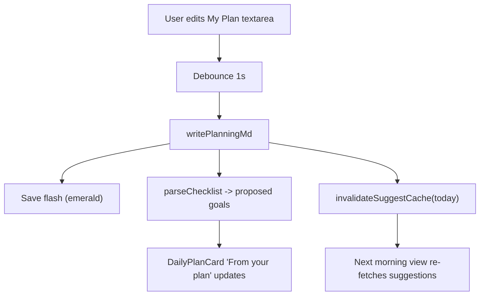
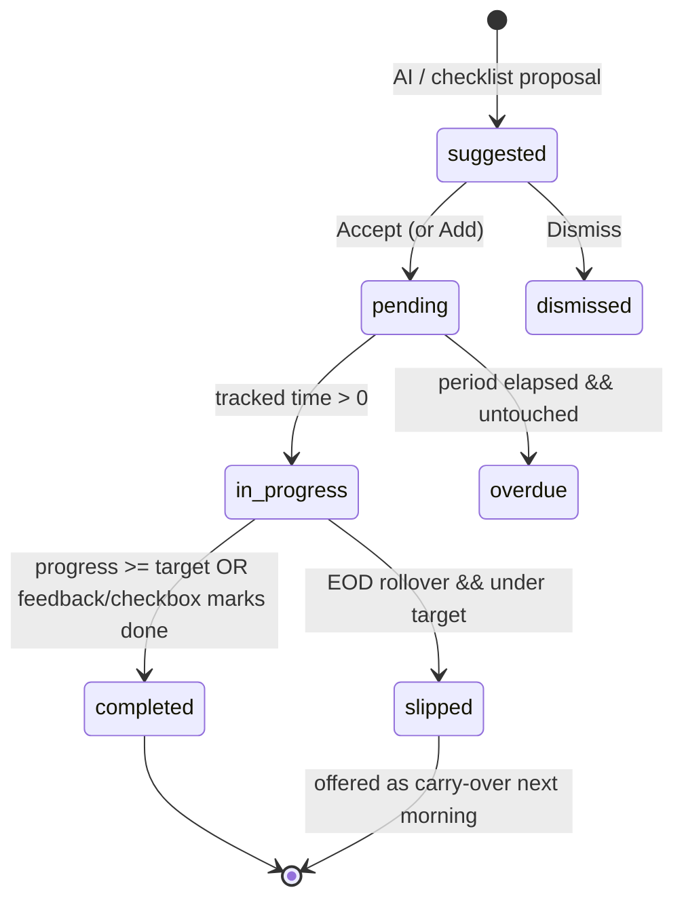
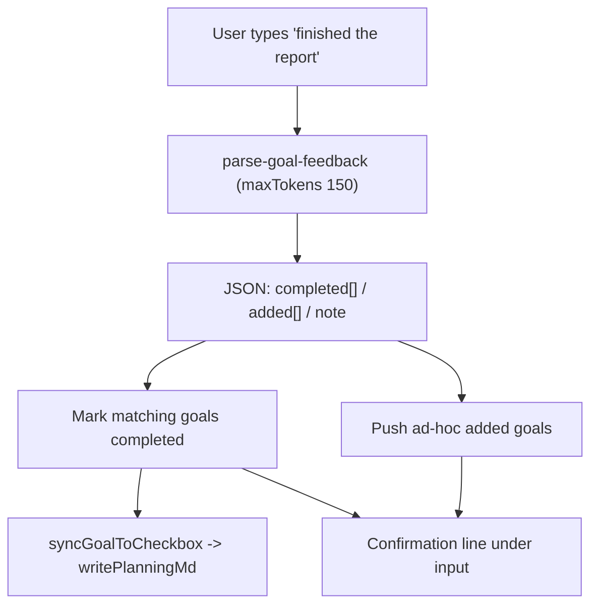

<aside>
🎨

**Continuation design.** The multi-provider connector + goal backend is built. This spec completes the AI Assistant with four interconnected features: **(A)** `planning.md` as the goal system prompt, **(B)** context persistence so the AI remembers yesterday, **(C)** checklist parsing + a natural-language feedback loop, and **(D)** a full UI/UX revamp of `AiPage` — the highest-priority part. Everything below is implementation-ready: TypeScript interfaces, system prompts, exact Tailwind classes, and state machines.

</aside>

<aside>
⚙️

**Constraints honored:** existing IPC bridge (`preload.ts` → `main.ts`), **no new npm deps** (regex markdown render, native HTML5 drag, framer-motion already present), provider config + `planning.md` survive restart, goals in localStorage for v1, reuse `GlassCard`, preserve token-tier fallback (200→100→50→40), Tailwind v4 only, unused features **deleted** not hidden. New main-process `.ts` files must be added to the `build:electron` script.

</aside>

## Table of contents

---

# 0. Implementation order & cleanup (foundation)

Build in this order so each stage is independently testable:

1. **Cleanup** (this section) — delete dead components, state, handlers, IPC, `AIService` methods.
2. **Part D** — revamp `AiPage` so the new cards have a proper home.
3. **Part A** — `planning.md` read/write IPC + My Plan card.
4. **Part B** — context persistence wired into the suggestion prompt.
5. **Part C** — checklist parsing, feedback loop, two-way checkbox sync.

## 0.1 Removal checklist

<aside>
🗑️

**Delete from the codebase (not hide):**

- **Components:** `AiBriefCard.tsx`, `WeeklyReviewCard.tsx`, `PatternCard.tsx`, `SleepCard.tsx`.
- **`AiPage.tsx`:** anomaly banner (267–282), Daily Brief (308–334), Weekly Review (337–369), Pattern (372–397), Sleep (400–425), inline anomaly alerts (440–489), data-chat block (492–573) — plus all their state, refs, handlers, and imports.
- **`AIService` methods + prompts:** `generateDailyBrief`, `generateWeeklyReview`, `analyzePatterns`, `analyzeSleep`, `dataChatQuery`, `checkAnomalies` and `DAILY_BRIEF_PROMPT`, `WEEKLY_REVIEW_SYSTEM`, `ANOMALY_SYSTEM`, `PATTERN_ANALYSIS_SYSTEM`, `SLEEP_ANALYSIS_SYSTEM`.
- **Fallback parsers:** `fallbackParseDailyBrief`, `fallbackParsePatternAnalysis`, `fallbackParseSleepAnalysis`.
- **IPC (preload + main):** `get-ai-brief`, `regenerate-ai-brief`, `check-anomalies`, `analyze-patterns`, `analyze-sleep`, `data-chat-query`, and the `onAiBriefReady` listener.

**Keep:** `generateTopicDigest` + `TOPIC_DIGEST_SYSTEM`, `get-topic-digest` (rewired), the provider layer, `GoalStore`, and the 8 built goal/provider IPC channels.

</aside>

### State vars to remove from `AiPage.tsx`

```tsx
// DELETE every one of these useState / useRef declarations and their setters:
briefContent, parsedBriefContent, briefLoading, briefError, briefCollapsed,
weeklyContent, weeklyLoading, weeklyError, weeklyDismissed,
parsedPatternContent, patternLoading, patternError,
parsedSleepContent, sleepLoading, sleepError,
chatMessages, chatInput, chatLoading, chatEndRef,
anomalies, anomaliesLoading
```

After cleanup, `AiPage` should import only: `GlassCard`, `DailyPlanCard`, `GoalHistoryCard`, `TopicDigestCard`, `MyPlanCard` (new), `ContextSummaryCard` (new), `motion`/`AnimatePresence`, and a small set of `lucide-react` icons (`Sparkles`, `Settings`, `RefreshCw`, etc.).

---

# Part D — Complete AiPage UI/UX Revamp

*(Built second, documented first because it defines the home for everything else.)*

## D.1 Design tokens (locked)

The AI page accent is **pink-500**. Goal/progress accent is **amber-400**. Semantic colors: **emerald-400** (success), **red-400** (error/overdue). No more than 3 accent colors visible in one view; text hierarchy uses zinc color tokens, never `opacity`.

| Token | Value |
| --- | --- |
| Base background | `zinc-950` |
| Elevated card | `zinc-900` |
| Glass surface | `bg-zinc-900/50 backdrop-blur-xl border border-zinc-800/50 rounded-xl` |
| Primary accent | `pink-500` (hover `pink-400`, active `pink-600`) |
| Goal accent | `amber-400` |
| Text | `zinc-100` / `zinc-400` / `zinc-600` |
| Border | `zinc-800` (subtle) / `zinc-700` (active) |
| Radius cap | `rounded-xl` (12px max) |
| Motion | 150ms hover · 250ms modal/mode · `cubic-bezier(0.16,1,0.3,1)` |

<aside>
⚠️

**Reconciling with the existing `GlassCard`.** The current `GlassCard` base is `rounded-2xl p-5`, but the impeccable skill caps radius at `rounded-xl`. Update `GlassCard` once: base becomes `bg-zinc-900/50 backdrop-blur-xl border border-zinc-800/50 rounded-xl p-4`, add an optional `accent?: 'pink' | 'amber' | 'none'` prop that renders a 2px top stripe. All cards below assume this updated component, so the revamp stays consistent app-wide.

</aside>

### Updated GlassCard

```tsx
// src/components/GlassCard.tsx
interface GlassCardProps {
  children: React.ReactNode;
  className?: string;
  accent?: 'pink' | 'amber' | 'none';   // top stripe, default 'none'
}

const STRIPE: Record<string, string> = {
  pink: 'bg-pink-500',
  amber: 'bg-amber-400',
  none: '',
};

export function GlassCard({ children, className = '', accent = 'none' }: GlassCardProps) {
  return (
    <div className={`relative overflow-hidden bg-zinc-900/50 backdrop-blur-xl border border-zinc-800/50 rounded-xl p-4 ${className}`}>
      {accent !== 'none' && <div className={`absolute inset-x-0 top-0 h-0.5 ${STRIPE[accent]}`} />}
      {children}
    </div>
  );
}
```

## D.2 Page layout & component tree

```jsx
AiPage  (max-w-6xl mx-auto p-6 space-y-6)
├─ PageHeader
│   ├─ Sparkles icon (pink gradient)  +  "AI Assistant" (text-xl font-semibold)
│   ├─ subtitle "Plan with purpose" (text-sm text-zinc-400)
│   └─ ProviderStatusChip  (green dot + "via OpenRouter")
├─ ProviderBanner            // conditional: only if 0 enabled providers
├─ Main grid  (grid grid-cols-1 lg:grid-cols-3 gap-5)
│   ├─ LEFT  (lg:col-span-2 space-y-5)
│   │   ├─ DailyPlanCard      // PRIMARY — morning / in-progress / review modes + feedback input
│   │   └─ TopicDigestCard    // kept, restyled, rewired through provider chain
│   └─ RIGHT (lg:col-span-1 space-y-5)
│       ├─ MyPlanCard         // Part A — planning.md editor (amber stripe)
│       ├─ GoalHistoryCard    // pink stripe, click-to-expand
│       └─ ContextSummaryCard // secondary (no stripe) — carry-overs, token usage
```

## D.3 Page header & provider status chip

```tsx
<header className="flex items-start justify-between">
  <div className="flex items-center gap-3">
    <div className="h-10 w-10 rounded-xl bg-gradient-to-br from-pink-500 to-pink-600 flex items-center justify-center shadow-lg shadow-pink-500/20">
      <Sparkles className="h-5 w-5 text-white" />
    </div>
    <div>
      <h1 className="text-xl font-semibold text-zinc-100 leading-tight">AI Assistant</h1>
      <p className="text-sm text-zinc-400">Plan with purpose</p>
    </div>
  </div>
  <ProviderStatusChip />
</header>
```

```tsx
function ProviderStatusChip({ status, label }: { status: 'ok' | 'error' | 'none'; label?: string }) {
  const dot = status === 'ok' ? 'bg-emerald-400' : status === 'error' ? 'bg-red-400' : 'bg-zinc-600';
  return (
    <div className="flex items-center gap-2 px-3 py-1.5 rounded-full bg-zinc-900/60 border border-zinc-800/50">
      <span className={`relative h-2 w-2 rounded-full ${dot}`}>
        {status === 'ok' && <span className="absolute inset-0 rounded-full bg-emerald-400 animate-ping opacity-75" />}
      </span>
      <span className="text-xs text-zinc-400">{status === 'none' ? 'No provider' : `via ${label}`}</span>
    </div>
  );
}
```

## D.4 DailyPlanCard (primary)

Glass card with **pink** accent stripe. Header carries the title, a date badge, a mode pill, and a `+ Add Goal` button. The body cross-fades between three modes via `AnimatePresence`. The feedback input (Part C) is pinned to the bottom in all non-empty modes.

### Shell

```tsx
<GlassCard accent="pink" className="min-h-[320px] flex flex-col">
  {/* Header */}
  <div className="flex items-center justify-between mb-4">
    <div className="flex items-center gap-2.5">
      <h3 className="text-[15px] font-semibold text-zinc-100">Daily Plan</h3>
      <span className="text-xs text-zinc-500">{todayLabel}</span>
      <ModePill mode={mode} />
    </div>
    <div className="flex items-center gap-2">
      {usedProviderLabel && (
        <span className="text-[11px] px-2 py-0.5 rounded-full bg-zinc-800 text-zinc-400">via {usedProviderLabel}</span>
      )}
      <button className="text-xs font-medium px-3 py-1.5 rounded-lg bg-zinc-800 hover:bg-zinc-700 text-zinc-100 transition-colors duration-150">
        + Add Goal
      </button>
    </div>
  </div>

  {/* Mode body */}
  <div className="flex-1">
    <AnimatePresence mode="wait">
      <motion.div key={mode}
        initial= opacity: 0, y: -4  animate= opacity: 1, y: 0  exit= opacity: 0, y: 4 
        transition= duration: 0.25, ease: [0.16, 1, 0.3, 1] >
        {mode === 'morning'    && <MorningMode />}
        {mode === 'inprogress' && <InProgressMode />}
        {mode === 'review'     && <ReviewMode />}
      </motion.div>
    </AnimatePresence>
  </div>

  {/* Feedback input (Part C) — hidden in empty state */}
  {!isEmpty && <FeedbackInput onSubmit={handleFeedback} />}
</GlassCard>
```

### Mode pill

```tsx
const MODE_PILL: Record<string, { label: string; cls: string }> = {
  morning:    { label: 'Morning',     cls: 'bg-amber-400/10 text-amber-400' },
  inprogress: { label: 'In Progress', cls: 'bg-emerald-400/10 text-emerald-400' },
  review:     { label: 'Review',      cls: 'bg-pink-500/10 text-pink-400' },
};
// <span className={`text-[11px] px-2 py-0.5 rounded-full ${MODE_PILL[mode].cls}`}>{MODE_PILL[mode].label}</span>
```

### Morning mode — "From your plan" + AI suggestions

Two sub-sections: checklist-derived proposals (Part C) at top, AI suggestions below. Each row enters with a staggered slide.

```tsx
<div className="space-y-4">
  {/* From your plan (checklist items — draggable) */}
  {planGoals.length > 0 && (
    <div>
      <p className="text-[11px] uppercase tracking-wide text-zinc-500 mb-2">From your plan</p>
      <div className="space-y-2">
        {planGoals.map((g, i) => (
          <div key={g.id} draggable
            onDragStart={() => dragItem.current = i}
            onDragOver={(e) => { e.preventDefault(); dragOver.current = i; }}
            onDrop={reorderPlanGoals}
            className="group flex items-center gap-2.5 p-2.5 rounded-lg bg-zinc-800/40 border border-zinc-800/60 hover:border-zinc-700 transition-colors duration-150">
            <span className="cursor-grab text-zinc-600 group-hover:text-zinc-400 select-none">⋮⋮</span>
            <CategoryIcon category={g.category} />
            <span className="flex-1 text-sm text-zinc-100">{g.title}</span>
            {g.target.targetSeconds && (
              <span className="text-[11px] text-zinc-500">{fmtDuration(g.target.targetSeconds)}</span>
            )}
            <button onClick={() => acceptGoal(g)} className="text-[11px] px-2 py-0.5 rounded-md bg-amber-400 text-zinc-950 font-medium hover:bg-amber-300 transition-colors duration-150">Add</button>
          </div>
        ))}
      </div>
    </div>
  )}

  {/* AI suggestions */}
  <div className="space-y-2.5">
    {suggestions.map((g, i) => (
      <motion.div key={g.id}
        initial= opacity: 0, x: -8  animate= opacity: 1, x: 0  transition= delay: i * 0.05, duration: 0.2 
        className="flex items-start gap-3 p-3 rounded-lg bg-zinc-800/40 border border-zinc-800/60">
        <div className="mt-0.5 h-8 w-8 shrink-0 rounded-lg bg-pink-500/10 flex items-center justify-center">
          <CategoryIcon category={g.category} className="text-pink-400" />
        </div>
        <div className="flex-1 min-w-0">
          <div className="flex items-center gap-2">
            <p className="text-sm font-medium text-zinc-100">{g.title}</p>
            {g.carriedOver && (
              <span className="text-[10px] px-1.5 py-0.5 rounded-full bg-amber-400/10 text-amber-400">carried over</span>
            )}
          </div>
          <p className="text-xs text-zinc-400 mt-0.5 leading-relaxed">{g.description}</p>
        </div>
        <div className="flex items-center gap-1.5 shrink-0">
          <button className="text-xs px-2.5 py-1 rounded-lg bg-pink-500 text-white font-medium hover:bg-pink-400 transition-colors duration-150">Accept</button>
          <button className="text-xs px-2.5 py-1 rounded-lg bg-zinc-800 hover:bg-zinc-700 text-zinc-300 transition-colors duration-150">Edit</button>
          <button className="text-xs px-2 py-1 rounded-lg text-zinc-500 hover:text-zinc-300 transition-colors duration-150">×</button>
        </div>
      </motion.div>
    ))}
  </div>

  <div className="flex items-center justify-between pt-1">
    <button className="text-xs text-zinc-500 hover:text-zinc-300 transition-colors duration-150">Dismiss all</button>
    <button className="text-sm font-medium px-4 py-2 rounded-lg bg-pink-500 text-white hover:bg-pink-400 transition-colors duration-150">Accept all</button>
  </div>
</div>
```

### In-progress mode — live progress bars

```tsx
<div className="space-y-4">
  {activeGoals.map((g) => {
    const pct = g.target.type === 'time'
      ? Math.min(100, Math.round(((g.progressSeconds ?? 0) / (g.target.targetSeconds || 1)) * 100))
      : (g.target.done ? 100 : 0);
    const done = pct >= 100;
    return (
      <div key={g.id} className="space-y-1.5">
        <div className="flex items-center justify-between">
          <div className="flex items-center gap-2">
            <CategoryIcon category={g.category} />
            <span className="text-sm text-zinc-100">{g.title}</span>
            {g.carriedOver && <span className="text-[10px] px-1.5 py-0.5 rounded-full bg-amber-400/10 text-amber-400">carried over</span>}
          </div>
          <span className="text-xs text-zinc-400 font-mono">
            {g.target.type === 'time' ? `${fmtDuration(g.progressSeconds ?? 0)} / ${fmtDuration(g.target.targetSeconds!)}` : (done ? 'Done' : 'Pending')}
          </span>
        </div>
        <div className="h-1.5 w-full rounded-full bg-zinc-800 overflow-hidden">
          <motion.div
            className={`h-full rounded-full ${done ? 'bg-emerald-400' : 'bg-amber-400'}`}
            initial= width: 0  animate={{ width: `${pct}%` }}
            transition= duration: 0.25, ease: [0.16, 1, 0.3, 1]  />
        </div>
        <div className="flex items-center justify-between">
          <StatusBadge status={g.status} />
          {g.links.length > 0 && (
            <button className="text-[11px] text-pink-400/80 hover:text-pink-400 transition-colors duration-150">{g.links.length} link{g.links.length > 1 ? 's' : ''}</button>
          )}
        </div>
      </div>
    );
  })}
</div>
```

<aside>
💡

**Bar fill uses `width`, not `transform` — intentional exception.** The impeccable rule against animating `width` exists to avoid layout thrashing on large/expensive subtrees. A 1.5px progress bar of fixed height is a known-safe, GPU-cheap case and the only faithful way to animate a fill. It is isolated inside `overflow-hidden` so it never reflows siblings. Everywhere else we animate only `transform`/`opacity`.

</aside>

### Review mode — EOD summary

```tsx
<div className="space-y-4">
  <p className="text-sm text-zinc-300 leading-relaxed">{review.summary}</p>
  <div className="grid grid-cols-2 gap-3">
    <div className="p-3 rounded-lg bg-emerald-400/5 border border-emerald-400/20">
      <p className="text-xs font-medium text-emerald-400 mb-1.5">Accomplished</p>
      <ul className="space-y-1">{review.accomplished.map((t, i) => (<li key={i} className="text-xs text-zinc-300">✓ {t}</li>))}</ul>
    </div>
    <div className="p-3 rounded-lg bg-amber-400/5 border border-amber-400/20">
      <p className="text-xs font-medium text-amber-400 mb-1.5">Slipped</p>
      <ul className="space-y-1">{review.slipped.map((t, i) => (<li key={i} className="text-xs text-zinc-300">→ {t}</li>))}</ul>
    </div>
  </div>
  <div className="p-3 rounded-lg bg-zinc-800/40 border border-zinc-800/60">
    <p className="text-[11px] uppercase tracking-wide text-zinc-500 mb-1">Pattern</p>
    <p className="text-xs text-zinc-300">{review.pattern}</p>
  </div>
</div>
```

### Status badge

```tsx
const BADGE: Record<string, string> = {
  'suggested':   'bg-pink-500/10 text-pink-400',
  'pending':     'bg-zinc-700/60 text-zinc-400',
  'in-progress': 'bg-amber-400/10 text-amber-400',
  'completed':   'bg-emerald-400/10 text-emerald-400',
  'overdue':     'bg-red-400/10 text-red-400',
  'slipped':     'bg-zinc-700/60 text-zinc-400',
};
// <span className={`text-[11px] px-2 py-0.5 rounded-full ${BADGE[status]}`}>{labelFor(status)}</span>
```

## D.5 MyPlanCard (Part A editor) — visual spec

Glass card with **amber** stripe. See Part A for behavior; the visual shell:

```tsx
<GlassCard accent="amber">
  <div className="flex items-center justify-between mb-3">
    <div className="flex items-center gap-2">
      <h3 className="text-[15px] font-semibold text-zinc-100">My Plan</h3>
      <span className="text-[11px] text-zinc-500">{saveState === 'saving' ? 'Saving…' : saveState === 'saved' ? 'Saved' : 'Unsaved changes'}</span>
    </div>
    <button onClick={() => setEditing(e => !e)}
      className="text-xs font-medium px-3 py-1.5 rounded-lg bg-zinc-800 hover:bg-zinc-700 text-zinc-100 transition-colors duration-150">
      {editing ? 'Preview' : 'Edit'}
    </button>
  </div>
  {editing ? (
    <textarea value={draft} onChange={onChange}
      className="w-full min-h-[220px] resize-y rounded-lg bg-zinc-950/50 border border-zinc-800 focus:border-pink-500 focus:ring-2 focus:ring-pink-500/40 focus:outline-none p-3 font-mono text-sm text-zinc-100 placeholder-zinc-600 transition-colors duration-150"
      placeholder="Write your daily/weekly plan here... Use markdown checklists like - [ ] Task name" />
  ) : (
    <div className="prose-plan text-sm text-zinc-300 leading-relaxed"><MarkdownPreview source={content} /></div>
  )}
</GlassCard>
```

The "Saved" indicator briefly flashes emerald on a successful save: add `text-emerald-400` for 600ms then transition back to `text-zinc-500`.

## D.6 GoalHistoryCard — visual spec

Glass card with **pink** stripe. Compact rows; click expands to that day's goals + review.

```tsx
<GlassCard accent="pink">
  <h3 className="text-[15px] font-semibold text-zinc-100 mb-3">Goal History</h3>
  <div className="space-y-2">
    {history.map((day) => (
      <div key={day.date}>
        <button onClick={() => toggle(day.date)}
          className="w-full flex items-center justify-between p-2.5 rounded-lg bg-zinc-800/30 hover:bg-zinc-800/50 transition-colors duration-150">
          <span className="text-sm text-zinc-300">{prettyDate(day.date)}</span>
          <div className="flex items-center gap-2.5">
            <span className="text-xs text-emerald-400">{doneCount(day)} done</span>
            <span className="text-xs text-zinc-500">{day.goals.length} total</span>
            <div className="h-1.5 w-16 rounded-full bg-zinc-800 overflow-hidden">
              <div className="h-full bg-amber-400" style={{ width: `${completionPct(day)}%` }} />
            </div>
          </div>
        </button>
        <AnimatePresence>
          {expanded === day.date && (
            <motion.div initial= opacity: 0, height: 0  animate= opacity: 1, height: 'auto'  exit= opacity: 0, height: 0 
              transition= duration: 0.2  className="overflow-hidden">
              <div className="pl-2.5 pt-2 space-y-1.5">
                {day.goals.map((g) => (
                  <div key={g.id} className="flex items-center justify-between">
                    <span className="text-xs text-zinc-400">{g.title}</span>
                    <StatusBadge status={g.status} />
                  </div>
                ))}
                {day.reviewSummary && <p className="text-xs text-zinc-500 italic pt-1">{day.reviewSummary}</p>}
              </div>
            </motion.div>
          )}
        </AnimatePresence>
      </div>
    ))}
  </div>
</GlassCard>
```

## D.7 ContextSummaryCard (secondary)

No stripe (secondary), subtle zinc border. Surfaces Part B state.

```tsx
<GlassCard>
  <div className="flex items-center justify-between mb-3">
    <h3 className="text-[15px] font-semibold text-zinc-100">Context</h3>
    <button onClick={refresh} title="Re-fetch suggestions (uses tokens)"
      className="flex items-center gap-1.5 text-xs px-2.5 py-1 rounded-lg bg-zinc-800 hover:bg-zinc-700 text-amber-400 transition-colors duration-150">
      <RefreshCw className="h-3 w-3" /> Refresh
    </button>
  </div>
  <div className="space-y-2">
    <div className="flex items-center justify-between">
      <span className="text-xs text-zinc-400">Unfinished (carried over)</span>
      <span className="text-sm font-medium text-amber-400">{ctx.unfinished.length}</span>
    </div>
    <div className="flex items-center justify-between">
      <span className="text-xs text-zinc-400">Completed this week</span>
      <span className="text-sm font-medium text-emerald-400">{ctx.recentlyCompleted.length}</span>
    </div>
  </div>
  <p className="text-[11px] text-zinc-500 mt-3 pt-3 border-t border-zinc-800/50">
    Last suggestion: {lastUsage ? `${lastUsage.tokens} tokens via ${lastUsage.provider}` : '—'}
  </p>
</GlassCard>
```

## D.8 Card states (every card)

| State | Treatment |
| --- | --- |
| Loading | Skeleton: `animate-pulse` blocks `bg-zinc-800 rounded-lg` matching the card's content shape (e.g. 3 stacked rows for goals). |
| Empty | Centered icon (`h-8 w-8 text-zinc-600`) + message (`text-sm text-zinc-400`) + primary action button. |
| Error | Body becomes `bg-red-400/5 border border-red-400/20`, `text-red-400` message + **Retry** button (`bg-zinc-800 hover:bg-zinc-700`). |

### Skeleton example

```tsx
function GoalSkeleton() {
  return (
    <div className="space-y-3">
      {[0, 1, 2].map((i) => (
        <div key={i} className="flex items-center gap-3 p-3 rounded-lg bg-zinc-800/30">
          <div className="h-8 w-8 rounded-lg bg-zinc-800 animate-pulse" />
          <div className="flex-1 space-y-2">
            <div className="h-3 w-1/2 rounded bg-zinc-800 animate-pulse" />
            <div className="h-2.5 w-3/4 rounded bg-zinc-800 animate-pulse" />
          </div>
        </div>
      ))}
    </div>
  );
}
```

### DailyPlanCard empty state

```tsx
<div className="flex flex-col items-center justify-center py-10 text-center">
  <Target className="h-8 w-8 text-zinc-600 mb-3" />
  <p className="text-sm text-zinc-400 mb-4">No goals yet. Let's plan your day.</p>
  <div className="flex items-center gap-2">
    <button className="text-sm font-medium px-4 py-2 rounded-lg bg-pink-500 text-white hover:bg-pink-400 transition-colors duration-150">Suggest goals</button>
    <button className="text-sm font-medium px-4 py-2 rounded-lg bg-zinc-800 hover:bg-zinc-700 text-zinc-100 transition-colors duration-150">Add manually</button>
  </div>
</div>
```

## D.9 Micro-interactions

- **Checkbox toggle:** scale bounce `scale-100 → scale-110 → scale-100` over 200ms (`motion` keyframes), then color flip to emerald.
- **Progress fill:** width 250ms ease-out (isolated, see callout above).
- **Mode switch:** `AnimatePresence` cross-fade, `opacity 0→1`, `y: -4→0`, 250ms.
- **Card hover (interactive rows):** `hover:border-zinc-700` color transition, 150ms. No `transition: all`.
- **Save flash:** indicator text → emerald-400 for 600ms.
- **Status dot:** emerald `animate-ping` halo when connected.

---

# Part A — planning.md as the goal system prompt

## A.1 File location & main-process IPC

File lives at `{userData}/DeskFlow/planning.md`, alongside `preferences.json`. The directory is created on first write.

```tsx
// src/main.ts — add near other ipcMain.handle blocks
import { app } from 'electron';
import * as fs from 'fs';
import * as path from 'path';

function planningPath(): string {
  const dir = path.join(app.getPath('userData'), 'DeskFlow');
  return path.join(dir, 'planning.md');
}

ipcMain.handle('read-planning-md', async () => {
  try {
    const content = await fs.promises.readFile(planningPath(), 'utf-8');
    return { content };
  } catch (err: any) {
    if (err.code === 'ENOENT') return { content: '' };   // missing file => empty
    throw err;
  }
});

ipcMain.handle('write-planning-md', async (_event, content: string) => {
  const file = planningPath();
  await fs.promises.mkdir(path.dirname(file), { recursive: true });
  await fs.promises.writeFile(file, content, 'utf-8');
  return { success: true };
});
```

## A.2 Preload bridges

```tsx
// src/preload.ts — add to the deskflowAPI object
readPlanningMd: (): Promise<{ content: string }> => ipcRenderer.invoke('read-planning-md'),
writePlanningMd: (content: string): Promise<{ success: boolean }> => ipcRenderer.invoke('write-planning-md', content),
```

```tsx
// src/App.tsx — extend the Window.deskflowAPI interface
readPlanningMd: () => Promise<{ content: string }>;
writePlanningMd: (content: string) => Promise<{ success: boolean }>;
getGoalContext: () => Promise<{ unfinished: any[]; recentlyCompleted: string[]; stats?: any }>;
```

## A.3 Default template (first open)

When `read-planning-md` returns an empty string, seed the textarea with:

```markdown
# Today's Plan

## Priorities
- [ ] 

## Notes
```

## A.4 Dependency-free markdown rendering

`react-markdown` is **not** a dependency and we must not add one. A small regex renderer covers the supported subset: `##`/`#` headings, `**bold**`, `-`  bullets, and `- [ ]`/`- [x]` checkboxes. Headings render in `purple-400` per spec; checked items in `emerald-400`.

```tsx
// src/components/MarkdownPreview.tsx (new)
export function MarkdownPreview({ source }: { source: string }) {
  const lines = source.split('\n');
  return (
    <div className="space-y-1">
      {lines.map((raw, i) => {
        const line = raw.trimEnd();
        // Checkbox
        const cb = line.match(/^\s*-\s*\[( |x|X)\]\s*(.*)$/);
        if (cb) {
          const checked = cb[1].toLowerCase() === 'x';
          return (
            <div key={i} className="flex items-center gap-2">
              <span className={`inline-flex h-4 w-4 shrink-0 items-center justify-center rounded border ${checked ? 'bg-emerald-400/20 border-emerald-400 text-emerald-400' : 'border-zinc-600'}`}>
                {checked ? '✓' : ''}
              </span>
              <span className={`text-sm ${checked ? 'text-zinc-500 line-through' : 'text-zinc-300'}`}>{renderInline(cb[2])}</span>
            </div>
          );
        }
        // Headings
        if (line.startsWith('## ')) return <p key={i} className="text-sm font-semibold text-purple-400 mt-2">{renderInline(line.slice(3))}</p>;
        if (line.startsWith('# '))  return <p key={i} className="text-base font-semibold text-purple-400 mt-2">{renderInline(line.slice(2))}</p>;
        // Bullet
        if (line.startsWith('- ')) return <p key={i} className="text-sm text-zinc-300 pl-3">• {renderInline(line.slice(2))}</p>;
        if (line === '') return <div key={i} className="h-2" />;
        return <p key={i} className="text-sm text-zinc-300">{renderInline(line)}</p>;
      })}
    </div>
  );
}

// Inline: only **bold** for v1.
function renderInline(text: string): React.ReactNode {
  const parts = text.split(/(\*\*[^*]+\*\*)/g);
  return parts.map((p, i) =>
    p.startsWith('**') && p.endsWith('**')
      ? <strong key={i} className="font-semibold text-zinc-100">{p.slice(2, -2)}</strong>
      : <span key={i}>{p}</span>
  );
}
```

## A.5 Auto-save (1s debounce) + load on mount

```tsx
// Inside MyPlanCard
const [content, setContent] = useState('');
const [draft, setDraft] = useState('');
const [editing, setEditing] = useState(false);
const [saveState, setSaveState] = useState<'saved' | 'saving' | 'dirty'>('saved');
const timer = useRef<ReturnType<typeof setTimeout>>();

useEffect(() => {
  window.deskflowAPI.readPlanningMd().then(({ content }) => {
    const seeded = content || DEFAULT_PLAN_TEMPLATE;
    setContent(seeded); setDraft(seeded);
  });
}, []);

function onChange(e: React.ChangeEvent<HTMLTextAreaElement>) {
  const next = e.target.value;
  setDraft(next); setSaveState('dirty');
  clearTimeout(timer.current);
  timer.current = setTimeout(() => save(next), 1000);   // debounce 1s
}

async function save(next: string) {
  setSaveState('saving');
  await window.deskflowAPI.writePlanningMd(next);
  setContent(next); setSaveState('saved');
  onPlanningSaved?.(next);   // triggers Part B cache-bust + Part C re-parse
}
```

## A.6 Injecting planning.md into goal prompts

The planning content is prepended as a `## User's Plan` section ahead of the existing system prompt for both `suggest-goals` and `review-goals`. Because those handlers currently take only `date`, extend them to accept an optional context payload (renderer passes it; the handler still works without it for backward compat).

```tsx
// src/main.ts — suggest-goals (extend existing handler ~11187)
ipcMain.handle('suggest-goals', async (_event, date: string, ctx?: GoalPromptContext) => {
  const planning = ctx?.planningContent?.trim();
  const planSection = planning ? `## User's Plan\n${planning}\n\n` : '';
  const systemPrompt = `${planSection}${GOAL_SUGGEST_SYSTEM}`;
  const userBlock = buildSuggestUserBlock(date, ctx);   // includes unfinished + recentlyCompleted + stats
  const chain = buildChain(await getProvidersState(), 'goalAssistant');
  const { result, usedProviderId } = await runWithFallback(chain, {
    systemPrompt, messages: [{ role: 'user', content: userBlock }], temperature: 0.4, maxTokens: 600,
  });
  return { goals: parseGoalJson(result.content), usedProviderId, usage: result.usage };
});
```

```tsx
interface GoalPromptContext {
  planningContent?: string;
  unfinished?: Array<{ title: string; category: string; progress?: number }>;
  recentlyCompleted?: string[];
  stats?: Record<string, number>;
}
```

---

# Part B — Context management persistence

## B.1 Extend GoalDay with a context field

```tsx
// src/services/GoalStore.ts
interface GoalDayContext {
  lastUnfinishedCarriedOver: string[];   // titles carried in from the prior day
  completedToday: number;
}

interface GoalDay {
  date: string;
  goals: Goal[];
  reviewSummary?: string;
  context?: GoalDayContext;              // NEW (optional => backward compatible)
}
```

## B.2 GoalStore helpers for carry-over & recent completions

```tsx
export const GoalStore = {
  // ...existing loadAll / getDay / saveDay / history...

  /** Goals from the most recent prior day that were not completed/dismissed. */
  unfinishedFromYesterday(today: string): Goal[] {
    const days = this.history(7).filter(d => d.date < today);
    if (!days.length) return [];
    const prev = days[0];   // history() is date-desc
    return prev.goals.filter(g => !['completed', 'dismissed'].includes(g.status));
  },

  /** Distinct titles completed in the last `n` days (so AI never re-suggests). */
  recentlyCompletedTitles(today: string, n = 7): string[] {
    const set = new Set<string>();
    this.history(n).forEach(d => d.goals.forEach(g => {
      if (g.status === 'completed') set.add(g.title.trim().toLowerCase());
    }));
    return [...set];
  },
};
```

## B.3 `get-goal-context` IPC helper

Assembles renderer-side carry-over (from `GoalStore`) plus main-process stats (from `logs`/`stats_daily`). Because `GoalStore` is localStorage (renderer-only), the renderer builds the goal parts and the main process supplies stats; the simplest split is: renderer calls `GoalStore` directly for `unfinished`/`recentlyCompleted`, and calls `get-goal-context` only for the DB-backed `stats`.

```tsx
// src/main.ts — DB-backed stats only
ipcMain.handle('get-goal-context', (_event, date: string) => {
  const last7 = `date('${date}','-6 days')`;
  const byCat = db.prepare(
    `SELECT category, COALESCE(SUM(duration_ms),0)/1000 AS sec
       FROM logs WHERE date(timestamp) BETWEEN ${last7} AND date('${date}')
       GROUP BY category`
  ).all() as Array<{ category: string; sec: number }>;
  const yesterday = db.prepare(
    `SELECT productive_seconds AS productiveSec, distracting_seconds AS distractingSec
       FROM stats_daily WHERE date = date('${date}','-1 day')`
  ).get() as { productiveSec: number; distractingSec: number } | undefined;
  return {
    last7dByCategory: Object.fromEntries(byCat.map(r => [r.category, r.sec])),
    yesterday: yesterday ?? { productiveSec: 0, distractingSec: 0 },
  };
});
```

```tsx
// Renderer assembly (AiPage) — combines GoalStore + DB stats
async function assembleGoalContext(today: string, planningContent: string): Promise<GoalPromptContext> {
  const unfinished = GoalStore.unfinishedFromYesterday(today).map(g => ({
    title: g.title, category: g.category, progress: g.progressSeconds,
  }));
  const recentlyCompleted = GoalStore.recentlyCompletedTitles(today);
  const stats = await window.deskflowAPI.getGoalContext();   // DB-backed
  return { planningContent, unfinished, recentlyCompleted, stats };
}
```

## B.4 Suggestion prompt — context-aware

```tsx
const GOAL_SUGGEST_SYSTEM = `You are DeskFlow's goal planning assistant. Using ONLY the provided data, suggest 2-3 prioritized daily goals.

RULES:
- The user's plan ("## User's Plan" section above, if present) is your PRIMARY source of intent. Honor it.
- Every goal MUST reference a real number from the tracking data (e.g. "You averaged 2.4h/day in IDE last week").
- CARRY FORWARD unfinished goals from yesterday when still relevant.
- NEVER re-suggest anything in "recentlyCompleted".
- Mix target types: at least one time-based (with targetSeconds) when the data supports it.
- Keep titles under 60 chars. NEVER invent data not present in the input.

Return ONLY valid JSON:
{
  "goals": [{
    "title": string,
    "description": string,            // must cite a real metric or the user's plan
    "category": "work"|"personal"|"health"|"learning",
    "target": { "type": "time"|"completion", "targetSeconds"?: number, "matchCategory"?: string },
    "period": "daily",
    "carriedOver": boolean,           // true if continued from yesterday
    "rationale": string
  }]
}`;
```

The user block serializes the context:

```tsx
function buildSuggestUserBlock(date: string, ctx?: GoalPromptContext): string {
  return [
    `Date: ${date}`,
    ctx?.unfinished?.length ? `Unfinished yesterday: ${JSON.stringify(ctx.unfinished)}` : 'Unfinished yesterday: none',
    ctx?.recentlyCompleted?.length ? `Recently completed (do NOT re-suggest): ${ctx.recentlyCompleted.join(', ')}` : '',
    ctx?.stats ? `Last 7d by category (seconds): ${JSON.stringify(ctx.stats.last7dByCategory ?? {})}` : '',
  ].filter(Boolean).join('\n');
}
```

## B.5 Cache busting

Morning suggestions are fetched **once per day**, guarded by a localStorage flag. Editing `planning.md` clears the flag so the next view re-fetches against the new plan.

```tsx
const suggestFlag = (date: string) => `goalSuggestFetched_${date}`;

function shouldAutoSuggest(date: string, goalsToday: Goal[]): boolean {
  if (goalsToday.length > 0) return false;
  return localStorage.getItem(suggestFlag(date)) !== '1';
}

function markSuggested(date: string) { localStorage.setItem(suggestFlag(date), '1'); }

// Called from MyPlanCard.onPlanningSaved (Part A):
function invalidateSuggestCache(date: string) { localStorage.removeItem(suggestFlag(date)); }
```

## B.6 Persisting carry-over context on the day record

When suggestions are accepted, record the context on today's `GoalDay` so the UI can show "carried over" badges without recomputing:

```tsx
function persistDayContext(today: string, carriedTitles: string[]) {
  const day = GoalStore.getDay(today);
  day.context = {
    lastUnfinishedCarriedOver: carriedTitles,
    completedToday: day.goals.filter(g => g.status === 'completed').length,
  };
  GoalStore.saveDay(day);
}
```

---

# Part C — Checklist parsing & user feedback loop

## C.1 Checklist → proposed goals

On mount and on every `planning.md` save, parse `- [ ]` / `- [x]` lines. Unchecked items become **proposed goals** shown in the DailyPlanCard "From your plan" section; checked items trigger completion sync (C.4).

```tsx
// src/services/planningParser.ts (new)
export interface ParsedChecklistItem {
  raw: string;
  title: string;
  checked: boolean;
  targetSeconds?: number;   // from (2h) / (30m) / (1.5h)
  lineIndex: number;
}

const TIME_RE = /\((\d+(?:\.\d+)?)\s*(h|hr|hrs|m|min)\)/i;

export function parseChecklist(md: string): ParsedChecklistItem[] {
  return md.split('\n').map((line, lineIndex) => {
    const m = line.match(/^\s*-\s*\[( |x|X)\]\s*(.+?)\s*$/);
    if (!m) return null;
    const checked = m[1].toLowerCase() === 'x';
    let title = m[2];
    let targetSeconds: number | undefined;
    const t = title.match(TIME_RE);
    if (t) {
      const value = parseFloat(t[1]);
      const unit = t[2].toLowerCase();
      targetSeconds = unit.startsWith('h') ? Math.round(value * 3600) : Math.round(value * 60);
      title = title.replace(TIME_RE, '').trim();   // strip the estimate from the display title
    }
    return { raw: line, title, checked, targetSeconds, lineIndex };
  }).filter(Boolean) as ParsedChecklistItem[];
}
```

Each unchecked item maps to a proposed `Goal` (`source: 'manual'`, `status: 'suggested'`, category inferred or defaulted to `work`). Accepting it calls `saveGoal` and flips status to `pending`.

## C.2 Auto-link time estimates

Handled in `parseChecklist` above: `(2h)` → `targetSeconds: 7200`, `(30m)` → `1800`, `(1.5h)` → `5400`. A parsed `targetSeconds` makes the goal **time-based**; without one it is **completion-based**.

## C.3 Drag-to-reorder (no new deps)

Native HTML5 drag on the "From your plan" rows (markup shown in D.4). Reorder rewrites the in-memory order and, on drop, rewrites the checklist line order back into `planning.md` so the plan file stays the source of truth.

```tsx
const dragItem = useRef<number | null>(null);
const dragOver = useRef<number | null>(null);

function reorderPlanGoals() {
  const from = dragItem.current, to = dragOver.current;
  if (from === null || to === null || from === to) return;
  const next = [...planGoals];
  const [moved] = next.splice(from, 1);
  next.splice(to, 0, moved);
  setPlanGoals(next);
  dragItem.current = dragOver.current = null;
  rewriteChecklistOrder(next);   // persist new order into planning.md (debounced write)
}
```

## C.4 Two-way checkbox ↔ goal sync

- **planning.md `- [x]` → GoalStore:** on save/parse, any newly-checked item creates (or updates) a matching goal with `status: 'completed'`, `completedAt: now`.
- **Goal completed in app → planning.md:** when a goal flips to `completed`, find its matching checklist line by normalized title and rewrite `- [ ]` to `- [x]`, then `writePlanningMd`.

```tsx
function syncCheckboxToGoals(items: ParsedChecklistItem[], today: string) {
  const day = GoalStore.getDay(today);
  items.filter(i => i.checked).forEach(i => {
    const norm = i.title.trim().toLowerCase();
    const existing = day.goals.find(g => g.title.trim().toLowerCase() === norm);
    if (existing) {
      if (existing.status !== 'completed') { existing.status = 'completed'; existing.completedAt = new Date().toISOString(); }
    } else {
      day.goals.push(makeGoal({ title: i.title, status: 'completed', target: { type: 'completion', done: true }, source: 'manual', date: today }));
    }
  });
  GoalStore.saveDay(day);
}

function syncGoalToCheckbox(goal: Goal, md: string): string {
  const norm = goal.title.trim().toLowerCase();
  return md.split('\n').map(line => {
    const m = line.match(/^(\s*-\s*)\ \(.+?)\s*$/);
    if (m && m[3].replace(TIME_RE, '').trim().toLowerCase() === norm) return `${m[1]}[x]${m[2]}${m[3]}`;
    return line;
  }).join('\n');
}
```

## C.5 Feedback input + lightweight AI call

Compact input pinned to the bottom of DailyPlanCard. On submit it runs a low-token parse that maps natural language to completions / new goals.

```tsx
<form onSubmit={onFeedbackSubmit} className="mt-4 pt-3 border-t border-zinc-800/50 flex items-center gap-2">
  <input value={fb} onChange={e => setFb(e.target.value)}
    placeholder="What did you finish?"
    className="flex-1 px-3 py-2 rounded-lg bg-zinc-950/50 border border-zinc-800 focus:border-pink-500 focus:ring-2 focus:ring-pink-500/40 focus:outline-none text-sm text-zinc-100 placeholder-zinc-600 transition-colors duration-150" />
  <button type="submit" disabled={!fb.trim() || fbLoading}
    className="px-3 py-2 rounded-lg bg-pink-500 text-white hover:bg-pink-400 disabled:opacity-50 disabled:cursor-not-allowed transition-colors duration-150">
    {fbLoading ? <Loader2 className="h-4 w-4 animate-spin" /> : <Send className="h-4 w-4" />}
  </button>
</form>
{fbResult && <p className="mt-2 text-xs text-emerald-400">{fbResult}</p>}
```

### Feedback prompt (low-token)

```tsx
const GOAL_FEEDBACK_SYSTEM = `You are tracking goal progress. Given the user's message and today's goals, respond with JSON:
{ "completed": ["goal titles that are done"], "added": [{ "title": string, "description": string }], "note": string }
If nothing matches, return empty arrays.`;
```

The handler reuses the existing provider chain (a new `parse-goal-feedback` IPC channel, or extend an existing one) with `maxTokens: 150`, applies the result to `GoalStore`, and returns a confirmation string:

```tsx
async function onFeedbackSubmit(e: React.FormEvent) {
  e.preventDefault();
  setFbLoading(true);
  const today = todayKey();
  const goals = GoalStore.getDay(today).goals.map(g => g.title);
  const { completed, added, note } = await window.deskflowAPI.parseGoalFeedback({ message: fb, goals });
  applyFeedback(today, completed, added);   // mark completed, push new goals, sync checkboxes
  setFbResult(note || `✓ Updated ${completed.length} goal(s), added ${added.length}.`);
  setFb(''); setFbLoading(false);
}
```

---

# Interaction & UX flows

## UX.1 planning.md edit → suggestion refresh



## UX.2 Daily Plan mode selection

```jsx
if (noEnabledProviders)            -> ProviderBanner (cards suppressed)
else if (todaysGoals.length === 0) -> morning mode
                                       -> if shouldAutoSuggest(today, goals): fetch once, markSuggested
else if (now >= 20:00 local)       -> review mode (fetch EOD review once, cache)
else                               -> in-progress mode (compute-goal-progress every 60s + on focus)
```

## UX.3 Goal lifecycle



## UX.4 Feedback loop



## UX.5 Empty & error states

| Condition | UI |
| --- | --- |
| No providers | Full-width ProviderBanner: "Connect an AI provider to enable goals & digest." + **Open Settings** (`bg-pink-500 text-white`). AI cards suppressed; MyPlanCard still works (local file). |
| No goals | DailyPlanCard empty state: "No goals yet. Let's plan your day." + **Suggest goals** / **Add manually**. |
| planning.md missing | MyPlanCard seeds the default template; not treated as an error. |
| Provider fails (fallback ran) | Result renders + subtle `via {provider}` chip. |
| All providers fail | Card body `bg-red-400/5 border-red-400/20`, **Retry**  • Settings link. Progress bars keep computing locally — goal data is never blocked. |

## UX.6 Research digest rewiring

`TopicDigestCard` keeps its props/UI but is restyled (pink stripe, new header). Its handler calls `runWithFallback(buildChain(state, 'researchDigest'), …)`; `TOPIC_DIGEST_SYSTEM` is unchanged; topics still come from the Interest Topics setting.

---

# Verification

| Stage | Check |
| --- | --- |
| Cleanup | `npm run build` (renderer + electron) passes with deleted components/IPC removed; no dangling imports. |
| Part D | AiPage loads, new layout renders, all cards show loading/empty/error states; no visual regressions on other pages. |
| Part A | planning.md reads, edits, auto-saves (1s); default template seeds when missing; preview renders headings/bold/checkboxes. |
| Part B | Suggestions reference yesterday's unfinished goals, never re-suggest recentlyCompleted; editing the plan re-fetches. |
| Part C | Checklist items appear as proposals; `(2h)` sets targetSeconds; drag reorders; feedback marks goals done; checkbox sync works both ways. |
| Build config | New main-process files (`get-goal-context` lives in `main.ts`; no new service file required) — if any new `.ts` is added to main, append it to `build:electron`. |

<aside>
✅

**Coverage:** Part A planning.md IPC + bridges + dependency-free renderer + 1s autosave + prompt injection ✓ · Part B GoalDay.context + carry-over + recentlyCompleted + get-goal-context + cache busting ✓ · Part C checklist parsing + time auto-link + native drag + two-way checkbox sync + feedback loop ✓ · Part D full revamp with pink/amber tokens, exact Tailwind for every element, three DailyPlanCard modes, all card states, micro-interactions, and the removal checklist ✓.

</aside>