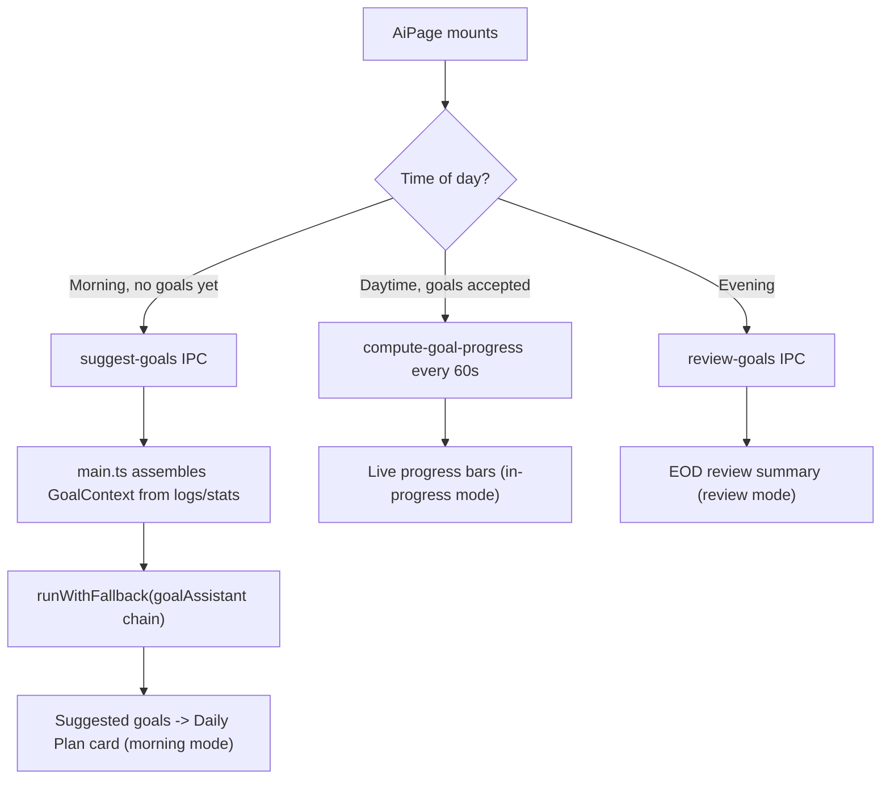
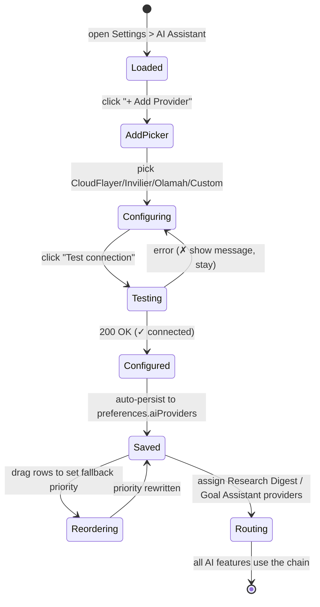
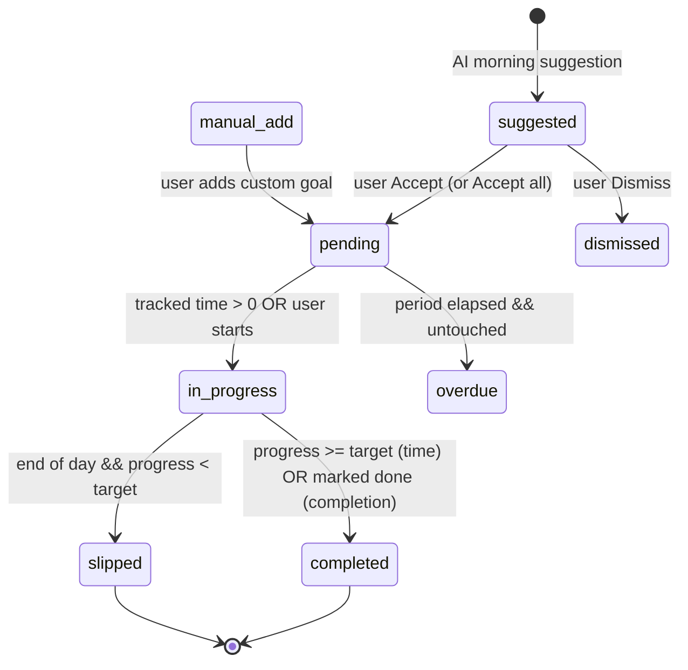
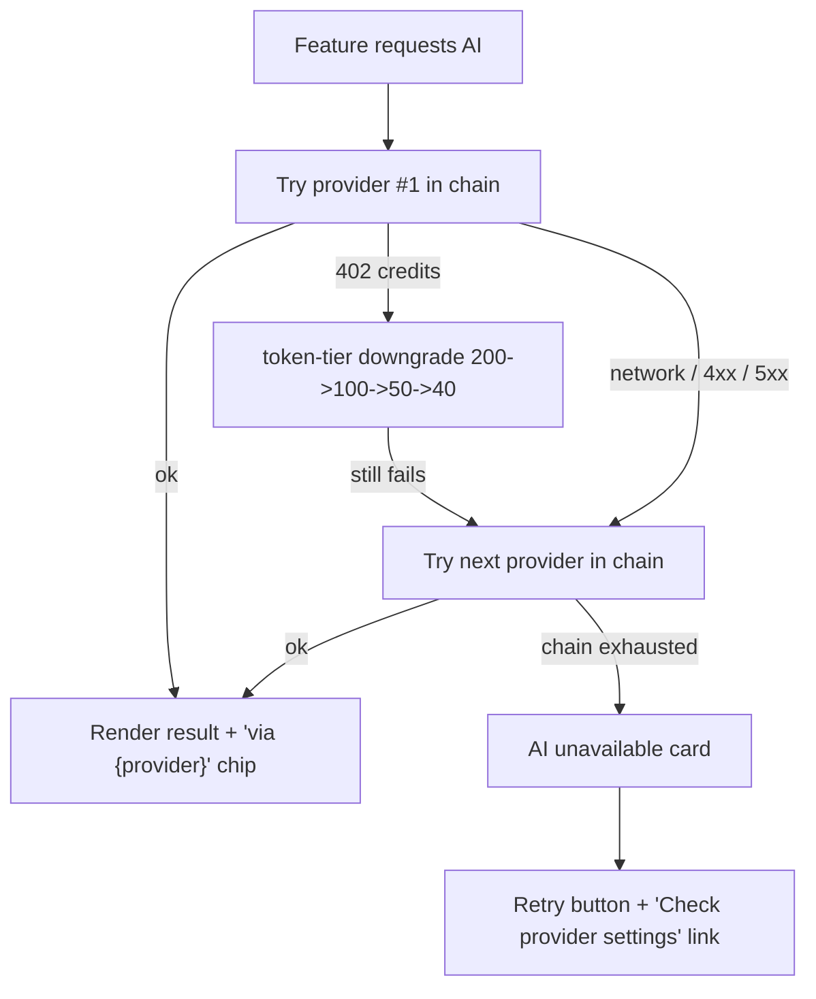

<aside>
🎯

**DeskFlow AI overhaul.** Two features: (1) a **multi-provider connector layer** that abstracts away the OpenRouter-only dependency, and (2) the star feature — an **AI-assisted Daily Goal Plan** that finally turns tracked usage data into actionable plans, progress checks, and reviews. The existing daily brief, weekly review, pattern analysis, sleep analysis, anomaly detection, and data-chat features are **removed**. Research Digest is kept and rewired through the new provider layer.

</aside>

<aside>
⚙️

**Constraints honored:** existing IPC bridge pattern (`preload.ts` → `main.ts`), no new npm deps, provider config survives restart (preferences table), goals in localStorage for v1, reuse `GlassCard`, preserve token-tier fallback (200→100→50→40), Tailwind v4 only, unused features deleted (not hidden).

</aside>

## Table of contents

---

# 1. Data Processing Pipeline

## 1.1 Provider Abstraction Layer

Today every method funnels through `callOpenRouter()` (AIService.ts:129). We replace that single function with a **connector registry** driven by configuration, not code. Adding a future provider becomes a config entry, never a new file.

### Core connector interface

**File:** `src/services/providers/types.ts` (new)

```tsx
// A provider "template" describes HOW to talk to an OpenAI-compatible endpoint.
// Concrete providers (OpenRouter, CloudFlayer, ...) are just data that fills this in.
export interface ProviderTemplate {
  id: string;                       // 'openrouter' | 'cloudflayer' | 'invilier' | 'olamah' | 'custom'
  label: string;                    // 'OpenRouter'
  defaultBaseUrl: string;           // chat-completions endpoint
  // How the API key is attached to the request.
  auth: { type: 'bearer' | 'header' | 'query'; headerName?: string; queryParam?: string };
  // Extra static headers (e.g. OpenRouter's HTTP-Referer / X-Title).
  staticHeaders?: Record<string, string>;
  // Request/response adapters let non-standard providers map to/from the canonical shape.
  buildBody?: (req: CanonicalRequest) => unknown;     // default: OpenAI chat shape
  parseResponse?: (raw: any) => CanonicalResponse;    // default: choices[0].message.content
  // Known models for the dropdown (user can still type custom).
  suggestedModels?: string[];
  docsUrl?: string;
}

export interface CanonicalRequest {
  model: string;
  systemPrompt: string;
  messages: Array<{ role: 'system' | 'user' | 'assistant'; content: string }>;
  maxTokens?: number;
  temperature?: number;
}

export interface CanonicalResponse {
  content: string;
  usage?: { prompt_tokens: number; completion_tokens: number };
}

// A configured, runnable provider = template + user credentials.
export interface ResolvedProvider {
  config: ProviderConfig;           // see 1.2
  template: ProviderTemplate;
}
```

### Built-in templates

**File:** `src/services/providers/templates.ts` (new)

```tsx
import type { ProviderTemplate } from './types';

export const PROVIDER_TEMPLATES: Record<string, ProviderTemplate> = {
  openrouter: {
    id: 'openrouter',
    label: 'OpenRouter',
    defaultBaseUrl: 'https://openrouter.ai/api/v1/chat/completions',
    auth: { type: 'bearer' },
    staticHeaders: { 'HTTP-Referer': 'https://deskflow.app', 'X-Title': 'DeskFlow' },
    suggestedModels: ['google/gemini-2.0-flash-001', 'deepseek/deepseek-chat-v3-0324'],
    docsUrl: 'https://openrouter.ai/docs',
  },
  cloudflayer: {
    id: 'cloudflayer',
    label: 'CloudFlayer',
    defaultBaseUrl: 'https://api.cloudflayer.ai/v1/chat/completions',
    auth: { type: 'bearer' },
    suggestedModels: [],
  },
  invilier: {
    id: 'invilier',
    label: 'Invilier',
    defaultBaseUrl: 'https://api.invilier.com/v1/chat/completions',
    auth: { type: 'bearer' },
    suggestedModels: [],
  },
  olamah: {
    id: 'olamah',
    label: 'Olamah',
    // Local-first runtimes typically run on localhost; user can override.
    defaultBaseUrl: 'http://localhost:11434/v1/chat/completions',
    auth: { type: 'bearer' },   // many local servers ignore auth; harmless if blank
    suggestedModels: ['llama3.1', 'qwen2.5'],
  },
  custom: {
    id: 'custom',
    label: 'Custom (OpenAI-compatible)',
    defaultBaseUrl: '',
    auth: { type: 'bearer' },
    suggestedModels: [],
  },
};
```

<aside>
💡

**Note on provider names:** "CloudFlayer", "Invilier", and "Olamah" are treated as OpenAI-compatible endpoints (the de-facto standard). If these are voice-transcription approximations of **Cloudflare (Workers AI)**, **Anthropic/other**, or **Ollama**, only the `defaultBaseUrl` and `suggestedModels` need adjusting — the architecture is identical. The `custom` template covers anything else.

</aside>

### The universal caller (replaces `callOpenRouter`)

**File:** `src/services/providers/callProvider.ts` (new)

```tsx
import { CanonicalRequest, CanonicalResponse, ResolvedProvider } from './types';

export async function callProvider(
  provider: ResolvedProvider,
  req: CanonicalRequest,
): Promise<CanonicalResponse> {
  const { config, template } = provider;
  const baseUrl = config.baseUrl || template.defaultBaseUrl;
  if (!baseUrl) throw new Error(`Provider ${config.id} has no base URL configured`);

  // --- Auth ---
  const headers: Record<string, string> = {
    'Content-Type': 'application/json',
    ...(template.staticHeaders ?? {}),
  };
  let url = baseUrl;
  if (config.apiKey) {
    if (template.auth.type === 'bearer') headers['Authorization'] = `Bearer ${config.apiKey}`;
    else if (template.auth.type === 'header') headers[template.auth.headerName!] = config.apiKey;
    else if (template.auth.type === 'query') url += `?${template.auth.queryParam}=${encodeURIComponent(config.apiKey)}`;
  }

  // --- Body (canonical OpenAI shape unless template overrides) ---
  const body = template.buildBody ? template.buildBody(req) : {
    model: req.model,
    messages: [{ role: 'system', content: req.systemPrompt }, ...req.messages],
    max_tokens: req.maxTokens ?? 500,
    temperature: req.temperature ?? 0.4,
  };

  const response = await fetch(url, { method: 'POST', headers, body: JSON.stringify(body) });
  if (!response.ok) {
    const errText = await response.text();
    // Tag the error with status so the fallback/token-tier logic can branch.
    const e = new Error(`${template.label} error ${response.status}: ${errText.slice(0, 200)}`);
    (e as any).status = response.status;
    throw e;
  }
  const raw = await response.json();
  return template.parseResponse ? template.parseResponse(raw) : {
    content: raw.choices?.[0]?.message?.content || '',
    usage: raw.usage,
  };
}
```

## 1.2 Provider Config Persistence

Stored in the existing **`preferences`** table (survives restart) under a single key `aiProviders`. The legacy `openrouterApiKey` migrates automatically on first load.

```tsx
export interface ProviderConfig {
  id: string;                 // matches a template id; unique per configured instance
  templateId: string;         // which template this is based on
  label: string;              // user-editable display name
  enabled: boolean;
  apiKey?: string;
  baseUrl?: string;           // overrides template default
  models: string[];           // user's curated model list for dropdowns
  priority: number;           // fallback order (0 = highest)
  // Per-provider token budget (see 1.6)
  monthlyTokenBudget?: number;
  tokensUsedThisMonth?: number;
  budgetResetDate?: string;   // ISO; rolls monthly
}

export interface AiProvidersState {
  providers: ProviderConfig[];
  // Per-feature routing (see 1.3). Each maps to { providerId, model } or null = global default.
  routing: {
    default: { providerId: string; model: string };
    researchDigest?: { providerId: string; model: string } | null;
    goalAssistant?: { providerId: string; model: string } | null;
  };
}
```

### Migration (runs once in main.ts on startup)

```tsx
async function migrateAiConfig() {
  const existing = await getPreference('aiProviders');
  if (existing) return;                                   // already migrated
  const legacyKey = await getPreference('openrouterApiKey');
  const legacy = await getPreference('aiConfig') ?? {};   // old briefModel etc.
  const state: AiProvidersState = {
    providers: [{
      id: 'openrouter', templateId: 'openrouter', label: 'OpenRouter',
      enabled: true, apiKey: legacyKey ?? undefined,
      models: ['google/gemini-2.0-flash-001', 'deepseek/deepseek-chat-v3-0324'],
      priority: 0,
    }],
    routing: {
      default: { providerId: 'openrouter', model: legacy.briefModel ?? 'google/gemini-2.0-flash-001' },
      researchDigest: { providerId: 'openrouter', model: legacy.digestModel ?? 'google/gemini-2.0-flash-001' },
      goalAssistant: { providerId: 'openrouter', model: 'google/gemini-2.0-flash-001' },
    },
  };
  await setPreference('aiProviders', state);
}
```

## 1.3 Provider Routing & Fallback

Each feature resolves an **ordered chain**: its assigned provider first, then all other enabled providers by ascending `priority`. The chain is tried until one succeeds.

**File:** `src/services/providers/router.ts` (new)

```tsx
export function buildChain(state: AiProvidersState, feature: 'researchDigest' | 'goalAssistant'):
    Array<{ provider: ResolvedProvider; model: string }> {
  const enabled = state.providers.filter(p => p.enabled);
  const assigned = state.routing[feature] ?? state.routing.default;
  const resolve = (id: string) => {
    const cfg = enabled.find(p => p.id === id);
    if (!cfg) return null;
    return { config: cfg, template: PROVIDER_TEMPLATES[cfg.templateId] };
  };
  const chain: Array<{ provider: ResolvedProvider; model: string }> = [];
  const primary = resolve(assigned.providerId);
  if (primary) chain.push({ provider: primary, model: assigned.model });
  // Append remaining enabled providers as fallbacks, by priority.
  enabled.sort((a, b) => a.priority - b.priority)
    .filter(p => p.id !== assigned.providerId)
    .forEach(p => chain.push({
      provider: { config: p, template: PROVIDER_TEMPLATES[p.templateId] },
      model: p.models[0] ?? assigned.model,
    }));
  return chain;
}

// Executes the chain with token-tier retry inside each provider (1.6).
export async function runWithFallback(
  chain: ReturnType<typeof buildChain>,
  req: Omit<CanonicalRequest, 'model'>,
): Promise<{ result: CanonicalResponse; usedProviderId: string }> {
  let lastErr: any;
  for (const link of chain) {
    try {
      const result = await callWithTokenTiers(link.provider, { ...req, model: link.model });
      return { result, usedProviderId: link.provider.config.id };
    } catch (err) { lastErr = err; /* try next provider */ }
  }
  throw lastErr ?? new Error('No providers available');
}
```

## 1.4 Goal Data Model

Goals live in **localStorage** for v1 under `deskflow_goals`. Shape designed so a later move to a `goals` SQLite table is a drop-in.

```tsx
export type GoalCategory = 'work' | 'personal' | 'health' | 'learning';
export type GoalPeriod = 'daily' | 'weekly' | 'monthly';
export type GoalStatus = 'suggested' | 'pending' | 'in-progress' | 'completed' | 'overdue' | 'slipped' | 'dismissed';

export interface GoalTarget {
  type: 'time' | 'completion';
  // time-based: track seconds against targetSeconds, optionally scoped to apps/categories
  targetSeconds?: number;
  matchCategory?: GoalCategory | string;     // e.g. count time in 'IDE' category
  matchApps?: string[];                      // e.g. ['Code.exe', 'cursor']
  // completion-based: simple done/not-done
  done?: boolean;
}

export interface GoalLink {
  label: string;
  url: string;                               // URL, doc path, or ticket link the AI can reference
}

export interface Goal {
  id: string;                                // uuid (crypto.randomUUID)
  title: string;
  description?: string;
  category: GoalCategory;
  target: GoalTarget;
  period: GoalPeriod;
  status: GoalStatus;
  date: string;                              // ISO day the goal belongs to (anchor for history)
  source: 'ai' | 'manual';
  links: GoalLink[];
  progressSeconds?: number;                  // computed, cached for display
  createdAt: string;
  completedAt?: string;
}

export interface GoalDay {
  date: string;                              // 'YYYY-MM-DD'
  goals: Goal[];
  reviewSummary?: string;                    // EOD AI review text
}
```

### Persistence helper

**File:** `src/services/GoalStore.ts` (new)

```tsx
const KEY = 'deskflow_goals';
export const GoalStore = {
  loadAll(): Record<string, GoalDay> {
    try { return JSON.parse(localStorage.getItem(KEY) || '{}'); } catch { return {}; }
  },
  getDay(date: string): GoalDay {
    return this.loadAll()[date] ?? { date, goals: [] };
  },
  saveDay(day: GoalDay) {
    const all = this.loadAll(); all[day.date] = day;
    localStorage.setItem(KEY, JSON.stringify(all));
  },
  history(limit = 30): GoalDay[] {
    return Object.values(this.loadAll())
      .sort((a, b) => b.date.localeCompare(a.date)).slice(0, limit);
  },
};
```

## 1.5 Goal Progress Computation (from logs/stats)

Progress is computed in the **main process** (it has DB access) and exposed via a new IPC handler. Time-based goals sum matching `logs.duration_ms` for the goal's day.

**New IPC handler** — `src/main.ts`

```tsx
ipcMain.handle('compute-goal-progress', (event, { date, goals }) => {
  // goals: minimal [{ id, target }]; returns [{ id, progressSeconds }]
  return goals.map((g) => {
    if (g.target.type !== 'time') return { id: g.id, progressSeconds: 0, done: g.target.done };
    const start = `${date}T00:00:00`, end = `${date}T23:59:59`;
    let sql = `SELECT COALESCE(SUM(duration_ms),0) AS ms FROM logs WHERE timestamp >= ? AND timestamp <= ?`;
    const params: any[] = [start, end];
    if (g.target.matchCategory) { sql += ` AND category = ?`; params.push(g.target.matchCategory); }
    if (g.target.matchApps?.length) {
      sql += ` AND (` + g.target.matchApps.map(() => `app_name LIKE ?`).join(' OR ') + `)`;
      g.target.matchApps.forEach((a) => params.push(`%${a}%`));
    }
    const row = db.prepare(sql).get(...params);
    return { id: g.id, progressSeconds: Math.round(row.ms / 1000) };
  });
});
```

**Preload bridge addition** — `src/preload.ts`

```tsx
computeGoalProgress: (params: { date: string; goals: Array<{ id: string; target: any }> }) =>
  ipcRenderer.invoke('compute-goal-progress', params),
// Provider + goal AI:
getAiProviders: () => ipcRenderer.invoke('get-ai-providers'),
saveAiProviders: (state: any) => ipcRenderer.invoke('save-ai-providers', state),
testProvider: (cfg: any) => ipcRenderer.invoke('test-provider', cfg),
suggestGoals: (params: { date: string; context: any }) => ipcRenderer.invoke('suggest-goals', params),
reviewGoals: (params: { date: string; goals: any[]; context: any }) => ipcRenderer.invoke('review-goals', params),
```

## 1.6 Token Budget per Provider + Tier Fallback

The existing `tokenTiers = [200, 100, 50, 40]` retry is **preserved** and now lives per-provider. A budget guard runs before each call.

```tsx
export async function callWithTokenTiers(
  provider: ResolvedProvider, req: CanonicalRequest,
): Promise<CanonicalResponse> {
  const cfg = provider.config;
  // Budget guard: skip provider if monthly budget exhausted -> caller falls back.
  if (cfg.monthlyTokenBudget && (cfg.tokensUsedThisMonth ?? 0) >= cfg.monthlyTokenBudget) {
    const e = new Error(`Budget exhausted for ${cfg.label}`); (e as any).status = 402; throw e;
  }
  const tiers = [req.maxTokens ?? 200, 100, 50, 40];
  let lastErr: any;
  for (const maxTokens of tiers) {
    try {
      const res = await callProvider(provider, { ...req, maxTokens });
      // Accrue usage for budget tracking (persisted by caller).
      const used = (res.usage?.prompt_tokens ?? 0) + (res.usage?.completion_tokens ?? 0);
      cfg.tokensUsedThisMonth = (cfg.tokensUsedThisMonth ?? 0) + used;
      return res;
    } catch (err: any) {
      lastErr = err;
      if (err.status !== 402) throw err;   // only 402 (credits) triggers tier downgrade
    }
  }
  throw lastErr;
}
```

## 1.7 AI Goal Assistant Pipeline

Three calls, each grounded in **real tracked data** assembled in the main process. Every prompt mandates citing actual numbers.

### Context assembled for each call (main.ts)

```tsx
interface GoalContext {
  today: string;
  // From stats_daily + logs:
  yesterday: { productiveSec: number; distractingSec: number; topApps: Array<{ app: string; sec: number }> };
  last7dByCategory: Record<string, number>;          // seconds per category
  unfinished: Array<{ title: string; category: string }>;  // yesterday's non-completed goals
  recurringPatterns: Array<{ category: string; avgDailySec: number; typicalHours: number[] }>;
  statedPriorities: string[];                        // user interest topics / pinned goals
  links: GoalLink[];                                 // links attached to carried-over goals
}
```

### Morning suggestion prompt

```tsx
const GOAL_SUGGEST_SYSTEM = `You are DeskFlow's goal planning assistant. Using ONLY the provided tracking data, suggest 2-3 prioritized daily goals.

RULES:
- Every goal MUST reference a real number from the data (e.g. "You averaged 2.4h/day in IDE last week").
- Prefer carrying over unfinished work and reinforcing positive recurring patterns.
- Mix target types: at least one time-based (with targetSeconds) and consider one completion-based.
- Keep titles under 60 chars. NEVER invent data not present in the input.
- If the user has linked resources, reference them in the relevant goal.

Return ONLY valid JSON:
{
  "goals": [{
    "title": string,
    "description": string,            // must cite a real metric
    "category": "work"|"personal"|"health"|"learning",
    "target": { "type": "time"|"completion", "targetSeconds"?: number, "matchCategory"?: string },
    "period": "daily",
    "rationale": string               // which data point drove this
  }]
}`;
```

### Progress check (lightweight, mostly local)

Progress bars are computed locally via `compute-goal-progress` (1.5) every ~60s and on window focus — **no AI call needed** for the numbers. An optional AI "nudge" line is generated only on demand:

```tsx
const GOAL_NUDGE_SYSTEM = `Given a goal and its current tracked progress, write ONE short encouraging or corrective sentence. Reference the exact numbers. No fluff. Max 120 chars.`;
// Example input -> output:
// {goal:"3h coding", progressSec:5400} -> "1.5h of 3h coding done — halfway there, keep the momentum."
```

### End-of-day review prompt

```tsx
const GOAL_REVIEW_SYSTEM = `You are DeskFlow's end-of-day reviewer. Using ONLY the provided goals + tracked data, summarize the day.

RULES:
- State what was ACCOMPLISHED (completed goals + actual tracked time).
- State what SLIPPED and by how much (e.g. "Coding: 1.8h of 3h target").
- Identify ONE pattern from the data worth noting tomorrow.
- Cite real numbers for every claim. Be concise and non-judgmental.

Return ONLY valid JSON:
{ "accomplished": string[], "slipped": string[], "pattern": string, "summary": string }`;
```

### Goal assistant data flow



---

# 2. Visual Specifications

All components reuse `GlassCard` (`bg-zinc-900/60 backdrop-blur-xl border border-zinc-800/50 rounded-2xl p-5`) and the amber accent system. Framer-motion entrances mirror the existing staggered pattern.

## 2.1 Simplified AiPage component tree

```
AiPage  (space-y-5)
├─ ProviderBanner          // only if zero enabled providers -> setup CTA
├─ DailyPlanCard           // PRIMARY, full width (col-span-3)
│   ├─ morning mode  -> SuggestedGoalList
│   ├─ inprogress mode -> ActiveGoalList (progress bars)
│   └─ review mode   -> GoalReviewSummary
├─ TopicDigestCard         // KEPT, rewired through provider layer (col-span-3)
└─ GoalHistoryCard         // past days/weeks (col-span-3)
```

<aside>
🗑️

**Deleted from AiPage and codebase:** `AiBriefCard`, `WeeklyReviewCard`, `PatternCard`, `SleepCard`, the inline Anomaly banner/Activity Alerts, and the Ask-Your-Stats chat. Remove their imports, the IPC handlers (`get-ai-brief`, `regenerate-ai-brief`, `check-anomalies`, `analyze-patterns`, `analyze-sleep`, `data-chat-query`), the corresponding `AIService` methods, and their system prompts.

</aside>

## 2.2 Daily Plan card — shared shell

```tsx
<motion.div initial= opacity: 0, y: 12  animate= opacity: 1, y: 0  transition= duration: 0.3 >
  <GlassCard className="col-span-3">
    {/* Header */}
    <div className="flex items-center justify-between mb-4">
      <div className="flex items-center gap-2">
        <span className="text-base font-semibold text-white">Daily Plan</span>
        <span className="text-xs text-zinc-500">{todayLabel}</span>
      </div>
      <div className="flex items-center gap-2">
        {usedProviderId && (
          <span className="text-[11px] px-2 py-0.5 rounded-full bg-zinc-800 text-zinc-400">
            via {usedProviderLabel}
          </span>
        )}
        <button className="text-xs font-medium px-3 py-1.5 rounded-lg bg-zinc-800 hover:bg-zinc-700 text-white transition-colors">
          + Add Goal
        </button>
      </div>
    </div>
    {/* Mode-specific body renders here */}
  </GlassCard>
</motion.div>
```

### Morning mode — suggested goal row

```tsx
<div className="space-y-3">
  {suggestions.map((g, i) => (
    <motion.div key={g.id}
      initial= opacity: 0, x: -8  animate= opacity: 1, x: 0  transition= delay: i * 0.05 
      className="flex items-start gap-3 p-3 rounded-xl bg-zinc-800/40 border border-zinc-800/60">
      <div className="mt-0.5 h-8 w-8 shrink-0 rounded-lg bg-amber-400/10 flex items-center justify-center">
        <span className="text-amber-400 text-sm">{categoryIcon(g.category)}</span>
      </div>
      <div className="flex-1 min-w-0">
        <p className="text-sm font-medium text-white">{g.title}</p>
        <p className="text-xs text-zinc-400 mt-0.5">{g.description}</p>
      </div>
      <div className="flex items-center gap-1.5">
        <button className="text-xs px-2.5 py-1 rounded-lg bg-amber-400 text-[#0a0a0a] font-medium hover:bg-amber-300 transition-colors">Accept</button>
        <button className="text-xs px-2.5 py-1 rounded-lg bg-zinc-800 hover:bg-zinc-700 text-zinc-300 transition-colors">Edit</button>
        <button className="text-xs px-2 py-1 rounded-lg text-zinc-500 hover:text-zinc-300 transition-colors">×</button>
      </div>
    </motion.div>
  ))}
  <div className="flex items-center justify-between pt-1">
    <button className="text-xs text-zinc-500 hover:text-zinc-300">Dismiss all</button>
    <button className="text-sm font-medium px-4 py-2 rounded-lg bg-amber-400 text-[#0a0a0a] hover:bg-amber-300 transition-colors">Accept all</button>
  </div>
</div>
```

### In-progress mode — active goal with progress bar

```tsx
<div className="space-y-4">
  {activeGoals.map((g) => {
    const pct = Math.min(100, Math.round((g.progressSeconds! / g.target.targetSeconds!) * 100));
    return (
      <div key={g.id} className="space-y-1.5">
        <div className="flex items-center justify-between">
          <span className="text-sm text-white">{g.title}</span>
          <span className="text-xs text-zinc-400">{fmt(g.progressSeconds!)} / {fmt(g.target.targetSeconds!)}</span>
        </div>
        <div className="h-2 w-full rounded-full bg-zinc-800 overflow-hidden">
          <motion.div className={pct >= 100 ? 'h-full rounded-full bg-emerald-400' : 'h-full rounded-full bg-amber-400'}
            initial= width: 0  animate={{ width: `${pct}%` }} transition= duration: 0.5, ease: 'easeOut'  />
        </div>
        <div className="flex items-center justify-between">
          <StatusBadge status={g.status} />
          {g.links.length > 0 && (
            <button className="text-[11px] text-amber-400/80 hover:text-amber-300">{g.links.length} link(s)</button>
          )}
        </div>
      </div>
    );
  })}
</div>
```

### Review mode — EOD summary

```tsx
<div className="space-y-4">
  <p className="text-sm text-zinc-300 leading-relaxed">{review.summary}</p>
  <div className="grid grid-cols-2 gap-3">
    <div className="p-3 rounded-xl bg-emerald-400/5 border border-emerald-400/20">
      <p className="text-xs font-medium text-emerald-400 mb-1.5">Accomplished</p>
      <ul className="space-y-1">{review.accomplished.map((t,i)=>(<li key={i} className="text-xs text-zinc-300">✓ {t}</li>))}</ul>
    </div>
    <div className="p-3 rounded-xl bg-amber-400/5 border border-amber-400/20">
      <p className="text-xs font-medium text-amber-400 mb-1.5">Slipped</p>
      <ul className="space-y-1">{review.slipped.map((t,i)=>(<li key={i} className="text-xs text-zinc-300">→ {t}</li>))}</ul>
    </div>
  </div>
  <div className="p-3 rounded-xl bg-zinc-800/40 border border-zinc-800/60">
    <p className="text-[11px] uppercase tracking-wide text-zinc-500 mb-1">Pattern</p>
    <p className="text-xs text-zinc-300">{review.pattern}</p>
  </div>
</div>
```

## 2.3 Status badge

```tsx
const BADGE: Record<string, string> = {
  'in-progress': 'bg-amber-400/10 text-amber-400',
  'completed':   'bg-emerald-400/10 text-emerald-400',
  'overdue':     'bg-red-400/10 text-red-400',
  'slipped':     'bg-zinc-700/60 text-zinc-400',
  'pending':     'bg-zinc-700/60 text-zinc-400',
};
// <span className={`text-[11px] px-2 py-0.5 rounded-full ${BADGE[status]}`}>{label}</span>
```

## 2.4 Goal History card

```tsx
<GlassCard className="col-span-3">
  <p className="text-base font-semibold text-white mb-4">Goal History</p>
  <div className="space-y-2">
    {history.map((day) => (
      <div key={day.date} className="flex items-center justify-between p-3 rounded-xl bg-zinc-800/30 hover:bg-zinc-800/50 transition-colors cursor-pointer">
        <span className="text-sm text-zinc-300">{prettyDate(day.date)}</span>
        <div className="flex items-center gap-3">
          <span className="text-xs text-emerald-400">{day.goals.filter(g=>g.status==='completed').length} done</span>
          <span className="text-xs text-zinc-500">{day.goals.length} total</span>
          <div className="h-1.5 w-24 rounded-full bg-zinc-800 overflow-hidden">
            <div className="h-full bg-amber-400" style={{ width: `${completionPct(day)}%` }} />
          </div>
        </div>
      </div>
    ))}
  </div>
</GlassCard>
```

## 2.5 Provider Settings UI (Settings › AI Assistant)

Replaces the single API-key block (SettingsPage.tsx:2838-3054).

```
AI Assistant section
├─ Header row: "AI Providers" + [+ Add Provider]
├─ Provider list (drag-to-reorder)
│   └─ ProviderRow (per provider)
│       ├─ drag handle + status dot + label + enabled toggle
│       └─ expanded: API key / base URL / model list / [Test] / [Remove]
├─ Feature routing
│   ├─ "Research Digest uses"  [provider ▾][model ▾]
│   └─ "Goal Assistant uses"   [provider ▾][model ▾]
└─ Usage stats (per provider tokens + budget bar)
```

### Provider row

```tsx
<div className="rounded-2xl bg-zinc-900/60 border border-zinc-800/50 backdrop-blur-xl">
  <div className="flex items-center gap-3 p-4">
    <span className="cursor-grab text-zinc-600 hover:text-zinc-400" aria-label="Drag to reorder">≡</span>
    <span className={`h-2 w-2 rounded-full ${statusDot}`} />  {/* emerald=connected, red=error, zinc=disconnected */}
    <span className="text-sm font-medium text-white flex-1">{p.label}</span>
    <span className="text-[11px] text-zinc-500">priority {p.priority}</span>
    {/* enabled toggle */}
    <button className={`relative h-5 w-9 rounded-full transition-colors ${p.enabled ? 'bg-amber-400' : 'bg-zinc-700'}`}>
      <span className={`absolute top-0.5 h-4 w-4 rounded-full bg-white transition-all ${p.enabled ? 'left-[18px]' : 'left-0.5'}`} />
    </button>
    <button className="text-zinc-500 hover:text-white text-xs">{expanded ? 'Hide' : 'Edit'}</button>
  </div>
  {expanded && (
    <div className="px-4 pb-4 space-y-3 border-t border-zinc-800/50 pt-3">
      <label className="block">
        <span className="text-xs text-zinc-400">API Key</span>
        <input type="password" className="mt-1 w-full px-3 py-2 rounded-lg bg-zinc-800 border border-zinc-700 text-sm text-white placeholder-zinc-500 focus:border-amber-400 focus:outline-none" placeholder="sk-..." />
      </label>
      <label className="block">
        <span className="text-xs text-zinc-400">Endpoint URL</span>
        <input type="text" className="mt-1 w-full px-3 py-2 rounded-lg bg-zinc-800 border border-zinc-700 text-sm text-white placeholder-zinc-500 focus:border-amber-400 focus:outline-none" placeholder={template.defaultBaseUrl} />
      </label>
      <label className="block">
        <span className="text-xs text-zinc-400">Models (comma-separated)</span>
        <input type="text" className="mt-1 w-full px-3 py-2 rounded-lg bg-zinc-800 border border-zinc-700 text-sm text-white focus:border-amber-400 focus:outline-none" />
      </label>
      <div className="flex items-center justify-between">
        <button className="text-xs px-3 py-1.5 rounded-lg bg-zinc-800 hover:bg-zinc-700 text-white">Test connection</button>
        <button className="text-xs text-red-400/80 hover:text-red-400">Remove</button>
      </div>
      {testState && <TestResult state={testState} />}  {/* spinner / ✓ connected / ✗ error msg */}
    </div>
  )}
</div>
```

### Add Provider modal

```tsx
<div className="fixed inset-0 bg-black/60 backdrop-blur-sm flex items-center justify-center z-50">
  <motion.div initial= scale: 0.96, opacity: 0  animate= scale: 1, opacity: 1 
    className="w-[440px] rounded-2xl bg-zinc-900 border border-zinc-800 p-6">
    <p className="text-base font-semibold text-white mb-4">Add Provider</p>
    <div className="grid grid-cols-2 gap-3">
      {['cloudflayer','invilier','olamah','custom'].map(id => (
        <button key={id} className="p-4 rounded-xl bg-zinc-800/50 border border-zinc-800 hover:border-amber-400/50 text-left transition-colors">
          <p className="text-sm font-medium text-white">{PROVIDER_TEMPLATES[id].label}</p>
          <p className="text-[11px] text-zinc-500 mt-1 truncate">{PROVIDER_TEMPLATES[id].defaultBaseUrl || 'Custom endpoint'}</p>
        </button>
      ))}
    </div>
  </motion.div>
</div>
```

### Per-provider usage / budget bar

```tsx
<div className="flex items-center gap-2">
  <span className="text-xs text-zinc-400 w-24 truncate">{p.label}</span>
  <div className="flex-1 h-1.5 rounded-full bg-zinc-800 overflow-hidden">
    <div className={budgetPct > 90 ? 'h-full bg-red-400' : 'h-full bg-amber-400'} style={{ width: `${budgetPct}%` }} />
  </div>
  <span className="text-[11px] text-zinc-500">{tokensUsed} / {budget || '∞'}</span>
</div>
```

## 2.6 Drag-to-reorder without new deps

Use the native HTML5 drag API (`draggable`, `onDragStart`, `onDragOver`, `onDrop`) on `ProviderRow` to reorder and rewrite `priority`. No `dnd-kit`/`react-beautiful-dnd` dependency needed.

---

# 3. Interaction & UX Flow

## 3.1 Provider configuration flow



**Test connection** sends a 1-token ping (`messages:[{role:'user',content:'ping'}], maxTokens:1`) through `test-provider`. Result: green dot + "Connected" or red dot + truncated error.

## 3.2 Goal lifecycle state machine



- **Auto-transition to completed:** when `compute-goal-progress` returns `progressSeconds >= targetSeconds`, status flips to `completed` and the bar turns emerald with a brief scale pulse.
- **EOD rollover (local midnight, user TZ):** any `pending`/`in-progress` time goal under target becomes `slipped`; unfinished items are offered as carry-overs in the next morning's `GoalContext.unfinished`.

## 3.3 Daily Plan card mode selection

```
if (no enabled providers)        -> ProviderBanner setup CTA (card hidden)
else if (todaysGoals.length===0) -> morning mode (auto-fetch suggestions once; cache to avoid re-spend)
else if (now >= 20:00 local)     -> review mode (fetch EOD review once, cache)
else                             -> in-progress mode
```

Morning suggestions auto-fetch **only once per day** (guarded by a `goalSuggestFetched_<date>` localStorage flag) to respect token budgets. Manual refresh is available but warns it costs tokens.

## 3.4 Empty states

| Condition | UI |
| --- | --- |
| No providers configured | Full-width `GlassCard`: "Connect an AI provider to enable goals & digest." + **Open Settings** button (`bg-amber-400 text-[#0a0a0a]`). All AI cards suppressed. |
| Providers OK, no goals | Daily Plan card shows centered: "Set your first goal" + **Suggest goals** (AI) and **Add manually** buttons. |
| Research digest, no topics | TopicDigestCard: "Add interest topics in Settings to get a digest." |

## 3.5 Error & fallback handling



- **Single provider fail → fallback used:** result renders normally plus a subtle `via {ProviderLabel}` chip so the user knows a fallback ran.
- **All providers fail:** replace card body with `text-red-400` message, a **Retry** button, and a link routing to Settings › AI Assistant. Tracking/goal *data* is never blocked — progress bars keep computing locally from logs even when AI is down.
- **Budget exhausted:** that provider is skipped (treated as 402) and the chain continues; its settings row shows a red budget bar.

## 3.6 Research Digest rewiring

`TopicDigestCard` keeps its UI. Its handler (`get-topic-digest`) is changed to call `runWithFallback(buildChain(state, 'researchDigest'), {...})` instead of `callOpenRouter`. The `TOPIC_DIGEST_SYSTEM` prompt is unchanged. Topics still come from the existing Interest Topics setting.

## 3.7 Removal checklist (cleanup)

- [ ]  Delete components: `AiBriefCard.tsx`, `WeeklyReviewCard.tsx`, `PatternCard.tsx`, `SleepCard.tsx`.
- [ ]  Remove from `AiPage.tsx`: anomaly banner, activity alerts, data-chat block, and their state/handlers.
- [ ]  Delete `AIService` methods: `generateDailyBrief`, `generateWeeklyReview`, `analyzePatterns`, `analyzeSleep`, `dataChatQuery`, `checkAnomalies` + their prompts (`DAILY_BRIEF_PROMPT`, `WEEKLY_REVIEW_SYSTEM`, `ANOMALY_SYSTEM`, `PATTERN_ANALYSIS_SYSTEM`, `SLEEP_ANALYSIS_SYSTEM`).
- [ ]  Remove IPC channels (preload + main): `get-ai-brief`, `regenerate-ai-brief`, `check-anomalies`, `analyze-patterns`, `analyze-sleep`, `data-chat-query`, and the legacy `save-ai-config`/`get-ai-config` once migration runs.
- [ ]  Keep: `get-topic-digest` (rewired), `generateTopicDigest` + `TOPIC_DIGEST_SYSTEM`, `testOpenRouterKey` (generalize to `test-provider`).
- [ ]  Add IPC: `get-ai-providers`, `save-ai-providers`, `test-provider`, `compute-goal-progress`, `suggest-goals`, `review-goals`.

---

<aside>
✅

**Requirements coverage:** provider interface + 5 implementations ✓ · config persistence + migration ✓ · per-feature routing + fallback ✓ · goal data model + localStorage v1 ✓ · morning/progress/EOD pipeline grounded in real data ✓ · progress computation from logs ✓ · per-provider token budgets ✓ · token-tier 200→100→50→40 preserved ✓ · provider + goal + history UI with exact Tailwind ✓ · all flows, empty + error states ✓ · unused features removed from code ✓.

</aside>