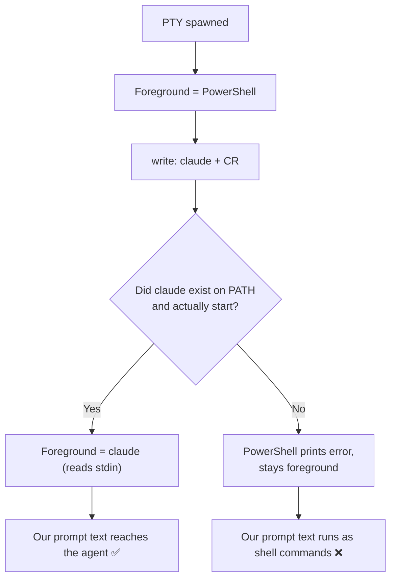
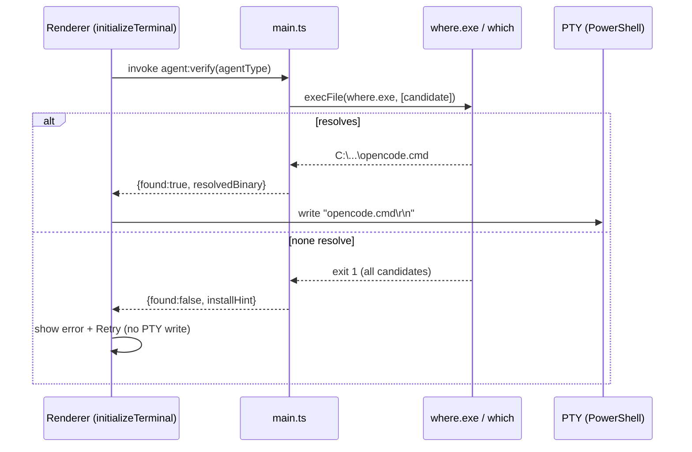
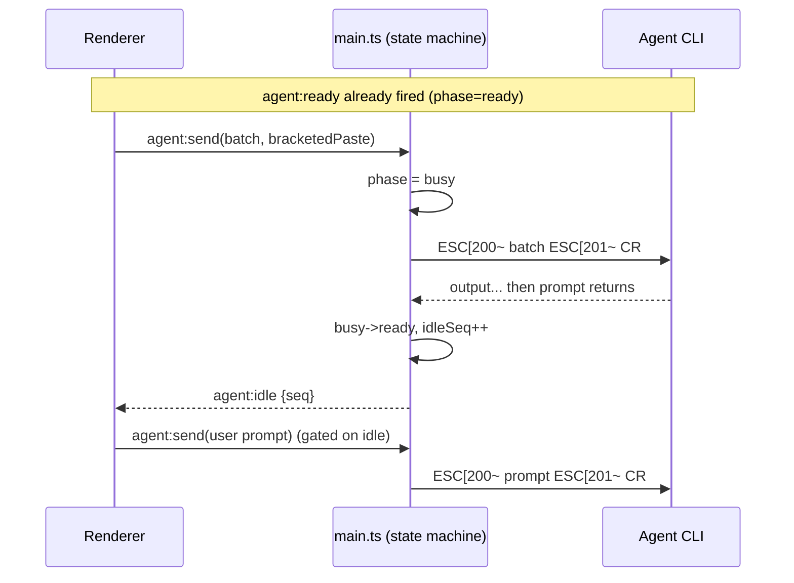
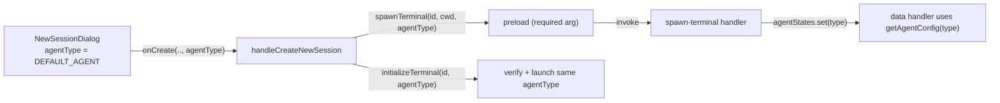
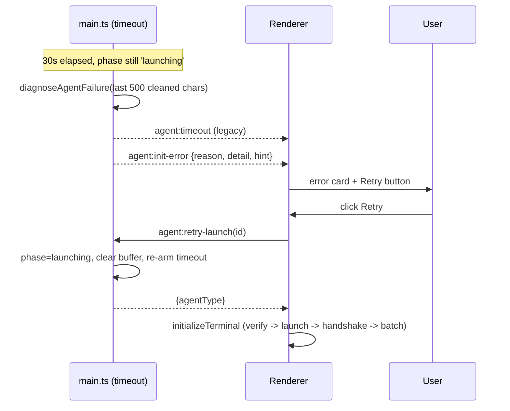

I'll start by reading the computer module documentation, then load the context bundle that's the source of truth for this task.

I need to read the source-of-truth context bundle first. Let me upload it to the sandbox and read it.

Now let me read the source-of-truth context bundle.

I have everything I need from the source-of-truth bundle. No searching required — this is a design task. I'll write the comprehensive solution as a Notion page (the natural home for a spec this size with code, diagrams, and tables).

Foundation is in place. Now I'll append Parts A–E. These all edit the same page, so I'll do them sequentially. Starting with Parts A & B.

Parts A & B are in. Continuing with Part C (write sequencing) and Part D (agentType consistency).

Now Part E plus the cross-cutting IPC summary and build checklist to complete the spec.

The full design spec is complete. Here's the comprehensive solution.

I designed a single, opinionated solution (no A/B/C options) covering all five parts, plus a **shared foundation** the whole fix depends on.

**Shared foundation (build first)**

- `AGENT_CONFIGS` table — per-agent binary candidates, ready regex, and install hints (adding a new agent = one table entry).
- `stripAnsi()` + `SHELL_PROMPT_REGEXES` — clean the buffer and explicitly *reject* shell prompts so PowerShell/bash can never masquerade as an agent.
- A per-terminal **state machine** (`launching → ready → busy`) — the key to "wait for each prompt": `agent:ready` fires once, and a new `agent:idle` event re-fires on every later prompt return.

**Per part**

- **A — Launch verification:** out-of-band `where.exe`/`which` check via `child_process` (never touches the PTY), tries candidates in order, writes the *resolved* binary, and emits structured `agent:init-error` instead of typing a doomed command into the shell.
- **B — Ready detection:** two-signal model — widened per-agent regex on the ANSI-stripped buffer (matches `>`, `opencode>`, `claude>`; excludes shell prompts) **plus** an authoritative echo-token handshake that works for any CLI.
- **C — Write sequencing:** all init content concatenated into one **bracketed-paste** write (embedded newlines stay literal, only a single `\r` submits), and every subsequent send gated on `agent:idle` via a `sendWhenIdle` helper — which also handles the already-running terminal case.
- **D — agentType consistency:** required 3rd param on `spawnTerminal`, shared `DEFAULT_AGENT` constant for dialog + main, hardcoded `'claude'` removed, detection **default on** with a fallback regex.
- **E — Error recovery:** timeout handler diagnoses the last 500 cleaned chars (`not-recognized` / `dropped-to-shell` / `silent-timeout`), emits `agent:init-error` (legacy `agent:timeout` preserved), and a **Retry** re-launches in place without re-spawning.

Each part includes a design spec, exact per-file code changes, a Mermaid data-flow diagram (success + failure), and an error-state table. The page closes with a full **IPC channel summary** (all existing channels preserved, 7 new ones added), an end-to-end happy-path sequence, and a `npm run build` verification checklist.

One note on your stated requirements: the prompt lists `$`  under "regex widening," but since a bare `$` is the bash/zsh shell prompt, I deliberately route it through the shell-exclusion set so it never falsely triggers `agent:ready` — consistent with the very next bullet about `user@host:~$`.

<aside>
🎯

**Goal:** Guarantee that text written to a PTY's stdin always reaches the *agent CLI* (opencode/claude), never the shell — regardless of timing, agent type, or startup duration. Windows/PowerShell is the primary platform.

</aside>

## Root cause, in one picture

The PTY has exactly one foreground process at a time. After spawn, that process is **PowerShell**. We write `claude\r\n` and *hope* `claude` takes over before our next write. Every bug below is a variation of "we wrote to stdin while the shell — not the agent — was the foreground process."



The fix has a **shared foundation** (config + ANSI-clean detector + a small state machine) that all five parts build on.

---

## Shared foundation (build this first)

### F1. Per-agent config table — `src/main.ts` (new, near `detectAgentPrompt`)

Single source of truth for binary candidates, ready regex, shell-exclusion regex, and install hints. Future agents = one new entry.

```tsx
// main.ts
export interface AgentConfig {
	binaryCandidates: string[];   // tried in order on PATH
	readyRegex: RegExp;           // matches THIS agent's prompt on a cleaned line
	installHint: string;          // shown in UI when not found
}

export const DEFAULT_AGENT = 'opencode'; // single canonical default (Part D)

export const AGENT_CONFIGS: Record<string, AgentConfig> = {
	opencode: {
		binaryCandidates: ['opencode', 'opencode.cmd', 'opencode.exe'],
		readyRegex: /^(?:opencode)?\s*>\s*$/i,
		installHint: 'Install with: npm i -g opencode-ai  (then restart the app)',
	},
	claude: {
		binaryCandidates: ['claude', 'claude.cmd', 'claude.exe'],
		readyRegex: /^(?:claude)?\s*>\s*$/i,
		installHint: 'Install with: npm i -g @anthropic-ai/claude-code  (then restart the app)',
	},
};

// Used when an unknown/empty agentType is passed (detection is DEFAULT ON).
export const FALLBACK_READY_REGEX = /^[A-Za-z0-9_-]*\s*>\s*$/;

export function getAgentConfig(agentType?: string): AgentConfig {
	return AGENT_CONFIGS[agentType ?? ''] ?? {
		binaryCandidates: agentType ? [agentType] : [],
		readyRegex: FALLBACK_READY_REGEX,
		installHint: `Could not find '${agentType}' on PATH.`,
	};
}
```

### F2. ANSI stripping + shell exclusion — `src/main.ts`

The detector must never see raw escape codes, and must explicitly *reject* shell prompts so a bash/PowerShell prompt can never masquerade as an agent.

```tsx
// main.ts
// Removes CSI, OSC, and single-char escape sequences.
export function stripAnsi(s: string): string {
	return s
		.replace(/\x1b\][^\x07\x1b]*(?:\x07|\x1b\\)/g, '') // OSC ... BEL / ST
		.replace(/\x1b[@-Z\\-_]/g, '')                      // 2-char escapes
		.replace(/\x1b\[[0-9;?]*[ -/]*[@-~]/g, '')          // CSI sequences
		.replace(/[\x00-\x08\x0b\x0c\x0e-\x1f]/g, '');       // stray control chars
}

// Lines that look like a SHELL prompt — these must NOT trigger agent:ready.
export const SHELL_PROMPT_REGEXES: RegExp[] = [
	/^PS\s+.*>\s*$/,                       // PowerShell:  PS C:\Users\me>
	/^[A-Za-z]:\\.*>\s*$/,                  // cmd.exe:     C:\Users\me>
	/^[^@\s]+@[^:\s]+:.*[#$]\s*$/,          // bash/zsh:    user@host:~$
];

export function looksLikeShell(line: string): boolean {
	return SHELL_PROMPT_REGEXES.some((re) => re.test(line));
}
```

### F3. Rewritten detector — replaces `detectAgentPrompt` (main.ts:6221-6230)

```tsx
// main.ts — replaces the old detectAgentPrompt
export function detectAgentPrompt(buffer: string, agentType?: string): boolean {
	const clean = stripAnsi(buffer);
	const lines = clean.split(/\r?\n/);
	for (let i = lines.length - 1; i >= 0; i--) {
		const trimmed = lines[i].trim();
		if (trimmed.length === 0) continue;
		if (looksLikeShell(trimmed)) return false;   // shell, not agent
		return getAgentConfig(agentType).readyRegex.test(trimmed);
	}
	return false;
}
```

### F4. Per-terminal agent state machine — `src/main.ts`

This is what lets us "wait for each prompt" (Part C). `agent:ready` fires once on first readiness; `agent:idle` re-fires every time the prompt returns after the agent was busy.

```tsx
// main.ts
type AgentPhase = 'launching' | 'ready' | 'busy';
interface AgentState {
	agentType: string;
	phase: AgentPhase;
	dataBuffer: string;
	idleSeq: number;        // increments on each busy->ready transition
	timeoutHandle?: NodeJS.Timeout;
}
const agentStates = new Map<string, AgentState>();
```

---

## Part A — Agent Launch Verification

### A1. Design specification

Before we ever write `<agent>\r\n` to the PTY, we verify the binary resolves on PATH using an **out-of-band** child process (NOT the PTY — so the check can never pollute the terminal stdin). We try each candidate in `binaryCandidates` order and use the first hit as the *resolved binary name*. If none resolve, we emit a structured `agent:init-error` and never write a launch command — the shell stays clean and the UI shows install instructions + Retry.

- **Triggers:** called by the renderer at the start of `initializeTerminal`, and again by the Retry button (Part E).
- **Platform:** `where.exe <name>` on Windows, `which <name>` on POSIX.
- **Out-of-band:** uses `child_process.execFile`, completely separate from `terminalManager` / node-pty (satisfies “don't change the spawn mechanism”).

### A2. Implementation details

**New IPC channel:** `agent:verify` (renderer→main, invoke/return).

```tsx
// main.ts — new function
import { execFile } from 'node:child_process';

export interface AgentVerifyResult {
	found: boolean;
	resolvedBinary?: string;  // first candidate that resolved
	resolvedPath?: string;    // absolute path from where/which
	tried: string[];
	installHint: string;
}

function whichOne(name: string): Promise<string | null> {
	const cmd = process.platform === 'win32' ? 'where.exe' : 'which';
	return new Promise((resolve) => {
		execFile(cmd, [name], { timeout: 4000, windowsHide: true }, (err, stdout) => {
			if (err) return resolve(null);
			const first = stdout.split(/\r?\n/).map((l) => l.trim()).find(Boolean);
			resolve(first ?? null);
		});
	});
}

export async function verifyAgent(agentType: string): Promise<AgentVerifyResult> {
	const cfg = getAgentConfig(agentType);
	const tried = cfg.binaryCandidates.length ? cfg.binaryCandidates : [agentType];
	for (const cand of tried) {
		const resolvedPath = await whichOne(cand);
		if (resolvedPath) {
			return { found: true, resolvedBinary: cand, resolvedPath, tried, installHint: cfg.installHint };
		}
	}
	return { found: false, tried, installHint: cfg.installHint };
}

ipcMain.handle('agent:verify', async (_e, agentType: string) => verifyAgent(agentType));
```

**Preload bridge — `src/preload.ts`** (new, mirrors existing invoke pattern):

```tsx
verifyAgent: (agentType: string): Promise<AgentVerifyResult> =>
	ipcRenderer.invoke('agent:verify', agentType),
```

**Renderer — `TerminalPage.tsx` `initializeTerminal`:** insert verification *before* step 2 (the launch write). Write the **resolved binary name**, not the raw agentType:

```tsx
// after terminal:ready, before writing launch command
const verify = await window.deskflowAPI?.verifyAgent?.(agent);
if (!verify?.found) {
	// Do NOT write anything to the PTY. Surface a structured error.
	setAgentError(terminalId, {
		reason: 'not-found',
		detail: `'${agent}' was not found on PATH. Tried: ${verify?.tried?.join(', ')}`,
		hint: verify?.installHint,
	});
	return; // abort init; Retry re-enters here
}
const launchBinary = verify.resolvedBinary!;     // e.g. 'opencode.cmd'
const launchCommand = resumeId ? `${launchBinary} --resume ${resumeId}${NL}` : `${launchBinary}${NL}`;
```

### A3. Data flow



### A4. Error states

| Failure mode | System response |
| --- | --- |
| No candidate on PATH | `agent:init-error` (reason `not-found`) + install hint in UI; nothing written to PTY |
| `where.exe` itself times out (4s) | Treated as not-found for that candidate; falls through to next / final not-found |
| Binary resolves but is a stale/broken shim | Verification passes; caught later by Part E init-error (shell prompt / error text after launch) |
| Unknown agentType (no config) | `getAgentConfig` fallback tries the raw name as the only candidate; fallback regex used |

---

## Part B — Agent Ready Detection

### B1. Design specification

Readiness uses a **two-signal** model, both built on the cleaned buffer from the shared foundation (F2/F3):

1. **Prompt regex (per-agent, ANSI-stripped, shell-excluded)** — fast path that matches `>`, `opencode>`, `claude>`, etc., and explicitly rejects shell prompts (`PS C:\>`, `user@host:~$`).
2. **Echo handshake (authoritative, agent-agnostic)** — after launch, the app writes a unique sentinel line; readiness is *confirmed* when that exact token appears in cleaned output **and** the line is not a shell prompt. This works for any CLI regardless of prompt format and removes false positives from decorative output.

The handshake is the source of truth; the regex is an accelerator that lets us fire quickly and gate the handshake. `agent:ready` fires once (first confirmation); `agent:idle` (Part C) re-fires on every subsequent prompt return.

### B2. Implementation details

**Rewire the `spawn-terminal` data handler (main.ts:6625-6715)** to use the state machine and the new detector. Detection is **default on** (Part D) — no `agentType &&` guard.

```tsx
// main.ts — inside terminalManager.getDataHandler(id, function (data) { ... })
const st = agentStates.get(id)!;
st.dataBuffer += data;
if (st.dataBuffer.length > 10000) st.dataBuffer = st.dataBuffer.slice(-5000);

const clean = stripAnsi(st.dataBuffer);
const handshakeSeen = st.handshakeToken ? clean.includes(st.handshakeToken) : false;
const promptSeen = detectAgentPrompt(st.dataBuffer, st.agentType);

// First readiness: prompt OR confirmed handshake
if (st.phase === 'launching' && (promptSeen || handshakeSeen)) {
	st.phase = 'ready';
	clearAgentTimeout(id);
	broadcast('agent:ready', { terminalId: id });
}
// Subsequent idle transitions (busy -> ready) handled in Part C
else if (st.phase === 'busy' && promptSeen) {
	st.phase = 'ready';
	st.idleSeq += 1;
	broadcast('agent:idle', { terminalId: id, seq: st.idleSeq });
}
```

**Handshake emission — `TerminalPage.tsx`** (after launch write, before system prompt). The token is benign text the agent will echo back to the terminal; we register it in main via a tiny channel so the data handler knows what to look for:

```tsx
// new IPC: agent:arm-handshake (renderer->main) sets st.handshakeToken
const token = `__READY_${terminalId}_${Date.now()}__`;
await window.deskflowAPI?.armHandshake?.(terminalId, token);
await window.deskflowAPI?.terminalWrite?.(terminalId, token + '\r');
```

```tsx
// main.ts
ipcMain.handle('agent:arm-handshake', (_e, id: string, token: string) => {
	const st = agentStates.get(id); if (st) st.handshakeToken = token;
	return { success: true };
});
```

**Per-agent regex** lives in `AGENT_CONFIGS` (F1) — no code change needed to add an agent, just a table entry. Shell exclusion lives in `SHELL_PROMPT_REGEXES` (F2).

### B3. Data flow

```mermaid
flowchart TD
	A["PTY data chunk"] --> B["st.dataBuffer += data (capped 10k)"]
	B --> C["stripAnsi(buffer)"]
	C --> D{"last non-empty line"}
	D -->|"matches SHELL_PROMPT_REGEXES"| X["NOT ready (shell)"]
	D -->|"matches agent readyRegex"| E{"phase?"}
	C --> F{"handshake token present?"}
	F -->|"yes"| E
	E -->|"launching"| G["phase=ready → emit agent:ready"]
	E -->|"busy"| H["phase=ready, idleSeq++ → emit agent:idle"]
```



### B4. Error states

| Failure mode | System response |
| --- | --- |
| Decorative `>` in banner art | Handshake token gates true readiness; stray `>` may fire fast-path but handshake confirms before writes proceed |
| Shell prompt looks promptish (`$`) | `looksLikeShell` rejects it; never fires agent:ready |
| ANSI-colored prompt `\x1b[1;32m>\x1b[0m` | `stripAnsi` removes codes before regex → matches |
| Agent never prints a prompt char | Handshake echo still confirms readiness; if neither appears → Part E timeout/init-error |
| Unknown agent (no config) | `FALLBACK_READY_REGEX`  • handshake still work |

---

## Part C — Write Sequencing

### C1. Design specification

Two principles eliminate the fragile 300ms-gap multi-write:

1. **One logical input = one atomic write, sent as a bracketed paste.** The system prompt, init content, and thought instruction are concatenated into a single payload with `\n\n---\n\n` separators and written **inside bracketed-paste markers** (`ESC[200~ … ESC[201~`) followed by a single submit `\r`. Bracketed paste makes the CLI treat embedded newlines as literal text, so multi-line content is never submitted line-by-line or interpreted as separate prompts.
2. **Gate every subsequent write on `agent:idle`.** Because `agent:ready` only fires once, the renderer waits on the new `agent:idle` event (busy→ready transition, Part B/F4) before sending the *next* logical input (e.g., the user's first prompt after the init batch). A `seq` number prevents racing a stale idle.

This also covers the **already-running** case: a helper `sendWhenIdle` checks current phase; if already `ready` it writes immediately, otherwise it waits for the next `agent:idle`.

### C2. Implementation details

**New IPC channel `agent:send` (renderer→main)** — writes payload AND marks the state machine `busy` atomically, so the very next prompt return is correctly classified as an idle transition (avoids a race where fast output flips to `ready` before we record `busy`):

```tsx
// main.ts
ipcMain.handle('agent:send', (_e, id: string, payload: string, opts?: { bracketedPaste?: boolean }) => {
	const st = agentStates.get(id);
	if (!st) return { success: false, error: 'no-agent-state' };
	const body = opts?.bracketedPaste ? `\x1b[200~${payload}\x1b[201~` : payload;
	st.phase = 'busy';                 // record busy BEFORE the write
	const res = terminalManager.write(id, body + '\r');
	return res ?? { success: true };
});
```

**Preload — `src/preload.ts`:**

```tsx
agentSend: (id: string, payload: string, opts?: { bracketedPaste?: boolean }) =>
	ipcRenderer.invoke('agent:send', id, payload, opts),
onAgentIdle: (cb: (d: { terminalId: string; seq: number }) => void) => {
	const h = (_e: any, d: any) => cb(d);
	ipcRenderer.on('agent:idle', h);
	return () => ipcRenderer.removeListener('agent:idle', h);
},
```

**Renderer helper — `TerminalPage.tsx` (new `sendWhenIdle`)** — the single primitive used by both init and InstructionPanel "Send":

```tsx
async function sendWhenIdle(terminalId: string, payload: string, timeoutMs = 20000) {
	const phase = await window.deskflowAPI?.getAgentPhase?.(terminalId); // 'ready'|'busy'|'launching'
	if (phase !== 'ready') {
		await new Promise<void>((resolve) => {
			let done = false;
			const off = window.deskflowAPI?.onAgentIdle?.((d) => {
				if (d.terminalId === terminalId && !done) { done = true; off?.(); resolve(); }
			});
			setTimeout(() => { if (!done) { done = true; off?.(); resolve(); } }, timeoutMs);
		});
	}
	return window.deskflowAPI?.agentSend?.(terminalId, payload, { bracketedPaste: true });
}
```

**Rewrite `initializeTerminal` steps 4–6 (TerminalPage.tsx:442-526)** into a single batched send after `agent:ready`:

```tsx
// after agent:ready resolves
const sysPrompt = systemPrompt
	?? ((await window.deskflowAPI?.getPreferences?.())?.systemPrompts || {})[agent] || '';
const sections = [sysPrompt, initContent, thoughtProcessEnabled ? thoughtInstruction : '']
	.map((s) => (s || '').trim())
	.filter(Boolean);
if (sections.length) {
	const batch = sections.join('\n\n---\n\n');
	await sendWhenIdle(terminalId, batch);   // one atomic bracketed-paste write
}
```

**`handleCreateNewSession` user prompt** now also goes through the gate, so it can't race the init batch:

```tsx
if (prompt && prompt.trim()) {
	await sendWhenIdle(newTerminalId, prompt.trim());
}
```

**`handleSendToTerminal` (already-running case)** routes through `sendWhenIdle` instead of raw `terminalWrite`, transparently handling both ready and busy terminals.

Supporting read-only IPC `agent:get-phase` returns `st?.phase ?? 'launching'`.

### C3. Data flow



### C4. Error states

| Failure mode | System response |
| --- | --- |
| Agent slow; `agent:idle` doesn't fire before timeout | `sendWhenIdle` resolves on timeout and sends anyway (best-effort); Part E monitors for stuck state |
| Multi-line content submitted prematurely | Bracketed paste makes embedded newlines literal; only the trailing `\r` submits |
| Fast output flips ready before busy recorded | `agent:send` sets `phase=busy` in main *before* writing — no renderer-side race |
| Two sends issued concurrently | Each awaits idle; second call sees `phase=busy` and waits for its own idle |
| Already-running terminal (InstructionPanel Send) | `sendWhenIdle` sees `phase=ready` → writes immediately |

---

## Part D — agentType Consistency

### D1. Design specification

`agentType` becomes a **required, single-sourced** value that flows unbroken from the dialog → session creation → spawn → detection. Detection is **default on**: if an unexpected falsy value ever slips through, the system falls back to `DEFAULT_AGENT` config and the fallback regex rather than disabling readiness.

### D2. Implementation details

| File / symbol | Change |
| --- | --- |
| `preload.ts:246` `spawnTerminal` | Make signature `(terminalId: string, cwd: string, agentType: string)` — 3rd param **required** (no `?`) |
| `main.ts` `spawn-terminal` handler | `const type = agentType || DEFAULT_AGENT;` Initialize `agentStates.set(id, { agentType: type, phase: 'launching', dataBuffer: '', idleSeq: 0 })`. Remove the `agentType &&` guard — detection always runs. |
| `TerminalPage.tsx` `handleCreateNewSession` | Accept `agentType` arg from the dialog; replace hardcoded `'claude'` in both `spawnTerminal(...)` and `initializeTerminal(...)` with it |
| `NewSessionDialog.tsx:245` | Keep `useState(DEFAULT_AGENT)` and pass `agentType` up through `onCreate(name, summary, prompt, agentType)` |
| Shared constant | Export `DEFAULT_AGENT` from a shared module imported by both main and renderer so the dialog default and main fallback can never diverge again |

```tsx
// preload.ts — required agentType
spawnTerminal: (terminalId: string, cwd: string, agentType: string) =>
	ipcRenderer.invoke('spawn-terminal', terminalId, cwd, agentType),
```

```tsx
// main.ts — spawn-terminal handler (detection DEFAULT ON)
ipcMain.handle('spawn-terminal', async (_event, id: string, cwd: string, agentType: string) => {
	const type = agentType || DEFAULT_AGENT;
	const result = terminalManager.spawn(id, cwd || '', 80, 24);
	if (!result.success) return result;
	agentStates.set(id, { agentType: type, phase: 'launching', dataBuffer: '', idleSeq: 0 });
	// ...register data handler (Part B) + exit handler + startAgentTimeout(id, type, sender)...
	return result;
});
```

```tsx
// TerminalPage.tsx — thread agentType through
const handleCreateNewSession = useCallback(async (name?, summary?, prompt?, agentType: string = DEFAULT_AGENT) => {
	await window.deskflowAPI.spawnTerminal(newTerminalId, cwd, agentType);
	await registerTerminal(newTerminalId);
	await initializeTerminal(newTerminalId, agentType, undefined);
	if (prompt?.trim()) await sendWhenIdle(newTerminalId, prompt.trim());
}, [/* drop dead deps selectedProject, projects */]);
```

### D3. Data flow



### D4. Error states

| Failure mode | System response |
| --- | --- |
| Caller omits agentType (TS now errors at compile) | Build fails — caught before ship; runtime fallback `|| DEFAULT_AGENT` if it somehow occurs |
| Dialog default ≠ creation default | Eliminated: both read the shared `DEFAULT_AGENT` constant |
| Unknown agentType string | `getAgentConfig` fallback + `FALLBACK_READY_REGEX`; detection still on |

---

## Part E — Error Recovery

### E1. Design specification

When readiness never confirms (existing 15s init wait / 30s `startAgentTimeout`), we stop failing silently. The timeout handler in main **diagnoses** the last 500 cleaned chars of PTY output and emits a structured `agent:init-error` with a machine-readable `reason` plus human-readable detail. The renderer renders an inline error card with the install/help text and a **Retry** button that re-runs verify + launch *in place* (no re-spawn, preserving the PTY).

Diagnosis classifies into:

- `not-recognized` — output matches "is not recognized" (PowerShell) / "command not found" (bash). The launch command hit the shell.
- `dropped-to-shell` — binary verified, but the last line matches a shell prompt (`PS C:\>`, `$` ). Agent started then exited, or never took foreground.
- `silent-timeout` — no prompt, no handshake, no error text. Genuinely stuck.

### E2. Implementation details

**New IPC (main→renderer):** `agent:init-error` with payload `{ terminalId, agentType, reason, detail, hint }`. Existing `agent:timeout` is **preserved** (kept firing for backward-compat); `agent:init-error` is emitted alongside it with richer data.

**Rewrite `startAgentTimeout` diagnosis — `src/main.ts`:**

```tsx
// main.ts
const ERROR_PATTERNS: Array<{ re: RegExp; reason: string }> = [
	{ re: /is not recognized as (?:the name of )?a?\s*cmdlet/i, reason: 'not-recognized' },
	{ re: /command not found/i, reason: 'not-recognized' },
	{ re: /No such file or directory/i, reason: 'not-recognized' },
];

function diagnoseAgentFailure(id: string, agentType: string) {
	const st = agentStates.get(id);
	const tail = stripAnsi((st?.dataBuffer ?? '')).slice(-500);
	const cfg = getAgentConfig(agentType);

	for (const { re, reason } of ERROR_PATTERNS) {
		if (re.test(tail)) return { reason, detail: tail.trim(), hint: cfg.installHint };
	}
	const lastLine = tail.split(/\r?\n/).map((l) => l.trim()).filter(Boolean).pop() ?? '';
	if (looksLikeShell(lastLine)) {
		return { reason: 'dropped-to-shell', detail: `Terminal is at a shell prompt: "${lastLine}"`, hint: cfg.installHint };
	}
	return { reason: 'silent-timeout', detail: tail.trim() || 'No output captured.', hint: cfg.installHint };
}

function startAgentTimeout(id: string, agentType: string, sender: Electron.WebContents) {
	const st = agentStates.get(id);
	if (st) st.timeoutHandle = setTimeout(() => {
		if (agentStates.get(id)?.phase !== 'launching') return; // became ready
		const diag = diagnoseAgentFailure(id, agentType);
		broadcast('agent:timeout', { terminalId: id, agentType });          // legacy, preserved
		broadcast('agent:init-error', { terminalId: id, agentType, ...diag }); // new, structured
	}, 30000);
}
```

**Retry path — new IPC `agent:retry-launch` (renderer→main)** resets state to `launching`, re-arms the timeout, and tells the renderer to re-run verify+launch (re-using `initializeTerminal`'s launch portion). No re-spawn:

```tsx
// main.ts
ipcMain.handle('agent:retry-launch', (_e, id: string) => {
	const st = agentStates.get(id);
	if (!st) return { success: false, error: 'no-agent-state' };
	st.phase = 'launching';
	st.dataBuffer = '';
	st.handshakeToken = undefined;
	return { success: true, agentType: st.agentType };
});
```

**Renderer — `TerminalPage.tsx`:** subscribe to `agent:init-error`, store per-terminal error, render the card. Retry calls `agent:retry-launch` then re-enters the launch+verify portion of `initializeTerminal`.

```tsx
useEffect(() => window.deskflowAPI?.onAgentInitError?.((e) => {
	setAgentError(e.terminalId, e); // { reason, detail, hint }
}), []);

async function retryAgentLaunch(terminalId: string) {
	clearAgentError(terminalId);
	const { agentType } = await window.deskflowAPI.agentRetryLaunch(terminalId);
	await initializeTerminal(terminalId, agentType); // verify -> launch -> handshake -> batch
}
```

**UI copy by reason:**

| reason | Card message |
| --- | --- |
| `not-recognized` | “{agent} isn’t installed or isn’t on PATH.” + `hint`  • Retry |
| `dropped-to-shell` | “{agent} started but returned to the shell. Check the CLI runs manually.” + Retry |
| `silent-timeout` | “{agent} didn’t respond in 30s. Showing last output.” + detail + Retry |

### E3. Data flow



### E4. Error states

| Failure mode | System response |
| --- | --- |
| Binary not on PATH | Caught earlier by Part A verify; if it ever reaches timeout, `not-recognized` card + Retry |
| Agent crashed back to shell | `dropped-to-shell` card; Retry re-sends launch on the same PTY |
| Agent alive but silent | `silent-timeout` card shows last output; Retry available |
| PTY exited entirely | Existing `terminal:exit` handler fires; error card notes the exit code |
| Retry repeatedly fails | Each attempt re-diagnoses; card persists with latest detail (no infinite auto-retry — user-driven) |

---

## IPC channel summary

| Channel | Status | Direction | Payload |
| --- | --- | --- | --- |
| `spawn-terminal` | Changed (agentType required) | r→m | `(id, cwd, agentType)` |
| `terminal-write` | Preserved | r→m | `(id, data)` — still used for raw keystrokes |
| `agent:ready` | Preserved (now reliable) | m→r | `{terminalId}` |
| `agent:timeout` | Preserved (legacy) | m→r | `{terminalId, agentType}` |
| `terminal:ready` / `terminal:data` / `terminal:exit` | Preserved | m→r | unchanged |
| `agent:verify` | New | r→m | `(agentType)` → `AgentVerifyResult` |
| `agent:arm-handshake` | New | r→m | `(id, token)` |
| `agent:send` | New | r→m | `(id, payload, {bracketedPaste})` |
| `agent:get-phase` | New | r→m | `(id)` → `'launching'|'ready'|'busy'` |
| `agent:idle` | New | m→r | `{terminalId, seq}` |
| `agent:init-error` | New | m→r | `{terminalId, agentType, reason, detail, hint}` |
| `agent:retry-launch` | New | r→m | `(id)` → `{success, agentType}` |

No channels removed — all existing ones preserved.

## End-to-end happy path

```mermaid
sequenceDiagram
	participant U as User
	participant R as Renderer
	participant M as main.ts
	participant PTY as PTY
	U->>R: New session (agentType from dialog)
	R->>M: spawn-terminal(id, cwd, agentType)
	M->>PTY: spawn PowerShell; agentStates=launching
	M-->>R: terminal:ready
	R->>M: agent:verify(agentType)
	M-->>R: {found, resolvedBinary}
	R->>PTY: write resolvedBinary + CR
	R->>M: agent:arm-handshake(token)
	R->>PTY: write token + CR
	PTY-->>M: prompt / token echo (ANSI-stripped)
	M-->>R: agent:ready (phase=ready)
	R->>M: agent:send(batched init, bracketedPaste)
	M->>PTY: ESC[200~ ... ESC[201~ CR (phase=busy)
	PTY-->>M: prompt returns
	M-->>R: agent:idle
	R->>M: agent:send(user prompt)
	M->>PTY: ESC[200~ prompt ESC[201~ CR
```

## Build & verification checklist

- [ ]  `npm run build` passes (TS: `spawnTerminal` 3rd arg now required — fix any caller that omits it).
- [ ]  Remove dead deps `selectedProject`, `projects` from `initializeTerminal` `useCallback`.
- [ ]  `DEFAULT_AGENT` exported from a module imported by both main and renderer (dialog default == main fallback).
- [ ]  Manual: opencode happy path (verify → ready → batched init → prompt).
- [ ]  Manual: claude happy path.
- [ ]  Manual: uninstalled agent → `not-recognized` card + Retry (nothing typed into shell).
- [ ]  Manual: InstructionPanel “Send” on already-running terminal → immediate write via `sendWhenIdle`.
- [ ]  Manual: multi-line init content stays one input (bracketed paste verified).