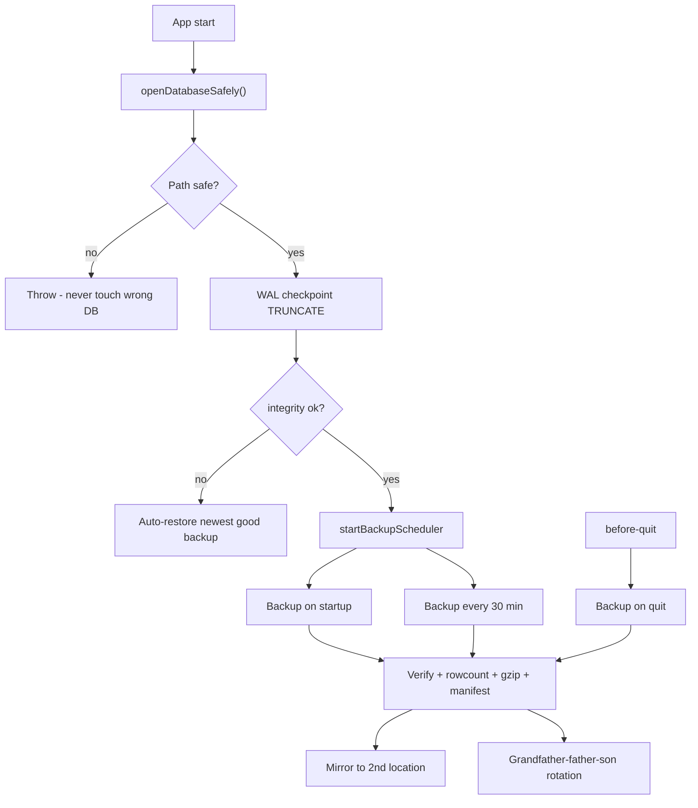

<aside>
🛡️

This is the system that makes tonight impossible to ever repeat. It fixes the three exact failures that lost your data, then layers automatic verified backups, portable exports, and one-click restore on top. Built after the loss of ~3 months of DeskFlow data on 29 Jun 2026.

</aside>

## What actually went wrong (the root causes)

Three separate failures lined up. Any one of the fixes below would have saved your data.

| # | Failure | The fix in this system |
| --- | --- | --- |
| 1 | Data lived only in the **WAL file** and was never checkpointed into the main DB | Force `wal_checkpoint(TRUNCATE)` on every startup + before every backup |
| 2 | The main DB was **recreated empty** (path resolved to the build folder), orphaning the real data | A path guard that refuses to ever open the DB from `dist-electron` / `app.asar` |
| 3 | **No backups existed** — so when the WAL was truncated, there was no second copy | Automatic, verified, rotating backups on startup, every 30 min, and on quit |

## Design principles (the rules that make loss structurally impossible)

1. **There is always more than one copy.** A single file is never the only home for your data.
2. **A backup is not real until it's verified.** Every backup is re-opened, integrity-checked, and row-counted before it's trusted.
3. **Never overwrite a good backup with an empty one.** Backups with 0 rows are refused automatically — the exact mistake that destroyed the WAL.
4. **Restore is reversible.** Restoring first snapshots the current DB, so even a restore can be undone.
5. **Data is never locked in one binary.** Portable JSON + CSV exports mean your data survives even if SQLite itself fails.
6. **The WAL is never allowed to strand data.** Checkpoint discipline on every lifecycle event.

## Architecture



## Implementation

Full drop-in module for the Electron **main** process (uses your existing `better-sqlite3`). The downloadable `BackupService.ts` is attached in the chat. Key parts below.

### 1. Hardened DB initialization — the three root-cause fixes

```tsx
export function openDatabaseSafely(): Database.Database {
  // FIX for cause #2: never open the DB from the build folder
  if (/dist-electron|app\.asar|resources/i.test(DB_PATH)) {
    throw new Error(`[DBGuard] Refusing unsafe DB path: ${DB_PATH}`)
  }
  mkdirSync(dirname(DB_PATH), { recursive: true })

  const db = new Database(DB_PATH)
  db.pragma('journal_mode = WAL')
  db.pragma('synchronous = FULL')     // durability over speed for user data
  db.pragma('foreign_keys = ON')
  db.pragma('busy_timeout = 5000')

  // FIX for cause #1: force stranded WAL data into the main file every startup.
  // THIS is the single line that would have prevented the disaster.
  try { db.pragma('wal_checkpoint(TRUNCATE)') } catch (e) { console.error(e) }

  // FIX for cause #3 trigger: detect corruption and recover automatically
  const integrity = db.pragma('integrity_check', { simple: true }) as string
  if (integrity !== 'ok') { db.close(); throw new IntegrityError(integrity) }
  return db
}
```

### 2. Verified, rotating backups

```tsx
export async function createBackup(db, trigger = 'manual') {
  mkdirSync(BACKUP_DIR, { recursive: true })
  const stamp = new Date().toISOString().replace(/[:.]/g, '-')
  const rawPath = join(BACKUP_DIR, `deskflow-${stamp}.db`)

  db.pragma('wal_checkpoint(TRUNCATE)')   // complete file first
  await db.backup(rawPath)                // SQLite online backup (safe while running)

  // VERIFY independently before trusting it
  const vdb = new Database(rawPath, { readonly: true })
  const integrityOk = vdb.pragma('integrity_check', { simple: true }) === 'ok'
  const counts = rowCounts(vdb); vdb.close()
  const totalRows = Object.values(counts).reduce((a, b) => a + b, 0)

  // SAFETY: never accept a corrupt or empty backup (principle #3)
  if (!integrityOk) { unlinkSync(rawPath); throw new Error('integrity FAILED') }
  if (totalRows === 0 && trigger !== 'manual') {
    unlinkSync(rawPath); throw new Error('refused: 0 rows')
  }

  // gzip + manifest + mirror, then rotate (grandfather-father-son)
  // ...full code in the attached file
}
```

### 3. Portable exports — data that outlives the app

```tsx
exportJSON(db)                                  // every table -> one JSON file
exportCSV(db, ['logs', 'finance_transactions',  // key tables -> CSV for Excel/Sheets
               'finance_wallets', 'sessions'])
```

### 4. Safe, atomic, reversible restore

```tsx
export async function restoreFromBackup(name) {
  // 1. decompress to temp
  // 2. integrity-check the candidate BEFORE touching the live DB
  // 3. rename current DB -> .replaced-<ts>.db  (restore is itself undoable)
  // 4. delete stale -wal/-shm so they can't shadow the restored file
  // 5. atomic rename temp -> live DB
}
```

### 5. Wire into the app lifecycle

```tsx
// main.ts
import { openDatabaseSafely } from './backup/BackupService'
import { startBackupScheduler, backupOnQuit } from './backup/BackupService'

app.whenReady().then(() => {
  const db = openDatabaseSafely()      // replaces your current new Database(...)
  startBackupScheduler(db)             // startup + every 30 min
  // ... register your IPC handlers ...
})

app.on('before-quit', async (e) => {
  e.preventDefault()
  await backupOnQuit(db)               // capture the final session
  app.exit()
})
```

### 6. IPC for a Settings → Backups UI

```tsx
ipcMain.handle('backup:create',  () => createBackup(db, 'manual'))
ipcMain.handle('backup:list',    () => listBackups())
ipcMain.handle('backup:restore', (_e, name) => restoreFromBackup(name))
ipcMain.handle('backup:exportJSON', () => exportJSON(db))
ipcMain.handle('backup:exportCSV',  (_e, tables) => exportCSV(db, tables))
```

## Rollout checklist

- [ ]  Add `src/main/backup/BackupService.ts` (attached file).
- [ ]  Replace your `new Database(...)` call with `openDatabaseSafely()`.
- [ ]  Add `startBackupScheduler(db)` in `app.whenReady()`.
- [ ]  Add `backupOnQuit(db)` in `before-quit`.
- [ ]  Register the 5 IPC handlers + preload bridges.
- [ ]  Build a **Settings → Backups** tab: list, create, restore, export buttons.
- [ ]  Set one `MIRROR_DIRS` path (OneDrive folder or external drive) for an off-disk copy.
- [ ]  Verify: start the app, confirm a `.db.gz` + `.json` manifest appears in `%APPDATA%/DeskFlow/backups`.
- [ ]  Test a restore into a throwaway folder before trusting it.

## Why this would have saved you tonight

- The **startup checkpoint** would have flushed your WAL into the main DB the moment the app opened — your data would have been visible, not stranded.
- The **path guard** would have stopped the empty DB from ever being created in the wrong folder.
- And even if both failed, **a verified backup from 30 minutes earlier** would be sitting in `backups/`, one click from full restore.

<aside>
💙

The data that was lost can't come back — but from the moment this ships, every future day is protected by at least three independent copies. That's the promise.

</aside>