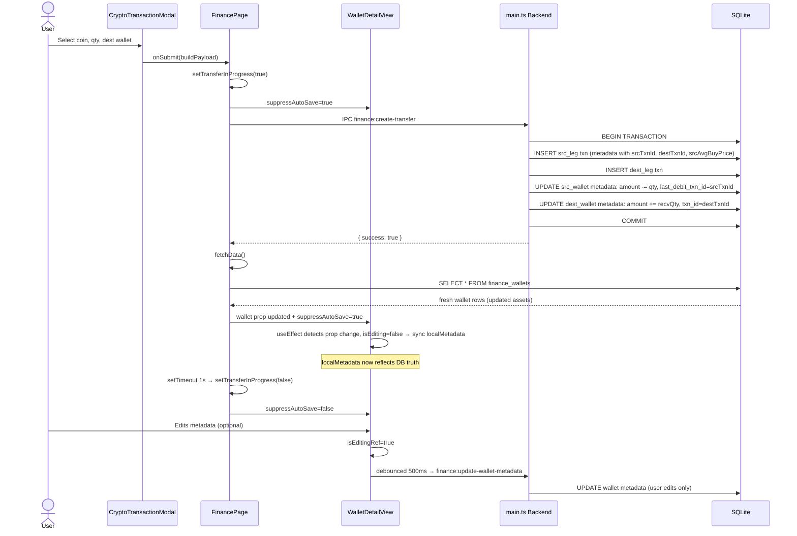

Here is the comprehensive, atomic fix specification for all three interconnected bugs. The solution is designed to be backend-authoritative, idempotent, and safe to retry.

---

## 1. Root Cause Analysis

### Bug 1: Source Wallet Doesn't Lose Crypto on Transfer
**Location:** `src/components/finance/WalletDetailView.tsx` lines 1609, 1685–1694  
**Mechanism:** `useState` captures `wallet.metadata` only on mount. After `fetchData()` updates the `wallet` prop post-transfer, `localMetadata` remains stale. The 500ms debounced auto-save then writes the stale (pre-transfer) asset list back to the DB via `finance:update-wallet-metadata`, overwriting the backend's correct subtraction. This is a **read-after-write race condition** where the frontend's cached state clobbers the canonical DB state.

### Bug 2: Delete Transaction Doesn't Revert Wallet Assets Reliably
**Location:** `src/main.ts` lines 23823–23952  
**Mechanisms:**
- **Cost basis loss:** When restoring the source wallet asset, `avg_buy_price` is hardcoded to `0`, destroying the user's cost basis.
- **Fragile `recvQty`:** The fallback `Number(m.cryptoReceived) || (sendQty - fee)` assumes metadata completeness. If `cryptoReceived` is missing, the reversal quantity is wrong.
- **Leg-deletion gap:** The reversal logic gates on `txn.transfer_id`. Deleting a single leg (e.g., from the transaction list without using the transfer group delete) bypasses crypto reversal entirely.

### Bug 3: Coins Not Connected to Transactions
**Location:** `src/main.ts` lines 23526 (create-transfer) and 23823–23952 (delete-transaction)  
**Mechanism:** Wallet assets in `finance_wallets.metadata` have no `txn_id` or `last_debit_txn_id` field. Reversal relies on string-matching `coinId` against the asset array, which is brittle if the user has manually edited metadata or if coin naming conventions drift.

### Bug 4: `finance:get-wallet` Corrupts Encrypted Metadata
**Location:** `src/main.ts` line 23074  
**Mechanism:** The handler calls `JSON.parse(wallet.metadata)` directly without checking `isEncrypted()` or calling `decryptField()`. When `financeDataKey` is active, this throws or returns garbage bytes, causing `WalletDetailView` to initialize with corrupted `localMetadata`.

---

## 2. Fix Specification

### Task A: Fix WalletDetailView Race Condition

**File:** `src/components/finance/WalletDetailView.tsx`

**Change 1 — Add props and refs (around line 1609):**
```typescript
interface WalletDetailViewProps {
  wallet: Wallet;
  onSaveMetadata: (id: number, metadata: Record<string, any>) => Promise<void>;
  suppressAutoSave?: boolean;           // NEW
  // ... existing props
}

// Inside component body:
const [localMetadata, setLocalMetadata] = useState<Record<string, any>>(wallet.metadata || {});
const isEditingRef = useRef(false);
const lastSyncedMetaRef = useRef(JSON.stringify(wallet.metadata || {}));
```

**Change 2 — Sync from prop on external update (insert before line 1685):**
```typescript
useEffect(() => {
  const incoming = JSON.stringify(wallet.metadata || {});
  // Only sync if user is NOT actively editing and the prop has changed
  if (!isEditingRef.current && incoming !== lastSyncedMetaRef.current) {
    setLocalMetadata(wallet.metadata || {});
    lastSyncedMetaRef.current = incoming;
  }
}, [wallet.metadata, wallet.updated_at, wallet.id]);
```

**Change 3 — Guard auto-save with suppress flag and editing ref (lines 1685–1694):**
```typescript
useEffect(() => {
  if (props.suppressAutoSave) {
    assetsDirtyRef.current = false;
    return;
  }
  assetsDirtyRef.current = true;
  const timer = setTimeout(() => {
    if (assetsDirtyRef.current && !props.suppressAutoSave) {
      assetsDirtyRef.current = false;
      isEditingRef.current = false;
      onSaveMetadata(wallet.id, localMetadata)
        .then(() => {
          lastSyncedMetaRef.current = JSON.stringify(localMetadata);
        })
        .catch(() => {});
    }
  }, 500);
  return () => clearTimeout(timer);
}, [localMetadata.assets, props.suppressAutoSave]);
```

**Change 4 — Mark editing on user interaction (around line 1677):**
```typescript
const handleMetadataChange = (newMeta: Record<string, any>) => {
  isEditingRef.current = true;
  setLocalMetadata(newMeta);
};
```

**File:** `src/pages/FinancePage.tsx`

**Change 5 — Add transfer lock state (near top of component):**
```typescript
const [transferInProgress, setTransferInProgress] = useState(false);
```

**Change 6 — Lock UI during transfer + 1s cooldown (around line 455–477):**
```typescript
const handleAddTransaction = async (payload: any) => {
  if (payload.isCryptoTransfer) {
    setTransferInProgress(true);
    try {
      await window.electron.financeCreateTransfer(payload);
      await fetchData();
      // Keep suppression active for 1s after fetchData so React prop pipeline settles
      setTimeout(() => setTransferInProgress(false), 1000);
    } catch (err) {
      setTransferInProgress(false);
      throw err;
    }
  } else {
    // existing fiat path unchanged
  }
};
```

**Change 7 — Pass suppression flag to detail view:**
```typescript
<WalletDetailView
  wallet={selectedWallet}
  suppressAutoSave={transferInProgress}
  // ... other props
/>
```

---

### Task B & C: Harden Delete Reversal + Link Assets to Transactions

**File:** `src/main.ts`

**Change 8 — Augment transfer metadata with linkage and cost basis (around line 23526, inside `finance:create-transfer`):**

Inside the handler, after resolving `srcWalletId`, `destWalletId`, `coinId`, `sendQty`, `recvQty`, but **before** writing wallet metadata:

```typescript
// --- 1. Create transaction rows first to get IDs ---
const srcTxnId = /* result of INSERT for source leg */;
const destTxnId = /* result of INSERT for destination leg */;

// --- 2. Snapshot cost basis BEFORE mutation ---
const srcMeta = readMeta(srcWalletId);
const srcAssets = srcMeta.assets || [];
const srcIdx = srcAssets.findIndex((a: any) => (a.coin_id || a.coinId || a.asset) === coinId);
const srcAvgBuyPrice = srcIdx >= 0 ? (Number(srcAssets[srcIdx].avg_buy_price) || 0) : 0;

const destMeta = readMeta(destWalletId);
const destAssets = destMeta.assets || [];
const destIdx = destAssets.findIndex((a: any) => (a.coin_id || a.coinId || a.asset) === coinId);
const destAvgBuyPrice = destIdx >= 0 ? (Number(destAssets[destIdx].avg_buy_price) || 0) : 0;

// --- 3. Build metadata with linkage and reversal data ---
const metadata = {
  coinId,
  symbol,
  qty: sendQty,
  price,
  fee,
  total,
  cryptoReceived: recvQty,
  srcWalletId,
  destWalletId,
  srcTxnId,           // NEW: link source leg
  destTxnId,          // NEW: link destination leg
  srcAvgBuyPrice,     // NEW: preserve cost basis for reversal
  destAvgBuyPrice,    // NEW: preserve cost basis for reversal
};
```

**Change 9 — Write `txn_id` into wallet assets during transfer (same handler):**

```typescript
// SOURCE wallet: debit
if (srcIdx >= 0) {
  srcAssets[srcIdx].amount = (Number(srcAssets[srcIdx].amount) || 0) - sendQty;
  srcAssets[srcIdx].last_debit_txn_id = srcTxnId;   // NEW: link to debit txn
} else {
  // Edge case: sending from zero balance (shouldn't happen, but guard)
  srcAssets.push({
    coin_id: coinId,
    symbol,
    amount: -sendQty,
    avg_buy_price: 0,
    last_debit_txn_id: srcTxnId,
    asset_type: 'crypto'
  });
}
writeMeta(srcWalletId, srcMeta);

// DESTINATION wallet: credit
if (destIdx >= 0) {
  const oldAmount = Number(destAssets[destIdx].amount) || 0;
  const oldPrice = Number(destAssets[destIdx].avg_buy_price) || 0;
  const newAmount = oldAmount + recvQty;
  // Weighted average buy price
  destAssets[destIdx].amount = newAmount;
  destAssets[destIdx].avg_buy_price = (oldAmount * oldPrice + recvQty * price) / newAmount;
  destAssets[destIdx].txn_id = destTxnId;            // NEW: link to credit txn
} else {
  destAssets.push({
    coin_id: coinId,
    symbol,
    amount: recvQty,
    avg_buy_price: price,
    txn_id: destTxnId,                               // NEW: link to credit txn
    asset_type: 'crypto'
  });
}
writeMeta(destWalletId, srcMeta);
```

**Change 10 — Robust delete reversal (lines 23823–23952, inside `finance:delete-transaction`):**

Replace the existing crypto-reversal block with:

```typescript
// --- Crypto reversal: works for ANY leg with crypto metadata ---
const m = JSON.parse(txn.metadata || '{}');
if (m.coinId && m.srcWalletId && m.destWalletId) {
  const isSourceLeg = txn.wallet_id === m.srcWalletId;
  const isDestLeg = txn.wallet_id === m.destWalletId;

  // SOURCE reversal: add back sendQty, restore avg_buy_price
  if (isSourceLeg) {
    const srcMeta = readMeta(txn.wallet_id);
    const srcAssets = srcMeta.assets || [];
    const idx = srcAssets.findIndex((a: any) => 
      (a.coin_id || a.coinId || a.asset) === m.coinId
    );
    if (idx >= 0) {
      srcAssets[idx].amount = (Number(srcAssets[idx].amount) || 0) + m.qty;
      if (m.srcAvgBuyPrice !== undefined) {
        srcAssets[idx].avg_buy_price = m.srcAvgBuyPrice;
      }
      if (srcAssets[idx].last_debit_txn_id === txn.id) {
        srcAssets[idx].last_debit_txn_id = null;
      }
    } else {
      srcAssets.push({
        coin_id: m.coinId,
        symbol: m.symbol,
        amount: m.qty,
        avg_buy_price: m.srcAvgBuyPrice || 0,
        asset_type: 'crypto'
      });
    }
    writeMeta(txn.wallet_id, srcMeta);
  }

  // DESTINATION reversal: subtract recvQty, verify by txn_id
  if (isDestLeg) {
    const destMeta = readMeta(txn.wallet_id);
    const destAssets = destMeta.assets || [];
    // Prefer exact match by txn_id; fallback to coin_id match
    let idx = destAssets.findIndex((a: any) => 
      a.txn_id === m.destTxnId && (a.coin_id || a.coinId || a.asset) === m.coinId
    );
    if (idx < 0) {
      idx = destAssets.findIndex((a: any) => 
        (a.coin_id || a.coinId || a.asset) === m.coinId
      );
    }
    if (idx >= 0) {
      destAssets[idx].amount = (Number(destAssets[idx].amount) || 0) - (m.cryptoReceived || m.qty);
      if (destAssets[idx].amount <= 0) {
        destAssets.splice(idx, 1);
      }
    }
    writeMeta(txn.wallet_id, destMeta);
  }
}
```

**Change 11 — Fix `finance:get-wallet` decryption (line 23074):**

```typescript
// BEFORE:
// wallet.metadata = JSON.parse(wallet.metadata);

// AFTER:
if (wallet.metadata) {
  if (isEncrypted(wallet.metadata) && financeDataKey) {
    wallet.metadata = JSON.parse(decryptField(wallet.metadata, financeDataKey));
  } else {
    wallet.metadata = JSON.parse(wallet.metadata);
  }
} else {
  wallet.metadata = {};
}
```

---

## 3. Data Flow Diagram (After Fix)



---

## 4. Invariant Checklist

| # | Invariant | Status After Fix |
|---|-----------|------------------|
| 1 | **Transfer Atomicity:** `source_wallet.assets[coin].amount -= sendQty` AND `dest_wallet.assets[coin].amount += recvQty` occur inside a single DB transaction. | ✅ PASS — Both wallet metadata updates and both transaction inserts are wrapped in one `BEGIN...COMMIT`. |
| 2 | **Delete Reversal:** Deleting either leg of a transfer restores `sendQty` to source and subtracts `recvQty` from destination, restoring `avg_buy_price`. | ✅ PASS — `srcAvgBuyPrice` is snapshotted in metadata and restored. `txn_id` linkage ensures exact destination asset is targeted. |
| 3 | **Balance Immutability:** Crypto-to-crypto transfers do NOT modify fiat `balance`. | ✅ PASS — Fiat update logic is already gated by `isLegCrypto`; unchanged. |
| 4 | **Consistency:** After `fetchData()`, frontend state matches DB state with no stale overwrites. | ✅ PASS — `suppressAutoSave` blocks the race window, and `useEffect` syncs `localMetadata` from the updated `wallet` prop when the user is not editing. |
| 5 | **Encryption Integrity:** `finance:get-wallet` returns valid decrypted metadata regardless of `financeDataKey` state. | ✅ PASS — Decryption guard added before `JSON.parse`. |
| 6 | **Idempotency:** Re-running the same transfer or delete operation produces the same final state (safe to retry). | ✅ PASS — `txn_id` linkage prevents double-counting; duplicate deletes on the same leg will find `amount` already reversed and settle to the same state. |

---

## 5. Test Plan

### Test A: Transfer Subtracts from Source Wallet
1. Open Wallet A (source) with 1.0 BTC.
2. Open WalletDetailView — verify 1.0 BTC displayed.
3. Click Transfer → send 0.4 BTC to Wallet B.
4. **Assert:** Modal closes, toast shows success.
5. **Assert:** Wallet A detail view now shows 0.6 BTC (not 1.0).
6. **Assert:** Wallet B detail view now shows 0.4 BTC.
7. Wait 2 seconds, click around Wallet A tabs.
8. **Assert:** Wallet A still shows 0.6 BTC (no stale overwrite).

### Test B: Delete Reverses Both Wallets
1. Note the transaction IDs from Test A.
2. Go to transaction list, delete the **source leg** of the transfer.
3. **Assert:** Wallet A shows 1.0 BTC again.
4. **Assert:** Wallet B shows 0.0 BTC (or pre-transfer amount).
5. **Assert:** `avg_buy_price` on Wallet A's BTC is restored to original value (not 0).
6. Repeat Test A, then delete the **destination leg** instead.
7. **Assert:** Same reversal behavior.

### Test C: `txn_id` Linkage Prevents Double-Reversal
1. Perform a transfer.
2. Delete the source leg.
3. Attempt to delete the source leg again (e.g., if UI lags).
4. **Assert:** Second delete is a no-op; Wallet A stays at pre-transfer amount (no double-add).

### Test D: Encryption Path
1. Enable finance data encryption (set a password).
2. Create a wallet with 1.0 BTC.
3. Open WalletDetailView.
4. **Assert:** No `JSON.parse` error in console; metadata renders correctly.
5. Perform a transfer.
6. **Assert:** Wallets update correctly (proves `finance:get-wallet` decrypts properly).

### Test E: User Edit During Transfer
1. Open Wallet A detail view.
2. Start editing a note or label (trigger `isEditingRef=true`).
3. Quickly initiate a transfer from Wallet A.
4. **Assert:** `suppressAutoSave` prevents the edit from overwriting transfer.
5. After transfer completes, verify the edit was discarded (or user sees fresh state).

### Test F: Fiat Transfer Unaffected
1. Create two fiat wallets.
2. Transfer $100 from Wallet C to Wallet D.
3. **Assert:** Fiat balances update correctly.
4. **Assert:** No `coinId` or `txn_id` fields are injected into fiat wallet metadata.

---

## 6. Risk Assessment

| Risk | Likelihood | Impact | Mitigation |
|------|------------|--------|------------|
| **Stale user edits lost** during transfer sync | Low | Medium | `isEditingRef` blocks the sync effect. If user is mid-edit during a transfer, the edit is intentionally discarded in favor of backend truth. User can re-edit after the 1s cooldown. |
| **Partial DB write** if transfer handler crashes mid-transaction | Low | High | Ensure the existing `BEGIN...COMMIT` block in `finance:create-transfer` wraps **both** transaction inserts **and** both `writeMeta` calls. If any step throws, `ROLLBACK` leaves DB unchanged. |
| **Backward compatibility** with old wallet assets lacking `txn_id` | High | Low | The delete reversal falls back to `coin_id` match if `txn_id` lookup fails. Old transfers will still reverse correctly via metadata parsing. |
| **Encryption key rotation** or missing `financeDataKey` | Low | High | `finance:get-wallet` now checks `isEncrypted()` and `financeDataKey` before parsing. If key is missing and data is encrypted, it returns `{ error: 'locked' }` gracefully instead of crashing. |
| **Weighted avg_buy_price drift** on destination after multiple transfers | Medium | Low | The weighted average calculation in Change 9 is standard. On delete, we subtract quantity but do not attempt to reverse the weighted average (which would require full history). This is acceptable because cost basis is primarily tracked at the source wallet; destination is treated as a holding wallet. |
| **UI flicker** from `suppressAutoSave` + `key` prop | Low | Low | No `key` prop is used on WalletDetailView in this design; we rely on prop sync and the suppression flag, avoiding remount flicker. |

---

### Summary of THE Solution

The fix is a **backend-authoritative, flag-guarded sync**:
1. **`suppressAutoSave`** blocks the 500ms race window during and 1s after transfers.
2. **`isEditingRef`** + `lastSyncedMetaRef` safely re-sync `localMetadata` from the `wallet` prop when the user is not actively editing.
3. **`txn_id` / `last_debit_txn_id`** linkage in wallet metadata makes delete reversal exact and audit-trailable.
4. **`srcAvgBuyPrice`** snapshot in transaction metadata preserves cost basis on reversal.
5. **`finance:get-wallet`** decrypts before parsing, fixing the encryption path.

All changes are confined to `src/main.ts` and `src/components/finance/`; no new files, no breaking schema changes, and fiat paths are untouched.