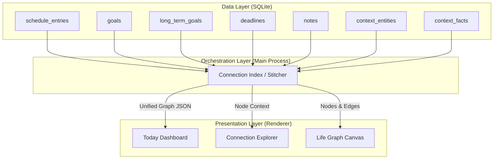

# RESULT.md

## 1. Architecture Overview

The core of the architecture is the **Orchestration Layer**, a middleware in the Electron main process that stitches the six isolated SQLite tables into a single, reactive "Life Graph". Instead of relying on massive, blocking SQL `JOIN`s, we use **Application-Layer Stitching** to build a Connection Index in memory, mapping every item ID across systems to its related items.

### The Life Graph Topology
*   **Schedule Blocks** $\rightarrow$ linked to Goals (via `cross_feature_link`), Deadlines (via date overlap), Notes (via `links` JSON).
*   **Goals** $\rightarrow$ linked to Schedule Blocks, Deadlines (`deadline` field), Long-Term Goals (`parent_id`), Notes, Context Brain.
*   **Deadlines** $\rightarrow$ linked to Goals, Schedule Blocks, Notes, Context Brain.
*   **Notes** $\rightarrow$ linked to anything via `links` JSON array.
*   **Context Brain** $\rightarrow$ the semantic layer binding the above via `context_episodes` (source_ref) and `context_facts`.
*   **Identity** $\rightarrow$ an emergent property (Profile Signals) derived from the density and completion rates of the connections.



---

## 2. Backend Specification

We will introduce a unified query endpoint to fetch the stitched graph in a single IPC round-trip, preventing main-thread blocking and UI waterfalls.

### New IPC Endpoints

#### `self:get-unified-graph` (New)
*   **Handler Location:** `src/main.ts` (Insert near existing Context Brain handlers ~13899)
*   **Logic:** Fetches all base tables in parallel, then stitches them in memory.
*   **SQL Queries:**
    ```sql
    SELECT * FROM schedule_entries;
    SELECT * FROM goals;
    SELECT * FROM long_term_goals;
    SELECT * FROM deadlines;
    SELECT * FROM notes;
    SELECT * FROM context_entities;
    SELECT * FROM context_episodes;
    SELECT * FROM context_facts WHERE valid_to IS NULL;
    ```
*   **Application-Layer Stitching Logic:**
    1.  Index all nodes by ID.
    2.  **Explicit Links:** Map `goals.cross_feature_link` $\rightarrow$ `schedule_entries.id`; `goals.parent_id` $\rightarrow$ `long_term_goals.id`; parse `notes.links` JSON $\rightarrow$ target IDs.
    3.  **Implicit/Heuristic Links:** Match `goals.deadline` (date) with `deadlines.due_date` where categories align.
    4.  **Semantic Links:** Map `context_episodes.source_ref` to `context_facts.subject_id` to link Brain entities to Goals/Deadlines.
*   **Data Shape Returned:**
    ```typescript
    interface UnifiedGraphNode {
      id: string;
      type: 'schedule' | 'goal' | 'deadline' | 'note' | 'entity' | 'ltg';
      title: string;
      metadata: Record<string, any>; // status, times, progress, etc.
    }
    interface UnifiedGraphEdge {
      source: string;
      target: string;
      type: 'explicit' | 'implicit' | 'semantic';
      weight: number; // 1.0 for explicit, 0.5 for implicit
    }
    interface ProfileSignal {
      trait: string; // e.g., "Consistency", "Pressure"
      value: number; // 0-100
      evidence: string[]; // IDs of nodes contributing to this signal
    }
    interface UnifiedGraph {
      nodes: UnifiedGraphNode[];
      edges: UnifiedGraphEdge[];
      profileSignals: ProfileSignal[];
    }
    ```

#### `self:get-today-context` (New)
*   **Handler Location:** `src/main.ts`
*   **Logic:** Computes the "now" state.
    *   Current day of week (0-6) for `schedule_entries`.
    *   Current time (`HH:MM`) to find the *active* schedule block.
    *   `date` = today for `goals`.
    *   `due_date` $\in$ [today, today+3] for `deadlines`.
*   **Data Shape Returned:**
    ```typescript
    interface TodayContext {
      activeScheduleId: string | null;
      todaysGoalIds: string[];
      approachingDeadlineIds: string[];
      relevantNoteIds: string[];
      activeEntityIds: string[];
    }
    ```

### Preload Bridge Modifications
Add to `src/preload.ts`:
```typescript
getUnifiedGraph: () => ipcRenderer.invoke('self:get-unified-graph'),
getTodayContext: () => ipcRenderer.invoke('self:get-today-context'),
```

---

## 3. Frontend Specification

### Component Hierarchy
Refactor `src/features/warmth/gold/GoldPage.tsx` (`pageTab === 'gold'`) from disconnected cards into a unified orchestration layout.

```text
GoldPage (pageTab === 'gold')
├── LifeGraphCanvas (Background / Visual Backbone)
│   ├── Custom Nodes (Schedule=Cyan, Goals=Emerald, Deadlines=Amber, Notes=Violet, Brain=Pink)
│   └── Dynamic Edges (Solid for explicit, Dashed for semantic)
├── TodayDashboard (Foreground Left - GlassCard Overlay)
│   ├── ActiveScheduleBlock (Time-aware pulse)
│   ├── TodaysGoals (Linked to active block or due today)
│   ├── ApproachingDeadlines
│   └── IdentitySignals (Derived from profileSignals)
└── ConnectionExplorer (Foreground Right - Slide-out Drawer)
    ├── NodeHeader (Title, Type, Status)
    ├── LinkedNodesList (Grouped by system type)
    └── ContextFactsList (Brain insights for this node)
```

### Visual System & Design Tokens
*   **Color Coding** (via `tokens.ts` ACCENT array):
    *   Schedule: Cyan (`#22d3ee`)
    *   Goals: Emerald (`#10b981`)
    *   Deadlines: Amber (`#f59e0b`)
    *   Notes: Violet (`#8b5cf6`)
    *   Brain: Pink (`#ec4899`)
*   **Cards:** Use `GlassCard` with a colored left-border or accent ring matching the system color.
*   **State Coverage:** Wrap the dashboard and graph in `StateShell` (handles Loading skeletons, Empty "Seed your Life" CTA, Error states).
*   **Motion (L2 Budget):** Use `lib/motion.ts` `useMotionProps` for staggered entrance of Today View cards. Hover lift (`y: -4`) on interactive nodes. Subtle ring glow pulse for the *active* schedule block.
*   **Typography:** Source Serif 4 (headlines), Geist (body), JetBrains Mono (data/times).

### Context Graph Integration
Upgrade `ContextGraphView` (`src/features/warmth/ContextGraphView.tsx`). Currently, it only renders `context_entities`. We will inject Schedule, Goals, Deadlines, and Notes as **custom R3F nodes**.
*   **Node Visuals:** Distinct 3D geometries (e.g., Spheres for Brain, Boxes for Schedule, Rings for Goals) using the system colors.
*   **Edges:** Render `UnifiedGraphEdge` data. Explicit links get solid glowing lines; semantic links get dashed/particle lines.

---

## 4. Interaction Design

### User Flows
1.  **Entry (The Today View):** User opens Gold/Self tab $\rightarrow$ sees `TodayDashboard` overlaid on the `LifeGraphCanvas`. Top card shows "Active Now" (Current schedule block). Below it: "Goals for this block", "Upcoming Deadlines".
2.  **Explore (Connection Explorer):** User clicks the "Active Now" schedule block $\rightarrow$ A side drawer slides in. Shows: "This block targets Goal X", "Deadline Y is approaching", "3 notes reference this topic".
3.  **Drill Down:** User clicks Goal X in the drawer $\rightarrow$ Drawer updates to show Goal X's connections: Parent Long-Term Goal, linked Deadline, related Notes.
4.  **Add Connection:** User clicks "Add Goal" inline within the Schedule Block card. Form appears. `cross_feature_link` is auto-populated with the Schedule Block's ID.
5.  **Overview (The Graph):** User clicks "View Full Graph" toggle. The Today Dashboard fades, zooming out to the 3D network. Clusters form around Life Phases. Hovering a node highlights its direct connections and dims the rest.

### State Transitions & Feedback
*   **Loading $\rightarrow$ Ready:** `StateShell` skeleton fades out (`crossfade`), nodes stagger in via `lib/motion.ts`.
*   **Hover:** Cards lift slightly, connecting edges in the background graph highlight.
*   **Active State:** The current schedule block pulses gently (subtle ring glow via `tokens.ts` RING color).

---

## 5. Implementation Plan

### Phase 1: Backend Orchestration Layer
1.  **Modify `src/main.ts`** (~line 19700)
    *   Add `self:get-unified-graph` IPC handler. Write SQL queries to fetch all base tables.
    *   Implement application-layer stitching to build the `UnifiedGraph` object, resolving `cross_feature_link`, `links` JSON, and date overlaps.
2.  **Modify `src/main.ts`** (~line 19750)
    *   Add `self:get-today-context` IPC handler to compute time-aware active blocks and filter goals/deadlines for today.
3.  **Modify `src/preload.ts`**
    *   Expose `getUnifiedGraph` and `getTodayContext` to the renderer.

### Phase 2: Frontend Data Hooks & State
4.  **Create `src/hooks/useLifeGraph.ts`**
    *   Custom hook wrapping the new IPC calls. Manages local cache and real-time updates via existing IPC channels (e.g., when a goal is saved, update the local graph node).
5.  **Create `src/utils/graphStitcher.ts`**
    *   Utility functions to resolve connections client-side for reactive updates without full refetches.

### Phase 3: Visual System & Layout
6.  **Refactor `src/features/warmth/gold/GoldPage.tsx`** (`pageTab === 'gold'`)
    *   Remove the disconnected cards (DeadlineRadar, GoalCard, ScheduleCard layouts).
    *   Implement the new Overlay layout: `TodayDashboard` over `LifeGraphCanvas`.
7.  **Create `src/features/warmth/gold/TodayDashboard.tsx`**
    *   Build the "Now" view using `GlassCard`, `SectionHead`, `StateShell`.
    *   Implement time-aware logic to highlight the active schedule block.
8.  **Create `src/features/warmth/gold/ConnectionExplorer.tsx`**
    *   Build the slide-out drawer to show cross-system links for any selected node.
9.  **Upgrade `src/features/warmth/ContextGraphView.tsx`**
    *   Inject Schedule, Goal, Deadline, and Note nodes into the R3F Canvas.
    *   Apply color coding (Cyan, Emerald, Amber, Violet, Pink).
    *   Add click handlers to open the `ConnectionExplorer`.

### Phase 4: Interaction & Polish
10. **Implement Inline Creation Modals**
    *   Modify `src/pages/dashboard/ScheduleCard.tsx` and `src/components/goals/GoalCard.tsx` logic to allow creating linked items inline (auto-setting `cross_feature_link`).
11. **Motion & Tokens**
    *   Apply `lib/motion.ts` staggered entrances to `TodayDashboard` cards.
    *   Ensure `StateShell` handles Loading/Empty/Error states for the unified graph.
12. **Profile Integration**
    *   Integrate `ProfileTab` logic into the `TodayDashboard` as "Identity Signals" (e.g., "You usually study at this time") derived from the `profileSignals` array returned by the backend.