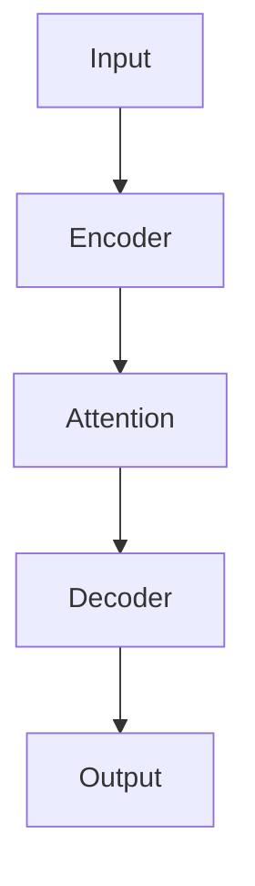

# Context Bundle — Lyceum Feature Showcase

## All 29 Block Types with .lmd Syntax Examples

### 1. Prose
```markdown
Plain text with **bold**, *italic*, `inline code`, and [links](url).
Supports $inline math$ and paragraph breaks.
```

### 2. Code
````
```python
def train(model, data):
    for batch in data:
        loss = model(batch)
        loss.backward()
        optimizer.step()
```
````

### 3. Math
```latex
$$
\mathcal{L} = -\sum_{i=1}^{N} y_i \log(\hat{y}_i) + (1-y_i)\log(1-\hat{y}_i)
$$
```

### 4. Image
```markdown

```

### 5. Mermaid
````

````

### 6. Chart
````
::: chart Training loss over epochs
{"$schema":"https://vega.github.io/schema/vega-lite/v5.json","mark":"line","encoding":{"x":{"field":"epoch"},"y":{"field":"loss"}}}
:::
````

### 7. Table
````
::: table
- [Concept | concept]
- [Formula | formula]
- [Example | example]
rows:
{"concept": "Attention", "formula": "Q·K^T/√d", "example": "Self-attention in transformer"}
:::
````

### 8. Flow
````
::: flow sankey
- Input -> Encoder : 100
- Encoder -> Decoder : 80
- Decoder -> Output : 80
:::
````

### 9. FinChart
````
::: finchart
{"type":"candlestick","data":[{"date":"2024-01","open":100,"high":110,"low":95,"close":105}]}
:::
````

### 10. SVG
````
::: figure
<svg width="400" height="200"><circle cx="200" cy="100" r="80" fill="#c2553a"/></svg>
:::
````

### 11. Quiz (MCQ)
````
::: quiz mcq L2
What is the time complexity of self-attention?
- [ ] O(n)
- [ ] O(n log n)
- [x] O(n²)
- [ ] O(2^n)
explain: Self-attention compares every token with every other token, resulting in n² comparisons.
:::
````

### 12. Quiz (Numeric)
````
::: quiz numeric L3
How many parameters does a transformer with d_model=512 and 8 attention heads have (in millions)?
answer: 25.2
explain: Approximately 25.2M parameters for the attention layers alone.
:::
````

### 13. Quiz (Open)
````
::: quiz open L4
Explain why layer normalization is applied before multi-head attention in modern transformers.
rubric: Must mention: (1) training stability, (2) gradient flow, (3) contrast with original post-norm design
:::
````

### 14. Flashcard
````
:::flashcard {"deck_id": "transformers", "card_type": "basic"}
Front: What does the softmax function do in attention?
Back: It converts attention scores into probabilities that sum to 1, weighting how much each token attends to others.
:::
````

### 15. Layer Reveal
````
:::layer_reveal {"title": "How Backprop Works"}
Step 1: Forward pass — compute prediction through the network
Step 2: Loss calculation — measure error between prediction and target
Step 3: Backward pass — compute gradients using chain rule
Step 4: Weight update — adjust parameters using optimizer
:::
````

### 16. Heatmap
````
:::viz_heatmap {"date_range": "last_90_days", "cell_size": 13}
:::
````

### 17. Knowledge Graph
````
:::viz_graph {"layout": "force"}
- node: Transformer (L3)
- node: Attention (L4)
- node: Feed-Forward (L2)
- edge: Transformer -> Attention
- edge: Transformer -> Feed-Forward
:::
````

### 18. Concept Map
````
:::viz_concept_map {"title": "Neural Network Architecture"}
- Neural Network
  - Layers (L2)
    - Input Layer
    - Hidden Layers
    - Output Layer
  - Activation Functions (L1)
    - ReLU
    - Sigmoid
    - Softmax
:::
````

### 19. Mastery Timeline
````
:::viz_timeline {"target_level": "L3", "show_events": true}
2024-01-15: quiz @80 - First quiz attempt
2024-01-22: mastery @L2 - Reached Apprentice
2024-02-01: mastery @L3 - Reached Practitioner
:::
````

### 20. Callout
````
::: callout warning
**Common misconception:** Attention replaces recurrence entirely. In practice, many architectures combine both (e.g., RWKV, Mamba).
:::
````

### 21. Layer (Mastery-gated)
````
::: layer L4 deeper
Advanced content about attention head pruning and sparse attention patterns...
:::
````

### 22. Widget (HTML)
````
::: html
<div id="interactive-demo">
  <button onclick="document.getElementById('demo').innerText='Clicked!'">
    Click me
  </button>
  <div id="demo">Waiting...</div>
</div>
:::
````

### 23. Illustration
````
:::illustration {"prompt": "小黑 stands before a giant open book, reaching up to turn the first page. Red annotation: 第一章", "concept": "Opening the first chapter"}
:::
````

### 24. Whiteboard
````
::: whiteboard {"read_only": false}
:::
````

### 25. Tutor Block
Rendered when user asks a question — shows AI response with citations.

### 26. Proposal Block
Rendered when AI suggests an edit — shows before/after with approve/reject buttons.

### 27. Conversation Block
Rendered for multi-turn AI dialogue — shows message history.

### 28. Notes Block
Rendered for user annotations — shows highlighted text with notes.

### 29. Image (with attribution)
```markdown

Source: Smith et al. 2024 | CC-BY-4.0
```

---

## IPC Endpoints for Dynamic Blocks
- `learn:askTutor` — AI answers questions about content
- `learn:createProposal` — AI suggests edits
- `learn:startConversation` — Multi-turn AI dialogue
- `learn:addNote` — User annotations
- `learn:generateIllustration` — AI generates hand-drawn images
- `learn:getDueCards` — Flashcard scheduling (FSRS)
- `learn:submitCardReview` — Rate flashcard difficulty
- `learn:getStudyHeatmap` — Study activity data
- `learn:getTutorDashboard` — Analytics data
