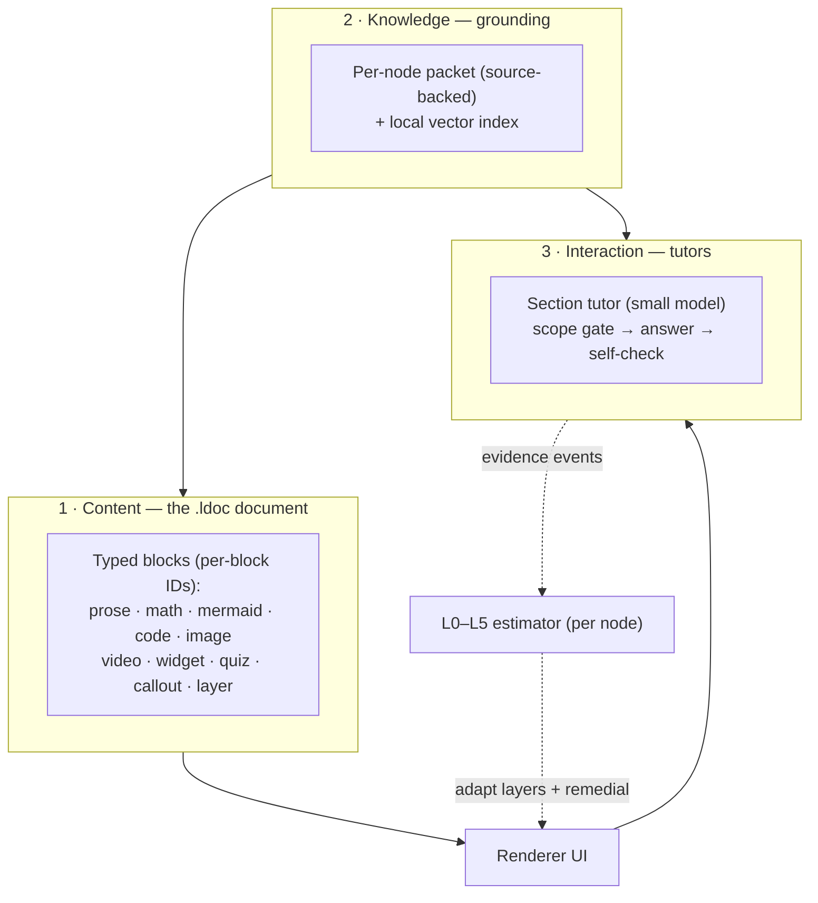
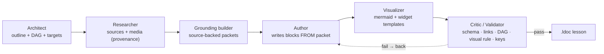
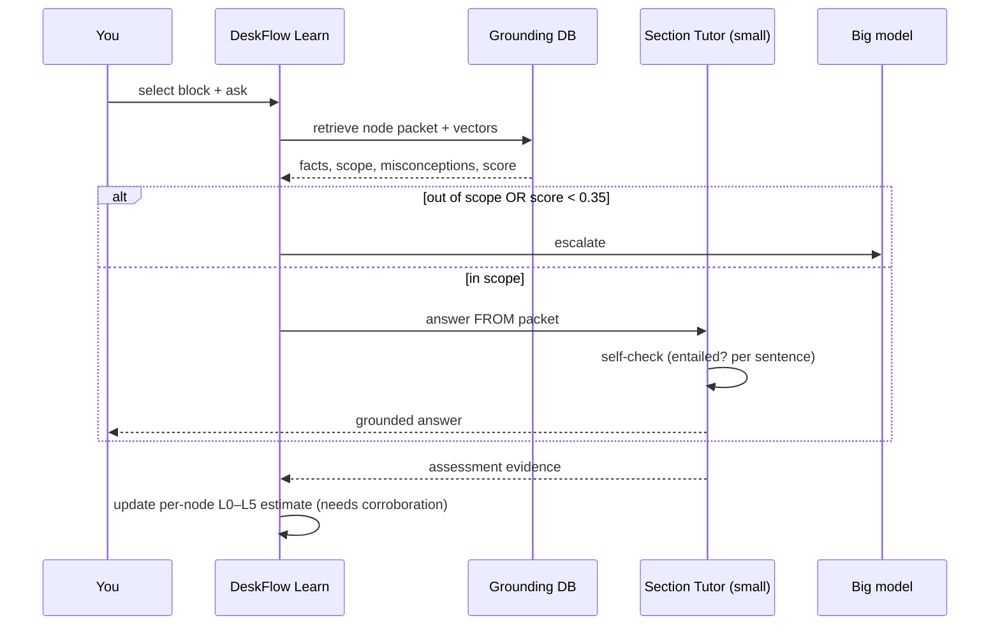
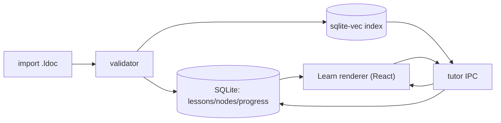

<aside>
📐

**Status: Design v0.1 — awaiting your “go” before any implementation.** This is the principal-engineer pass on the Lyceum brief: what's right, what I'd change and *why*, a concrete `.ldoc` JSON Schema, and one fully worked lesson. **No code written yet** — deliverables 3–7 are previewed at design level only.

Parent brief: Lyceum — A Living-Textbook Format & AI Tutor System (Build Brief + Prompt) · Profile: Clement — Personal Context · Curriculum + L0–L5: Clement — North Star: The Unified Path

</aside>

<aside>
📚

**Implementation-ready companion specs (v0.2):** Lyceum — Backend Implementation Spec (v0.2) · Lyceum — Frontend Design Spec (v0.2). Together with this design doc, they cover data model, IPC, validator, retrieval/tutor/mastery logic, design tokens, screens, and components — enough for a model to build the Learn module.

</aside>

## 1 · Verdict, then the critique

**Verdict:** the core bet is correct and I'm keeping it — typed JSON blocks (not a new syntax), three independent layers (Content / Knowledge / Interaction), and a *small* tutor model made accurate by grounding rather than size. But the brief has **four load-bearing flaws** that would quietly rot the system, plus ~10 smaller refinements. The four that matter:

### 🔴 Change 1 — Reverse the pipeline: ground *first*, author *second*

**Problem:** The brief's pipeline is Author → … → Grounding-builder, then a validator that checks “every claim is covered by grounding.” Proving natural-language entailment between arbitrary prose and a packet is expensive and unreliable — the validator you described is the hardest NLP problem in the stack, run on every block.

**Fix:** Build the **grounding packet first** (facts + sources), then have the Author write prose *from* the packet. Coverage becomes true **by construction**; the validator only spot-checks, instead of trying to prove entailment.

**Why:** You turn an unreliable verification problem into a cheap generation constraint. This is the single most important change.

### 🔴 Change 2 — The grounding packet can hallucinate too; source-back every fact

**Problem:** The packet is supposed to keep the small model honest — but if an LLM writes the packet, the packet itself can be wrong. You've just moved the hallucination up one layer and given it more authority.

**Fix:** Every `must_know` fact carries a **citation to a real source** the Researcher fetched. The validator checks facts are source-backed, not just that prose is packet-backed. Unsourced facts are quarantined for human review.

**Why:** Grounding is only as trustworthy as *its* grounding. Without this, the whole “accuracy from grounding” premise is hollow.

### 🔴 Change 3 — Don't trust a small model's self-graded confidence

**Problem:** “Tutor self-checks and escalates if confidence < 0.6” assumes LLM-reported confidence is calibrated. It isn't, especially for small models — they're confidently wrong exactly when you need them cautious.

**Fix:** Make escalation **deterministic where possible**: (a) a retrieval-score + scope-keyword gate runs *before* the model answers (out-of-scope → refuse/escalate without even calling it); (b) self-check is a *separate constrained* call (“is each sentence entailed by these packet facts? yes/no”), not a vibe; (c) escalate on low *retrieval* score, not just self-reported confidence.

**Why:** You want the leash held by retrieval math and the packet, not by the small model's opinion of itself.

### 🔴 Change 4 — Widget *templates* by default; free-form HTML is the rare escape hatch

**Problem:** “Generated HTML/JS in a sandbox” is both a security surface *and* a reliability nightmare — LLM-authored HTML rots, pulls dead CDNs, and is hard to validate.

**Fix:** Ship a small library of **parameterized widget templates** (e.g. `function-plotter`, `vector-field`, `graph-explorer`, `matrix-playground`). The model emits a `template` name + typed `params` — tiny, schema-validatable, deterministic, safe. Free-form sandboxed HTML stays as a gated escape hatch behind stricter validation + a capability manifest.

**Why:** 90% of your visual needs are a dozen reusable interactives. Templates make widgets *reliable and cheap to validate*, and shrink the attack surface to near zero. This is the visual-learner payoff without the security/rot tax.

### More refinements (still important)

| **#** | **Change** | **Why** |
| --- | --- | --- |
| 5 | **Per-*block* stable IDs**, not just per-node | Your “select any part → ask the tutor” UX needs sub-node anchors; also lets quiz/widget state persist |
| 6 | **Drop MDX from v1.** JSON is the only source of truth; add a form-based block editor + read-only preview instead | Two source formats = a bidirectional converter = a maintenance sink. Defer until authoring pain is real |
| 7 | **Content-hash per node + a migration policy** (minor edit keeps mastery; material change flags re-assessment) | Stops content updates from silently wiping or inflating your L0–L5 progress |
| 8 | **Mastery = accumulated evidence**, never one answer. A decaying per-node estimate that needs corroboration to promote a level | One lucky reply isn't mastery; one slip isn't failure. Also gives you spaced-repetition signal for free |
| 9 | **Prereqs are a DAG** — validate acyclic + all IDs resolve; use it for unlock + remedial routing | Parts 0–10 become the top-level graph; cycles would deadlock adaptivity |
| 10 | **“Visual-required” is a validator rule:** any node with mastery_target ≥ L2 must contain ≥1 visual block | Encodes your visual-learner profile into the gate, not into hope |
| 11 | **Constrained JSON emission** (schema/function-calling mode) + a repair loop; favor many small blocks over few big ones | Models emit valid JSON far more reliably when each block is small and flat |
| 12 | **Reuse DeskFlow's SQLite** for `.ldoc`  • progress; local vector index via `sqlite-vec`/hnswlib — not pgvector | pgvector is EnterpriseAI's *cloud* stack; this module is local-first Electron. Don't add a DB |
| 13 | **Separate closed vs open quizzes:** closed (mcq/numeric) auto-grade via `answer_key`; open (explain/derive) grade via `rubric` | “Answer key” and “rubric” are different tools; conflating them breaks auto-grading |
| 14 | **Precompute embeddings at build-time; cache tutor answers per (node, question-cluster)** | Keeps the cheap model cheap and the UI instant |

## 2 · Refined architecture

Same three layers — with the pipeline reordered (Change 1) so grounding precedes authoring.





## 3 · The `.ldoc` format — v0.1

**Design rationale:** a lesson is a `lesson` header + an array of `nodes`. A node is the unit of mastery: stable `id`, `mastery_target`, `prereq` (DAG edges), a `content_hash`, an array of typed `blocks`, and one source-backed `grounding` packet. Every block has its own `id` (Change 5) and a `type` discriminator. This single object is *simultaneously* a renderable page, a mastery-trackable unit, and a self-contained brief a cheap tutor can answer from.

```json
{
  "$schema": "https://json-schema.org/draft/2020-12/schema",
  "$id": "https://deskflow.app/schemas/ldoc-1.0.json",
  "title": "ldoc",
  "type": "object",
  "required": ["doc", "lesson", "nodes"],
  "properties": {
    "doc": { "const": "ldoc/1.0" },
    "lesson": {
      "type": "object",
      "required": ["id", "title", "part", "version"],
      "properties": {
        "id": { "type": "string", "pattern": "^[a-z0-9]+([._-][a-z0-9]+)*$" },
        "title": { "type": "string" },
        "part": { "type": "integer", "minimum": 0, "maximum": 10 },
        "version": { "type": "string" },
        "summary": { "type": "string" },
        "authored_by": { "enum": ["human", "ai", "hybrid"] }
      }
    },
    "nodes": { "type": "array", "minItems": 1, "items": { "$ref": "#/$defs/node" } }
  },
  "$defs": {
    "level": { "enum": ["L0", "L1", "L2", "L3", "L4", "L5"] },
    "id": { "type": "string", "pattern": "^[a-z0-9]+([._-][a-z0-9]+)*$" },
    "node": {
      "type": "object",
      "required": ["id", "title", "mastery_target", "blocks", "grounding"],
      "properties": {
        "id": { "$ref": "#/$defs/id" },
        "title": { "type": "string" },
        "mastery_target": { "$ref": "#/$defs/level" },
        "prereq": { "type": "array", "items": { "$ref": "#/$defs/id" } },
        "content_hash": { "type": "string" },
        "blocks": { "type": "array", "minItems": 1, "items": { "$ref": "#/$defs/block" } },
        "grounding": { "$ref": "#/$defs/grounding" }
      }
    },
    "block": {
      "type": "object",
      "required": ["id", "type"],
      "properties": { "id": { "type": "string" }, "type": { "type": "string" } },
      "oneOf": [
        { "properties": { "type": { "const": "prose" }, "md": { "type": "string" } }, "required": ["md"] },
        { "properties": { "type": { "const": "math" }, "tex": { "type": "string" }, "caption": { "type": "string" } }, "required": ["tex"] },
        { "properties": { "type": { "const": "mermaid" }, "src": { "type": "string" }, "caption": { "type": "string" } }, "required": ["src"] },
        { "properties": { "type": { "const": "code" }, "lang": { "type": "string" }, "src": { "type": "string" }, "runnable": { "type": "boolean" }, "stage": { "enum": [1, 2, 3] } }, "required": ["lang", "src"] },
        { "properties": { "type": { "const": "image" }, "url": { "type": "string", "format": "uri" }, "alt": { "type": "string" }, "source": { "type": "string" }, "license": { "type": "string" }, "caption": { "type": "string" }, "fallback_url": { "type": "string" } }, "required": ["url", "alt", "source", "license"] },
        { "properties": { "type": { "const": "video" }, "provider": { "enum": ["youtube", "vimeo", "file"] }, "ref": { "type": "string" }, "source": { "type": "string" }, "license": { "type": "string" }, "caption": { "type": "string" } }, "required": ["provider", "ref", "source", "license"] },
        { "properties": { "type": { "const": "widget" }, "kind": { "enum": ["template", "html"] }, "template": { "type": "string" }, "params": { "type": "object" }, "html": { "type": "string" }, "io_contract": { "type": "object" }, "capabilities": { "type": "object", "properties": { "network": { "type": "array", "items": { "type": "string" } }, "storage": { "type": "boolean" } } }, "caption": { "type": "string" } }, "required": ["kind"] },
        { "properties": { "type": { "const": "quiz" }, "format": { "enum": ["mcq", "numeric", "open"] }, "q": { "type": "string" }, "options": { "type": "array", "items": { "type": "string" } }, "answer_key": {}, "rubric": { "type": "object" }, "level": { "$ref": "#/$defs/level" }, "grounding_ref": { "type": "string" } }, "required": ["format", "q", "level"] },
        { "properties": { "type": { "const": "callout" }, "icon": { "type": "string" }, "md": { "type": "string" }, "tone": { "type": "string" } }, "required": ["md"] },
        { "properties": { "type": { "const": "layer" }, "reveal_at": { "$ref": "#/$defs/level" }, "mode": { "enum": ["deeper", "remedial"] }, "blocks": { "type": "array", "items": { "$ref": "#/$defs/block" } } }, "required": ["reveal_at", "mode", "blocks"] }
      ]
    },
    "grounding": {
      "type": "object",
      "required": ["must_know", "scope", "sources"],
      "properties": {
        "must_know": {
          "type": "array",
          "items": {
            "type": "object",
            "required": ["claim", "source_id"],
            "properties": { "claim": { "type": "string" }, "source_id": { "type": "string" } }
          }
        },
        "canonical_answers": { "type": "object" },
        "misconceptions": {
          "type": "array",
          "items": {
            "type": "object",
            "required": ["wrong", "correct"],
            "properties": { "wrong": { "type": "string" }, "correct": { "type": "string" } }
          }
        },
        "scope": {
          "type": "object",
          "required": ["includes"],
          "properties": { "includes": { "type": "string" }, "excludes": { "type": "array", "items": { "type": "string" } } }
        },
        "rubric_ref": { "type": "string" },
        "escalate_if": { "type": "array", "items": { "type": "string" } },
        "sources": {
          "type": "array",
          "items": {
            "type": "object",
            "required": ["id", "url", "title"],
            "properties": { "id": { "type": "string" }, "url": { "type": "string" }, "title": { "type": "string" }, "kind": { "type": "string" }, "license": { "type": "string" }, "retrieved": { "type": "string" } }
          }
        }
      }
    }
  }
}
```

**Block catalog (v0.1)**

| **Block** | **Purpose** | **Key fields** |
| --- | --- | --- |
| `prose` | Markdown explanation | `md` |
| `math` | TeX equation | `tex`, `caption` |
| `mermaid` | Diagram (structure/flow/graph) | `src`, `caption` |
| `code` | Code, optionally runnable, Stage 1/2/3 tagged | `lang`, `src`, `runnable`, `stage` |
| `image` | Web/figured image w/ provenance | `url`, `alt`, `source`, `license`, `fallback_url` |
| `video` | Embedded video w/ provenance | `provider`, `ref`, `source`, `license` |
| `widget` | Interactive viz — template (default) or sandboxed html | `kind`, `template`, `params`, `io_contract`, `capabilities` |
| `quiz` | Check — closed (auto) or open (rubric) | `format`, `q`, `answer_key` / `rubric`, `level` |
| `callout` | Emphasis / warning / aside | `icon`, `md`, `tone` |
| `layer` | Adaptive reveal: deeper at high mastery, remedial at low | `reveal_at`, `mode`, `blocks` |

## 4 · Worked example — one lesson (Part 7: PyTorch Autograd)

A real `.ldoc` lesson with two nodes (showing the prereq DAG), every major block type, source-backed grounding, and a templated widget. Topic chosen because it's visual (computation graph), has sharp misconceptions, and maps directly to the `backward()` you wrote by hand.

```json
{
  "doc": "ldoc/1.0",
  "lesson": {
    "id": "part7.autograd",
    "title": "PyTorch Autograd — the tape that replaces your backward()",
    "part": 7,
    "version": "0.1.0",
    "summary": "Why autograd is reverse-mode tape-based differentiation, not symbolic calculus.",
    "authored_by": "ai"
  },
  "nodes": [
    {
      "id": "autograd.tape",
      "title": "Autograd is a tape, not symbolic calculus",
      "mastery_target": "L4",
      "prereq": ["nn.backprop-by-hand"],
      "content_hash": "sha256:PLACEHOLDER",
      "blocks": [
        { "id": "b1", "type": "callout", "icon": "\ud83c\udfaf", "md": "You already built this. PyTorch's `.backward()` is the exact blame-assignment you coded in your Stage 2 `backward()` — automated, per-op." },
        { "id": "b2", "type": "prose", "md": "**The problem.** A network has millions of parameters but **one** scalar loss. You need dL/dw for every w. Computing each derivative independently re-walks the whole graph — hopelessly slow." },
        { "id": "b3", "type": "prose", "md": "**The idea.** As the forward pass runs, each op records itself and a local rule for turning an output-gradient into an input-gradient (a vector\u2013Jacobian product). `.backward()` plays this **tape** in reverse, once, accumulating gradients via the chain rule. One backward pass fills every `.grad`." },
        { "id": "b4", "type": "math", "tex": "\\frac{\\partial L}{\\partial x} = J^{\\top} \\, \\frac{\\partial L}{\\partial y}, \\quad \\text{where } J = \\frac{\\partial y}{\\partial x}", "caption": "Each op applies its transposed Jacobian to the incoming gradient — the VJP. Reverse mode never forms J explicitly." },
        { "id": "b5", "type": "mermaid", "src": "flowchart LR\n  x[\"x (leaf, requires_grad)\"] --> p[\"pow: z=x^2\"]\n  p --> z[\"z\"]\n  z --> L[\"loss\"]\n  L -. \"grad 1\" .-> z\n  z -. \"dz: 1\" .-> p\n  p -. \"dx = 2x\" .-> x", "caption": "Forward builds the tape (solid); backward plays it in reverse (dashed)." },
        { "id": "b6", "type": "code", "lang": "python", "stage": 3, "runnable": true, "src": "import torch\nx = torch.tensor(3.0, requires_grad=True)\nz = x ** 2          # tape records: pow\nz.backward()        # play tape in reverse\nprint(x.grad)       # tensor(6.) == 2x at x=3 — matches your hand derivative" },
        { "id": "b7", "type": "widget", "kind": "template", "template": "graph-explorer", "params": { "nodes": ["x", "x^2", "loss"], "mode": "reverse-ad", "editable_input": "x", "show": "grad_flow" }, "io_contract": { "in": { "x": "number" }, "out": { "x_grad": "number" } }, "capabilities": { "network": [], "storage": false }, "caption": "Drag x; watch the gradient flow back along the tape." },
        { "id": "b8", "type": "image", "url": "https://upload.wikimedia.org/wikipedia/commons/thumb/3/3d/Reverse_accumulation_AD.png/640px-Reverse_accumulation_AD.png", "alt": "Reverse-mode automatic differentiation accumulation over a computation graph", "source": "Wikimedia Commons", "license": "CC BY-SA", "caption": "Reverse accumulation — the formal name for what the tape does." },
        { "id": "b9", "type": "quiz", "format": "open", "q": "Why does deep learning use reverse-mode AD instead of forward-mode?", "rubric": { "L2": "Says reverse is 'faster' without why.", "L4": "Explains the input/output asymmetry: many parameters, one scalar loss, so reverse computes all grads in one pass while forward would need one pass per input." }, "level": "L4", "grounding_ref": "why_reverse" },
        { "id": "b10", "type": "layer", "reveal_at": "L4", "mode": "deeper", "blocks": [ { "id": "b10a", "type": "prose", "md": "**Why never materialize J.** For y=f(x) with x in R^n, y in R^m, J is m\u00d7n. A VJP computes v\u1d40J in O(cost of f) without storing J — this is what makes backprop memory-feasible." } ] }
      ],
      "grounding": {
        "must_know": [
          { "claim": "Autograd records a dynamic computation graph (a tape) during the forward pass.", "source_id": "s1" },
          { "claim": "backward() performs reverse-mode AD: one pass computes gradients for all parameters.", "source_id": "s1" },
          { "claim": "Each op stores a vector-Jacobian product, never the full Jacobian.", "source_id": "s2" }
        ],
        "canonical_answers": { "why_reverse": "Millions of inputs (params) map to one scalar loss; reverse mode gets all input grads in a single backward pass, forward mode would need one pass per input." },
        "misconceptions": [
          { "wrong": "Autograd does symbolic calculus like SymPy.", "correct": "It records concrete numeric ops and replays local VJPs — no symbolic expressions." },
          { "wrong": "It computes the full Jacobian.", "correct": "It computes Jacobian-vector products; J is never formed." }
        ],
        "scope": { "includes": "autograd recording + backward + reverse-mode rationale", "excludes": ["cuda.dispatch", "torch.compile", "distributed.autograd"] },
        "rubric_ref": "L0-L5",
        "escalate_if": ["question references CUDA kernels or torch.compile", "retrieval_score < 0.35"],
        "sources": [
          { "id": "s1", "url": "https://pytorch.org/docs/stable/notes/autograd.html", "title": "PyTorch Autograd mechanics", "kind": "official-docs", "license": "BSD-style", "retrieved": "2026-06-28" },
          { "id": "s2", "url": "https://en.wikipedia.org/wiki/Automatic_differentiation", "title": "Automatic differentiation", "kind": "reference", "license": "CC BY-SA", "retrieved": "2026-06-28" }
        ]
      }
    },
    {
      "id": "autograd.zero_grad",
      "title": "Why gradients accumulate (the zero_grad bug)",
      "mastery_target": "L3",
      "prereq": ["autograd.tape"],
      "content_hash": "sha256:PLACEHOLDER",
      "blocks": [
        { "id": "c1", "type": "prose", "md": "`.backward()` **adds** into `.grad` instead of overwriting. Skip `optimizer.zero_grad()` and gradients from old steps pile up, corrupting training." },
        { "id": "c2", "type": "code", "lang": "python", "stage": 3, "src": "optimizer.zero_grad()   # clear old grads (else they accumulate)\nout = model(x)\nloss = loss_fn(out, y)\nloss.backward()         # adds into .grad\noptimizer.step()" },
        { "id": "c3", "type": "callout", "icon": "\u26a0\ufe0f", "tone": "red_bg", "md": "In your hand-written Stage 2 loop you recomputed grads fresh each batch, so you never saw this. PyTorch's accumulate-by-default exists to enable grad accumulation across micro-batches — a feature, repurposed as a footgun." },
        { "id": "c4", "type": "quiz", "format": "mcq", "q": "What happens if you omit zero_grad() in the loop?", "options": ["Gradients are overwritten each step", "Gradients accumulate across steps", "Training is unaffected", "An error is raised"], "answer_key": 1, "level": "L2" }
      ],
      "grounding": {
        "must_know": [ { "claim": "PyTorch accumulates gradients into .grad by default; you must zero them each step.", "source_id": "s1" } ],
        "canonical_answers": { "omit_zero_grad": "Gradients accumulate across steps, so updates use stale summed gradients and training destabilizes." },
        "misconceptions": [ { "wrong": "backward() resets grads automatically.", "correct": "It adds to existing grads; zeroing is the caller's job." } ],
        "scope": { "includes": "gradient accumulation + zero_grad", "excludes": ["optimizer internals"] },
        "rubric_ref": "L0-L5",
        "escalate_if": ["retrieval_score < 0.35"],
        "sources": [ { "id": "s1", "url": "https://pytorch.org/docs/stable/notes/autograd.html", "title": "PyTorch Autograd mechanics", "kind": "official-docs", "license": "BSD-style", "retrieved": "2026-06-28" } ]
      }
    }
  ]
}
```

## 5 · Tutor & assessment (design preview)



**Mastery estimator (Change 8):** each interaction emits *evidence* (demonstrated / partial / wrong + the rubric level it targeted). A node's level is a decaying estimate that only promotes after corroborating evidence and demials/decays over time — feeding spaced repetition. One answer never sets a level.

## 6 · Validator gate (nothing ships unless all pass)

- Schema-valid against `ldoc-1.0`.
- Prereq graph is a **DAG**; every `prereq` id resolves.
- **Visual rule:** every node with `mastery_target` ≥ L2 has ≥1 `mermaid` / `image` / `widget`.
- Every `image` / `video` link **resolves** (HEAD check) and carries `source` + `license` + `alt`.
- Every `must_know` fact has a resolving `source_id`.
- Every closed `quiz` has an `answer_key`; every open `quiz` has a `rubric`.
- Every `widget` is a known `template` with valid `params`, **or** html with a capability manifest + sandbox.
- `content_hash` recomputed and stored for migration.

## 7 · Integration into DeskFlow

**Recommendation:** a **new, separate “Learn” module** — a sibling to the AI-infra page, not bolted onto it. It reuses existing DeskFlow plumbing rather than adding stacks:

- **Storage:** the existing **SQLite** db (same one finance uses). Tables: `lessons`, `nodes`, `progress(node_id, level, evidence, updated)`, `tutor_cache`. `.ldoc` stored as a JSON blob per lesson + normalized node rows.
- **Vectors:** local **`sqlite-vec`** (or hnswlib) index built at lesson-import time. *Not* pgvector — that's EnterpriseAI's cloud stack; this is local-first Electron.
- **IPC:** same `ipcMain` pattern as finance (`learn:import-ldoc`, `learn:ask-tutor`, `learn:get-progress`, `learn:assess`).
- **Renderer:** React; reuse your markdown/mermaid/KaTeX stack; widgets in a sandboxed `<iframe>` with a `postMessage` contract.
- **Progress sync:** the per-node estimator writes back to the North Star L0–L5 tracker shape so the doc and the app agree.



## 8 · Suggested build order (incremental — not boiling the ocean)

1. **Schema + validator + renderer** for the static block types (prose/math/mermaid/code/callout/image). Ship: a lesson renders.
2. **Quiz + layer + progress table.** Ship: self-check + adaptive reveal.
3. **Widget templates** (start with `function-plotter`, `graph-explorer`). Ship: interactivity.
4. **Grounding + vector index + tutor** (scope gate → answer → self-check → escalate).
5. **Generation pipeline** (Architect→Researcher→Grounding→Author→Visualizer→Critic) + content-gen system prompt.
6. **Eval harness** for generated lessons + tutor answers.

---

<aside>
🛑

**I'm stopping here for your go-ahead, as you asked.** Open decisions I need from you before I write any code are listed in chat. Once you confirm, I'll start at build-order step 1.

</aside>

Lyceum — Backend Implementation Spec (v0.2)

Lyceum — Frontend Design Spec (v0.2)