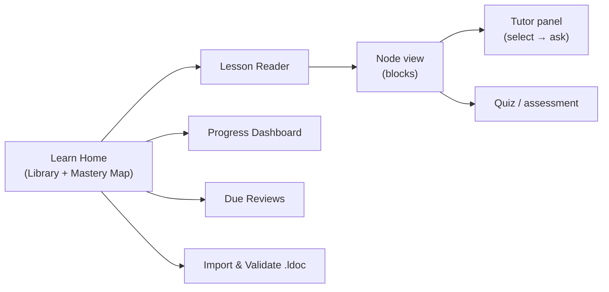

<aside>
🎨

**Implementation-grade frontend design** for the Lyceum "Learn" module — the visual + interaction spec a model/engineer can build directly. Pairs with the Lyceum — Backend Implementation Spec (v0.2) and the Lyceum v0.1 — Design Critique & .ldoc Spec.

**Tooling honesty:** the "impeccable / human-centric / pro-max / taste" skills and the **21st.dev MCP are not connected to me in this environment**, so I can't invoke them. I've applied their *principles* directly (design tokens, IA, wireframes, component contracts, motion, a11y) plus Notion's `website-building` design kit. When you're ready, I can also generate a real clickable HTML prototype.

</aside>

## 1 · Design principles (your profile, encoded)

From Clement — Personal Context: strong **visual learner**, depth-to-mastery, design-rationale over API trivia, math-first.

1. **Visual-first by default.** A diagram/figure/widget is the hero of a node; prose supports it, never the reverse. (The validator already enforces ≥1 visual for L2+ nodes.)
2. **One concept per view.** A node is a focused reading surface; no infinite scroll of unrelated content.
3. **Progressive disclosure.** Deeper/remedial `layer` blocks stay collapsed until earned or requested — calm by default, deep on demand.
4. **Tutor is ambient, not modal.** "Select anything → ask" must feel instant and local, never a context switch.
5. **Assessment is evidence, not judgment.** Mastery shows as a *growing* signal, never a red "fail." Tone = coach.
6. **Honest grounding.** Every tutor answer shows its sources and scope; out-of-scope is shown as a boundary, not a hallucinated guess.
7. **Quiet, focused aesthetic.** This is a study tool — low-chroma surfaces, high-contrast text, color reserved for meaning (mastery, status).

## 2 · Design language (tokens)

Dark-first (study at night), light parity. Express as CSS vars / Tailwind theme extension.

| Token | Dark | Light | Use |
| --- | --- | --- | --- |
| `--bg` | #0E0F13 | #FBFCFD | app canvas |
| `--surface` | #16181F | #FFFFFF | cards, panels |
| `--surface-2` | #1E2128 | #F2F4F7 | insets, code |
| `--border` | #2A2E37 | #E4E7EC | hairlines |
| `--text` | #ECEEF2 | #14181F | primary text |
| `--text-muted` | #9AA3B2 | #5B6472 | secondary |
| `--accent` | #7C8CF8 | #4759E0 | primary action, links |
| `--accent-soft` | #7C8CF826 | #4759E014 | selection, hover wash |

**Mastery scale (single source of truth for color):**

| Level | Meaning | Color |
| --- | --- | --- |
| L0 | Untouched | #5B6472 slate |
| L1 | Exposed | #5B8DEF blue |
| L2 | Familiar | #23B5B5 teal |
| L3 | Working | #3CCB7F green |
| L4 | Deep | #A78BFA violet |
| L5 | Mastery | #F5C04E gold |
- **Type:** UI = Inter / system. **Reading body = a serif** (Source Serif / Lora) for prose blocks — longer-form legibility. Code = JetBrains Mono. Scale (rem): 0.78 / 0.875 / 1 / 1.125 / 1.375 / 1.75 / 2.25; body reading 1.0625 with `line-height 1.7`, `max-width 68ch`.
- **Spacing:** 4px base → 4/8/12/16/24/32/48/64.
- **Radius:** 8 (controls) / 12 (cards) / 16 (panels). **Elevation:** one soft shadow for popovers only; surfaces separated by border, not shadow.
- **Motion:** 150ms (hover/press), 220ms (panel/layer reveal), `cubic-bezier(0.2,0.8,0.2,1)`; respect `prefers-reduced-motion`.

## 3 · Information architecture



Learn sits as a top-level DeskFlow module (sidebar entry **Learn**, sibling to the AI-infra page — not nested in it).

## 4 · Screen specs (wireframes)

### 4.1 Learn Home — Library + Mastery Map

```
┌─ Learn ─────────────────────────────────────────┐
│  Continue        Due for review (3)        [ Import .ldoc ] │
│  ┌────────────┐  ┌──────────┐                          │
│  │ Autograd    │  │ zero_grad│   ← mastery-ringed cards   │
│  │ ●●●○○ L3   │  │ ●○○ L1 │                          │
│  └────────────┘  └──────────┘                          │
│                                                          │
│  Curriculum (Parts 0–10)            view: [Grid][Graph]  │
│  0 · What AI engineers do      ███████░░  L4              │
│  1 · CS & systems             ███░░░░░░░  L2              │
│  7 · PyTorch                  ██░░░░░░░░  L1              │
│  ...                                                     │
└────────────────────────────────────────────┘
```

- **Graph view** toggles to the prereq **DAG** (force/layered), nodes colored by mastery, locked nodes dimmed until prereqs reached. This is the visual-learner's map of the whole curriculum.

### 4.2 Lesson Reader — 3-pane (the core surface)

```
┌─ Outline ─┐┌─ Node: “Autograd is a tape” ────────┐┌─ Tutor ─────┐
│ ● tape    ││ [🎯 callout] you already built this ││ Ask about    │
│ ○ zero..  ││ prose …                            ││ “VJP”        │
│           ││ $ Jᵀ · dL/dy $   (math, captioned)││ ────────── │
│ target L4 ││ [mermaid: forward/backward tape] ││ Answer (s1) │
│ ●●●○○    ││ [code ▶ run]  x.grad → 6.          ││ grounded …   │
│           ││ [▣ widget: graph-explorer]        ││ Sources · Scope│
│ Prereqs:  ││ [quiz · open] why reverse-mode?   ││ [Helpful?]  │
│ backprop✓ ││ ▸ Go deeper (L4 layer)            ││             │
└─────────┘└────────────────────────────┘└──────────┘
```

- **Left:** node outline within the lesson + this node's mastery ring, target, and prereq status (✓ met / locked).
- **Center:** the rendered `.ldoc` blocks (§5). Comfortable reading column; visuals can break out wider.
- **Right:** the **Tutor panel** (collapsible). Default collapsed to a slim rail with an “Ask” affordance; expands on select-to-ask.
- Responsive: < 1100px → tutor becomes a bottom sheet; outline becomes a top dropdown.

### 4.3 “Select anything → ask” (the signature interaction)

```
user selects text / clicks a block's ⋮ → floating pill:
     [ 💡 Explain ]  [ ❓ Ask… ]  [ 🔍 Simpler ]  [ ↗ Deeper ]
           │
           ▼  (opens Tutor panel, pre-scoped to that block_id)
   Answer streams in, grounded; shows [s1][s2] chips + a “Scope: autograd”
   tag. If out-of-scope → calm boundary card: “That's outside this section
   — want me to use a broader model?”  [Use bigger model]
```

- Every block carries a stable `block_id` → the ask is locally grounded to that block/node (backend §7–8).
- Streaming tokens; citations render as chips that scroll the source into a footnote popover.
- Latency target: first token < 1.2s on cache miss; instant on cache hit.

### 4.4 Block renderers (visual contract per type)

| Block | Render | States / affordances |
| --- | --- | --- |
| `prose` | Serif reading column, 68ch | select-to-ask |
| `math` | KaTeX, centered, caption below | tap = enlarge; ask |
| `mermaid` | Rendered SVG, zoom/pan, caption | loading skeleton; render-error fallback to source |
| `code` | Mono, syntax-highlighted, Stage badge | copy; **Run** (if `runnable`) → output drawer |
| `image` | Figure + caption + source/license footnote | broken → `fallback_url` → placeholder w/ alt |
| `video` | Lazy facade → embed on click | provider chip; license footnote |
| `widget` | Sandboxed `<iframe>`, template-driven | loading; capability/denied notice; reset |
| `quiz` | mcq/numeric inline; open = textarea + rubric reveal | submit → evidence; explanation reveal |
| `callout` | Toned card + icon | tone via mastery/semantic color |
| `layer` | Collapsed disclosure (“Go deeper” / “Need a refresher”) | auto-open by mastery; manual toggle |

### 4.5 Quiz & assessment feedback

- Closed quiz: inline select → immediate correctness + grounded explanation. Wrong answers map to a `misconception` correction when one matches.
- Open quiz: textarea → tutor grades against `rubric` → shows the level demonstrated + what would raise it. **No score shaming**; framed as “you showed L3 — here's the step to L4.”
- Each submission emits an evidence event; the node's mastery ring animates its change.

### 4.6 Progress Dashboard

```
┌─ Mastery ────────────────────────────────────┐
│ Parts 0–10 heat-strip (L0–L5 colored)                 │
│ ┌─ Prereq DAG ───────────┐  ┌─ Due reviews ──────┐ │
│ │ ●→●→●  (color=mastery) │  │ zero_grad  today   │ │
│ │     ↘● locked          │  │ backprop   2d ago  │ │
│ └───────────────────┘  └───────────────┘ │
│ Trend: levels over time (sparkline per Part)         │
└─────────────────────────────────────────┘
```

Mirrors the North Star L0–L5 tracker (backend writes back), so the doc + app always agree.

### 4.7 Import & Validate

- Drop/paste `.ldoc` → runs `learn:validate` → a **validation report** UI: each rule pass/fail with node/block jump-links; import button disabled until errors clear (warnings allowed). Visual rule, broken links, missing keys each shown with a fix hint.

## 5 · Component inventory

| Component | Key props | States |
| --- | --- | --- |
| `<LessonReader>` | `lessonId` | loading / error / ready |
| `<NodeView>` | `node, progress` | ready / locked (prereqs unmet) |
| `<BlockRenderer>` | `block, onAsk` | per-type (see 4.4) |
| `<TutorPanel>` | `nodeId, blockId?` | idle / streaming / grounded / out-of-scope / error |
| `<MasteryRing>` | `level, target` | static / animating promotion |
| `<CurriculumGraph>` | `nodes, edges` | grid / graph; locked dim |
| `<WidgetHost>` | `template, params, capabilities` | loading / ready / denied |
| `<QuizBlock>` | `format, q, ...` | unanswered / submitted / explained |
| `<ValidationReport>` | `report` | pass / has-errors |
| `<CitationChip>` | `sourceId` | default / popover open |

## 6 · Universal states

- **Empty:** no lessons → friendly “Import your first .ldoc” with the worked example offered.
- **Loading:** skeletons that match final layout (no spinners for content).
- **Error:** inline, recoverable, never a dead end; show what failed + retry.
- **Offline:** reading + cached tutor answers work; live tutor shows a queued state.
- **Locked node:** show prereq chips with a path to unlock.

## 7 · Accessibility & input

- WCAG AA contrast (tokens chosen to pass on both themes); never color-only — mastery also shows the `L#` label + ring fill.
- Full keyboard: `j/k` next/prev block, `a` ask on focused block, `?` shortcuts, `/` search. Focus-visible rings everywhere.
- Screen-reader: blocks are landmarks; math has `aria-label` from caption/alt; widgets expose an accessible summary.
- `prefers-reduced-motion` disables non-essential animation.

## 8 · Tech mapping

- React + Tailwind (DeskFlow stack) ♻️; tokens → Tailwind theme. Markdown via existing renderer; math via KaTeX; diagrams via Mermaid; code via existing highlighter.
- Each block type = a component switched on `block.type`; unknown types render a graceful “unsupported block” placeholder (never crash).
- Widgets in `<iframe sandbox>` + `postMessage` io-contract from backend §14.
- All data via `window.learn.*` (backend §11); optimistic UI for quiz/evidence with reconcile.

## 9 · Build order (frontend) — mirrors backend

1. **Reader shell** + `BlockRenderer` for prose/math/mermaid/code/callout/image (static lesson renders).
2. **Quiz + layer + MasteryRing + progress write** (interactive + adaptive reveal).
3. **WidgetHost** (template widgets: function-plotter, graph-explorer).
4. **TutorPanel** + select-to-ask + citations + scope boundary.
5. **CurriculumGraph + Dashboard + Due reviews.**
6. **Import & ValidationReport** UI.

---

<aside>
🛑

**Still awaiting your “go” before any code.** With backend + frontend now specified, the design package is implementation-ready. If you want, my next step can be a **clickable HTML prototype** of the Lesson Reader (4.2) so you can feel the select-to-ask flow before we build it in DeskFlow.

</aside>