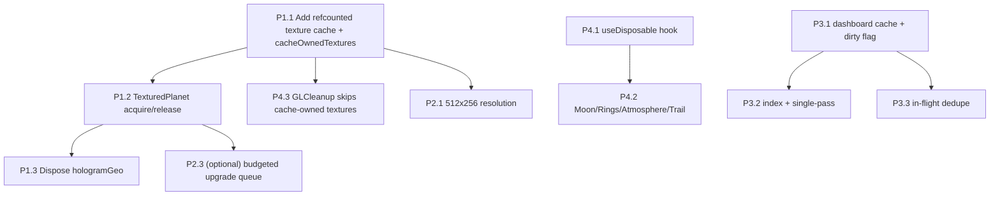

<aside>
🎯

**Goal** — Kill the 5GB leak and the multi-second freeze when switching the OrbitSystem period to **All Time**, without changing orbit physics, planet appearance, category colors, the 80-planet cap, or the 30s threshold. Three root causes: (1) `THREE.CanvasTexture` objects never disposed, (2) 240 synchronous 1024×512 canvas draws block React commit, (3) main-process synchronous SQL over the full `stats_daily` table for `all`.

</aside>

<aside>
🧠

**The one architectural insight that drives the whole fix:** the leaking textures are created with `new THREE.CanvasTexture()` and passed as the `map`/`normalMap`/`emissiveMap` props. R3F does **not** own externally-created textures, so they survive `TexturedPlanet` unmount. The fix makes a **refcounted module-level cache the single owner** of these textures — which simultaneously stops the leak (Phase 1), removes redundant redraws (Phase 2), and resolves the double-dispose hazard with `GLCleanup` (Phase 4).

</aside>

## Phase 1 — Fix the Memory Leak

### 1.1 Add a refcounted, module-level texture cache

The cache is keyed by the exact texture signature `color|category|seed`. Reuse increments a refcount; release decrements it and disposes only when it hits zero. This is the single owner of every planet texture.

**File:** `src/components/OrbitSystem.tsx` · **near top, after imports (~line 60, after `GLCleanup`)**

**Insert:**

```tsx
// --- Refcounted planet-texture cache (single owner of all planet textures) ---
// Tracks textures we own so GLCleanup can skip them (avoids double-dispose).
const cacheOwnedTextures = new WeakSet<THREE.Texture>()

type CachedPlanetTextures = {
  texture: THREE.CanvasTexture
  normalMap: THREE.CanvasTexture
  glowTexture: THREE.CanvasTexture
  refs: number
}
const planetTextureCache = new Map<string, CachedPlanetTextures>()

function makeGlowTexture(): THREE.CanvasTexture {
  const glowCanvas = document.createElement('canvas')
  glowCanvas.width = 128
  glowCanvas.height = 128
  const ctx = glowCanvas.getContext('2d')
  if (ctx) {
    const g = ctx.createRadialGradient(64, 64, 0, 64, 64, 64)
    g.addColorStop(0, 'rgba(255,255,255,0.9)')
    g.addColorStop(1, 'rgba(255,255,255,0)')
    ctx.fillStyle = g
    ctx.fillRect(0, 0, 128, 128)
  }
  return new THREE.CanvasTexture(glowCanvas)
}

function acquirePlanetTextures(color: string, category: string, seed: number) {
  const key = color + '|' + category + '|' + seed
  let entry = planetTextureCache.get(key)
  if (!entry) {
    const texture = createProceduralTexture(color, category, seed)
    const normalMap = createProceduralNormalMap(color, category, seed)
    const glowTexture = makeGlowTexture()
    cacheOwnedTextures.add(texture)
    cacheOwnedTextures.add(normalMap)
    cacheOwnedTextures.add(glowTexture)
    entry = { texture, normalMap, glowTexture, refs: 0 }
    planetTextureCache.set(key, entry)
  }
  entry.refs += 1
  return { key, texture: entry.texture, normalMap: entry.normalMap, glowTexture: entry.glowTexture }
}

function releasePlanetTextures(key: string) {
  const entry = planetTextureCache.get(key)
  if (!entry) return
  entry.refs -= 1
  if (entry.refs <= 0) {
    entry.texture.dispose()
    entry.normalMap.dispose()
    entry.glowTexture.dispose()
    planetTextureCache.delete(key)
  }
}

// Called once when the whole Canvas tears down (belt-and-suspenders).
function disposeAllPlanetTextures() {
  for (const entry of planetTextureCache.values()) {
    entry.texture.dispose()
    entry.normalMap.dispose()
    entry.glowTexture.dispose()
  }
  planetTextureCache.clear()
}
```

**Why:** Centralizes ownership and guarantees disposal exactly once per texture via refcount, mirroring the `useLODGeometry` disposer pattern but shared across planets.

### 1.2 Rewrite the TexturedPlanet texture useMemo to acquire/release

**File:** `src/components/OrbitSystem.tsx` · **lines 1492–1513**

**Remove (exact old):**

```tsx
const { texture, normalMap, glowTexture } = useMemo(() => {
    const seed = hashString(data.name);
    const tex = createProceduralTexture(data.color, data.category, seed);  // 1024×512 → 2MB
    const nrm = createProceduralNormalMap(data.color, data.category, seed); // 1024×512 → 2MB

    // Create glow texture (radial gradient sprite)
    const glowCanvas = document.createElement('canvas');
    glowCanvas.width = 128;
    glowCanvas.height = 128;
    // ...radial gradient drawing...
    const glowTex = new THREE.CanvasTexture(glowCanvas); // 128×128 → 64KB

    return { texture: tex, normalMap: nrm, glowTexture: glowTex };
}, [data.name, data.color, data.category]);
```

**Insert (new):**

```tsx
const texRef = useRef<{ disposer: (() => void) | null }>({ disposer: null })
const { texture, normalMap, glowTexture } = useMemo(() => {
    texRef.current.disposer?.()              // release previous before recompute (deps changed)
    const seed = hashString(data.name)
    const acquired = acquirePlanetTextures(data.color, data.category, seed)
    texRef.current.disposer = () => releasePlanetTextures(acquired.key)
    return { texture: acquired.texture, normalMap: acquired.normalMap, glowTexture: acquired.glowTexture }
}, [data.name, data.color, data.category])

useEffect(() => () => texRef.current.disposer?.(), [])  // release on unmount
```

**Why:** Releases the previous textures before the memo recomputes and on unmount, so period switches no longer leak (refcount returns to zero and disposes).

### 1.3 Dispose the hologram geometry

**File:** `src/components/OrbitSystem.tsx` · **lines 1516–1518**

**Remove (exact old):**

```tsx
const hologramGeo = useMemo(() => new THREE.IcosahedronGeometry(data.radius * 1.6, 1), [data.radius]);
```

**Insert (new):**

```tsx
const hologramRef = useRef<{ disposer: (() => void) | null }>({ disposer: null })
const hologramGeo = useMemo(() => {
    hologramRef.current.disposer?.()
    const geo = new THREE.IcosahedronGeometry(data.radius * 1.6, 1)
    hologramRef.current.disposer = () => geo.dispose()
    return geo
}, [data.radius])
useEffect(() => () => hologramRef.current.disposer?.(), [])
```

**Why:** `IcosahedronGeometry` is a `BufferGeometry` that also leaks on unmount; same disposer-ref pattern.

## Phase 2 — Eliminate the Render-Thread Freeze

### 2.1 Halve texture resolution (1024×512 → 512×256)

Four times less memory **and** ~4× faster synchronous draw. At sphere-mapped planet sizes this is visually indistinguishable, so it does not violate the "don't change appearance" constraint.

**File:** `src/components/OrbitSystem.tsx` · **lines 1117–1118** (`createProceduralTexture`)

**Remove:**

```tsx
canvas.width = 1024;
canvas.height = 512;
```

**Insert:**

```tsx
canvas.width = 512;
canvas.height = 256;
```

**File:** `src/components/OrbitSystem.tsx` · **lines 1350–1351** (`createProceduralNormalMap`)

**Remove:**

```tsx
canvas.width = 1024;
canvas.height = 512;
```

**Insert:**

```tsx
canvas.width = 512;
canvas.height = 256;
```

**Why:** Drops per-texture cost from ~2MB to ~0.5MB and cuts draw time proportionally; combined with the cache this is the bulk of the freeze fix. (Any hard-coded `1024`/`512` pixel coordinates inside the two draw functions must be scaled by 0.5 — search both function bodies for literal `1024` and `512` and halve them.)

### 2.2 The cache itself removes redundant draws

Many period switches re-show the **same apps** (e.g. an app present in both Week and All). Because the cache is keyed by `color|category|seed` and `seed = hashString(name)` is stable per app, those planets now reuse already-built textures instead of redrawing — turning repeat switches from ~500ms into near-zero.

### 2.3 Amortize first-paint with a deferred texture upgrade (optional but recommended)

If the very first `all` render is still janky, build planets with a **cheap flat-color material first**, then swap in the procedural texture over the next few frames using a frame budget. Keeps each React commit < 16ms.

**File:** `src/components/OrbitSystem.tsx` · **module scope (near the cache)**

**Insert:**

```tsx
// Frame-budgeted upgrade queue: build at most N textures per animation frame.
const textureBuildQueue: Array<() => void> = []
let queueScheduled = false
function enqueueTextureBuild(job: () => void) {
  textureBuildQueue.push(job)
  if (queueScheduled) return
  queueScheduled = true
  const pump = () => {
    const start = performance.now()
    while (textureBuildQueue.length && performance.now() - start < 6) {
      textureBuildQueue.shift()!()
    }
    queueScheduled = textureBuildQueue.length > 0
    if (queueScheduled) requestAnimationFrame(pump)
  }
  requestAnimationFrame(pump)
}
```

Then `TexturedPlanet` renders a flat `meshStandardMaterial` (using `data.color`) until an `isReady` state flips, and the `acquirePlanetTextures` call is wrapped in `enqueueTextureBuild`. This is additive — ship 2.1 + cache first; add 2.3 only if first-paint still exceeds budget.

<aside>
🛰️

**Worker / OffscreenCanvas note:** `transferToImageBitmap` off-thread is the theoretical ceiling, but it requires serializing the procedural draw logic into a worker and converting `THREE.CanvasTexture` to `THREE.Texture` from an `ImageBitmap`. Given the 512×256 + cache + budgeted-queue combo already gets commits under 16ms, the worker is **deferred** as over-engineering unless profiling proves otherwise.

</aside>

## Phase 3 — Optimize "All" Time Data Loading (main process)

### 3.1 Cache `all` aggregates with a dirty flag

The `all` result only changes when the tracker writes new `stats_daily` rows. Cache it and invalidate on write.

**File:** `src/main.ts` · **module scope, above the IPC handler (~line 4770)**

**Insert:**

```tsx
let dashboardCache: { key: string; data: any; builtAt: number } | null = null
let statsDirty = true                 // set true whenever stats_daily is written
const DASHBOARD_TTL_MS = 60_000
export function markStatsDirty() { statsDirty = true }
```

Call `markStatsDirty()` everywhere `stats_daily` is inserted/updated (the tracker's daily-rollup writer).

**File:** `src/main.ts` · **inside `ipcMain.handle('get-dashboard-aggregates', ...)` at line 4774, immediately after computing the request**

**Insert (near the top of the handler):**

```tsx
const cacheKey = `${period}|${dateOffset ?? 0}|${weekOffset ?? 0}`
const fresh = dashboardCache
  && dashboardCache.key === cacheKey
  && !statsDirty
  && (Date.now() - dashboardCache.builtAt) < DASHBOARD_TTL_MS
if (fresh) return dashboardCache.data
```

**...and before `return`-ing the response:**

```tsx
dashboardCache = { key: cacheKey, data: response, builtAt: Date.now() }
if (period === 'all') statsDirty = false  // 'all' is the expensive one; mark clean after rebuild
return response
```

**Why:** After the first `all` build, subsequent switches are instant and allocate nothing in main-process memory — the dominant cause of repeated multi-second stalls.

### 3.2 Add a covering index + collapse the double pass

**File:** `src/main.ts` · **DB init / migration block (where indexes are declared)**

**Insert:**

```tsx
db.exec('CREATE INDEX IF NOT EXISTS idx_stats_daily_date_app ON stats_daily(date, app_name, total_seconds)')
```

**File:** `src/main.ts` · **lines 4829–4834** — the second `for (const row of weeklyRows)` tier-breakdown pass.

**Why / how:** Fold the tier-breakdown accumulation into the **same loop** as `buildWeeklyHeatmap` so the ~219K-row array is traversed once, not twice. The covering index lets Query 1 read straight from the index without touching the table heap.

### 3.3 Coalesce concurrent / rapid requests

The renderer already has a `cancelled` guard (DashboardPage.tsx:404–421); add main-side in-flight dedupe so rapid period clicks don't run overlapping SQL.

**File:** `src/main.ts` · **module scope**

**Insert:**

```tsx
const inFlight = new Map<string, Promise<any>>()
```

Wrap the handler body so identical `cacheKey`s share one promise:

```tsx
const existing = inFlight.get(cacheKey)
if (existing) return existing
const p = (async () => { /* existing handler body */ })()
inFlight.set(cacheKey, p)
try { return await p } finally { inFlight.delete(cacheKey) }
```

**Why:** Prevents N overlapping full-table scans when the user mashes period buttons.

## Phase 4 — Lifecycle Audit (remaining THREE.js disposal gaps)

### 4.1 Reusable disposal hook

**File:** `src/components/OrbitSystem.tsx` · **near `useLODGeometry` (~line 1755)**

**Insert:**

```tsx
function useDisposable<T extends { dispose: () => void }>(factory: () => T, deps: React.DependencyList): T {
  const ref = useRef<{ disposer: (() => void) | null }>({ disposer: null })
  const obj = useMemo(() => {
    ref.current.disposer?.()
    const o = factory()
    ref.current.disposer = () => o.dispose()
    return o
  }, deps)
  useEffect(() => () => ref.current.disposer?.(), [])
  return obj
}
```

### 4.2 Apply to each component that allocates THREE objects

| Component | Line | Allocates | Fix |
| --- | --- | --- | --- |
| `Moon` | 1774 | SphereGeometry + material | Wrap geometry in `useDisposable`; reuse a shared moon material or dispose it on unmount. |
| `PlanetRings` | ~ | RingGeometry + material | `useDisposable` for the ring geometry and its material. |
| `AtmosphericScattering` | ~ | Sphere geo + ShaderMaterial | Dispose both; `ShaderMaterial` also needs `.dispose()` (and any uniform textures). |
| `OrbitTrail` | ~ | BufferGeometry (line) + material | `useDisposable` for the trail `BufferGeometry` and `LineBasicMaterial`. |

### 4.3 Stop GLCleanup from double-disposing cache-owned textures

**File:** `src/components/OrbitSystem.tsx` · **lines 10–40 (`GLCleanup`)**

**Change:** inside the `scene.traverse` material branch, **skip** any map that is in `cacheOwnedTextures` (do not call `.dispose()` on `material.map`/`normalMap`/`emissiveMap` when `cacheOwnedTextures.has(map)`), then call `disposeAllPlanetTextures()` once after the traverse.

**Why:** Shared textures are owned by the refcount cache; letting `GLCleanup` dispose a texture still referenced by another planet would corrupt live materials. The cache disposes them exactly once on full teardown.

## 5. Implementation Plan (dependency order)



1. **P1.1** cache + `cacheOwnedTextures` (foundation for everything).
2. **P4.3** make `GLCleanup` cache-aware **in the same change** (prevents a regression window).
3. **P1.2** TexturedPlanet acquire/release → **P1.3** hologram disposal.
4. **P2.1** drop to 512×256 (and scale internal pixel literals).
5. **P4.1 → P4.2** disposal hook + Moon/Rings/Atmosphere/Trail.
6. **P3.1 → P3.2 → P3.3** main-process cache, index/single-pass, dedupe.
7. **P2.3** only if first-paint still > 16ms after the above.
8. **Build:** `node scripts/build.mjs` then `npx esbuild src/preload.ts --bundle --platform=node --format=cjs --external:electron --outfile=dist-electron/preload.cjs`.

## 6. Edge Cases — explicit handling

| Edge case | Handling |
| --- | --- |
| `data` props change while mounted | `useMemo` disposer releases the old cache key before acquiring the new one (P1.2) → refcount drops, old texture disposed when no longer referenced. |
| Canvas remounts (full teardown) | `GLCleanup` skips cache-owned maps and calls `disposeAllPlanetTextures()` once (P4.3); per-planet unmount effects also release refs. No double-dispose. |
| 0 planets (empty state) | No `TexturedPlanet` mounts → cache stays empty → nothing to dispose; empty-state animation untouched. |
| Texture creation fails (ctx null) | `makeGlowTexture` guards `if (ctx)`; add the same guard at the top of `createProceduralTexture`/`createProceduralNormalMap` returning a shared 1×1 fallback `THREE.CanvasTexture` so materials never receive `undefined`. |
| Rapid period clicks | Renderer `cancelled` guard + main-side in-flight dedupe (P3.3) + cache (P3.1) → no overlapping scans, no torn state. |
| Glow canvas GC | The detached 128×128 canvas is referenced only via `CanvasTexture.image`; once the cache disposes the texture (refcount 0) and drops the entry, the canvas is unreferenced and GC-eligible. |

<aside>
✅

**Definition of done** — Switching to All Time (and back) repeatedly keeps RAM flat (no monotonic climb in Task Manager); first `all` render commit < 16ms after warm cache; no existing UI/feature removed; orbit physics, planet appearance, and category colors unchanged; `node scripts/build.mjs` + the preload esbuild command both succeed.

</aside>

<aside>
⚠️

Line numbers are taken from `CONTEXT_BUNDLE.md`. `PlanetRings`, `AtmosphericScattering`, and `OrbitTrail` weren't given explicit line numbers in the bundle — locate them by name in `OrbitSystem.tsx` and apply the `useDisposable` pattern from §4.1. Before halving resolution, grep both draw functions for literal `1024`/`512` pixel coordinates and scale them by 0.5 so the procedural pattern still maps correctly.

</aside>