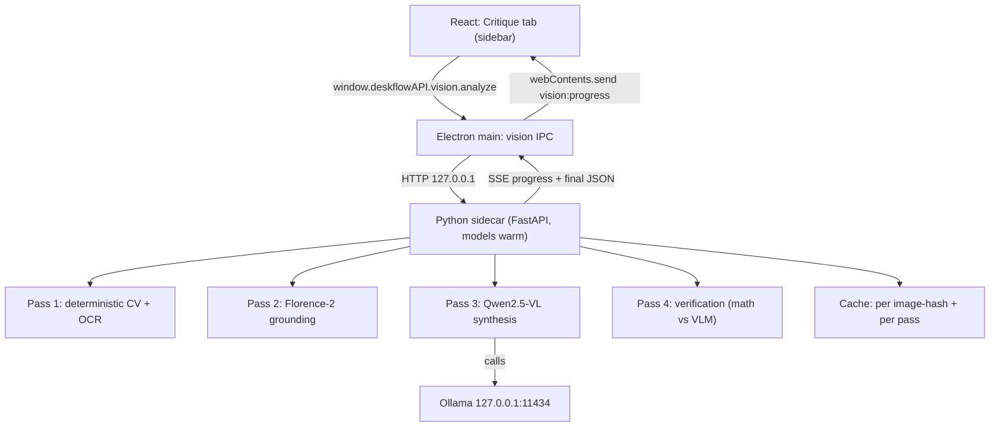

<aside>
🛠️

**BUILD PACKET — for opencode (Hands & Eyes).** This is a *plan-first* packet. Validate the design, then build **M0 → M1 only**. Do **NOT** write the whole codebase. Stop after each milestone and reply in CYCLE REPORT format. Architect: Notion AI. Target: **RTX 4050 laptop · 6 GB VRAM · fully local · no cloud APIs.**

</aside>

## 0. Scope & non-negotiable principles

- The feature lives **inside DeskFlow** as a new sidebar tool ("Critique"), not a standalone app.
- **Hybrid, measure-don't-ask.** Deterministic CV/OCR produces every *number*. The VLM only (a) labels elements with boxes and (b) writes prose **anchored to those numbers**. Never ask the VLM for a measurement (color, distance, contrast, size).
- **Deterministic-first build order.** You ship a useful measured report *before any model is wired* (M1). VLM passes come later (M3–M4). This de-risks the whole thing.
- Every judgment in the final output must cite a measured value (px, ratio, hex). No vibes.
- Trust the math: when a VLM claim disagrees with a measured value, the measured value wins and the disagreement is flagged.

## 0b. Assumptions — CONFIRM these before starting M0

<aside>
⚠️

These are my assumptions about DeskFlow + the runtime. If any are wrong, tell CZ before building — they change the plan.

</aside>

1. **Stack:** Electron + TypeScript + React + Vite. Main uses `ipcMain.handle`, preload exposes `window.deskflowAPI`, preload is bundled by esbuild to `dist-electron/preload.cjs`. (From AGENTS.md / context bundle.)
2. **Python is NOT currently a dependency.** This feature introduces a Python sidecar. Confirm that's acceptable. (The pure-Node alternative — ONNXRuntime + JS color/CV — is far more work and weaker OCR; not recommended.)
3. **Ollama is installed** on the target machine and reachable at `127.0.0.1:11434`. If not, we bundle `llama.cpp` instead — confirm which.
4. **CUDA-enabled PyTorch** works on the 4050 (needed for Florence-2). A CPU fallback exists but is ~10× slower.
5. We target the **dev runtime first** (system Python + a venv + `requirements.txt`). Production packaging (PyInstaller / embedded Python) is its own later milestone, not M0–M5.
6. New sidebar nav items are registered in DeskFlow's nav/router component. **Point the agent at that file** so it edits the right place (don't invent a new nav system).

## 1. Architecture



**How it slots into DeskFlow**

- **Renderer:** one new feature module `src/features/critique/` with a `CritiqueTab.tsx` page + a sidebar nav entry. Mirrors how Finance is structured (`FinancePage` + tabs).
- **Main:** one new IPC module `src/main/ipc/visionHandlers.ts` registered in bootstrap (the same `registerXHandlers()` pattern — and remember the rebuild-preload gotcha from MEMORY.md).
- **Sidecar:** a new Python package `vision-sidecar/` (outside the TS build) that the main process spawns and supervises. Electron talks to it over local HTTP; the sidecar talks to Ollama. The renderer never talks to Python directly.
- **Why a long-lived HTTP sidecar, not one-shot child processes:** model load is the slow part (seconds). A persistent process keeps Florence/Qwen warm and lets us stream per-pass progress over SSE. One-shot `spawn` per request would reload models every call — unacceptable.

## 2. Models & quantization (the 6 GB plan)

| Pass | Model | Precision | ~VRAM | Why |
| --- | --- | --- | --- | --- |
| 1 · OCR | PaddleOCR (PP-OCRv4) — Tesseract fallback | CPU | 0 (RAM only) | Accurate boxes + text; keep VRAM free for the VLM. |
| 1 · CV/color | Pillow + NumPy + scikit-learn (k-means in LAB) | CPU | 0 | Palette, gradients, WCAG contrast, geometry — pure math, deterministic. |
| 2 · Grounding | Florence-2-large (0.77B) — base 0.23B fallback | fp16 (no quant) | ~1.5 GB | Native box outputs (OD / dense-region-caption); tiny; keep precision high for grounding as requested. |
| 3 · Synthesis | Qwen2.5-VL-3B-Instruct (default) · 7B opt-in | Q4_K_M GGUF | ~3–3.5 GB (3B) / ~5 GB (7B) | Writes description + critique from measured facts; Q4 is fine for prose anchored to numbers. |

**VRAM budget & scheduling (critical on 6 GB):**

- Reserve ~1 GB for OS/display → treat ~5 GB as usable.
- **Never co-resident.** Run passes sequentially: load Florence → ground → free (`del model; torch.cuda.empty_cache()`) → load Qwen via Ollama → synthesize → unload (`keep_alive: 0`).
- Default synthesis model = **Qwen2.5-VL-3B** (safe headroom). Expose **7B as a "High quality" toggle** with a VRAM pre-check that refuses if Florence didn't release.
- Moondream2 (1.8B) is a valid ultralight alt for description-only if Qwen is too heavy on a given machine.

## 3. Python sidecar ↔ Electron integration

**Process model & lifecycle**

- Main spawns the sidecar **lazily on first Critique use** (not at app start — saves memory for users who never open it): `spawn(python, ['-m', 'vision_sidecar.server', '--port', <freePort>])`.
- Sidecar prints `READY port=<p>` on stdout once models-available check passes; main gates the UI on a `/health` 200.
- Supervise: restart on crash (max N retries with backoff), and **kill on `app.before-quit`** so no orphan Python.
- Pick a **random free port**; pass via arg; never hardcode.

**HTTP API (sidecar, bound to 127.0.0.1 only)**

```
GET  /health              -> { status, gpu, vram_free_mb, models, version }
POST /analyze             -> { job_id }      (async; body = AnalyzeRequest)
GET  /jobs/{id}/events    -> text/event-stream (per-pass progress)
GET  /jobs/{id}           -> CritiqueResult (final JSON, see §4)
POST /jobs/{id}/cancel    -> { ok }
```

`AnalyzeRequest` (all optional except image):

```json
{
	"image_path": "C:/path/or/b64",
	"passes": ["cv", "ocr", "ground", "synth", "verify"],
	"resolution": { "max_long_edge": 2048 },
	"tiling": { "enabled": true, "tile": 768, "overlap": 96 },
	"models": { "ground": "florence2-large", "synth": "qwen2.5vl-3b" },
	"temps": { "facts": 0.1, "prose": 0.6 },
	"rubric_version": "1.0",
	"use_cache": true
}
```

**IPC surface (main → preload → renderer)**

- `vision:analyze` (args) → `{ jobId }`
- `vision:cancel` (jobId)
- `vision:health` → health object
- Main subscribes to the sidecar SSE and forwards: `webContents.send('vision:progress', { jobId, pass, pct, partial })`.
- Preload exposes `window.deskflowAPI.vision = { analyze, cancel, health, onProgress(cb) }`.

**On-disk layout**

- Sidecar code: `vision-sidecar/` (with `requirements.txt`, `vision_sidecar/`).
- Cache: `%APPDATA%/DeskFlow/vision-cache/<imageHash>/<pass>.json`.
- Rubrics: `vision-sidecar/rubrics/v1.0.json` (versioned, see §5).

## 4. Output schema (authoritative)

Define it once as a TypeScript type (shared `src/features/critique/types.ts`; the sidecar mirrors it as a JSON Schema for constrained decoding). bbox convention: **pixel `[x, y, w, h]`, top-left origin, full-resolution coordinates.**

```tsx
export interface CritiqueResult {
	schema_version: "1.0"
	image: ImageMeta
	ocr_text: OcrSpan[]
	palette: PaletteColor[]
	gradients: Gradient[]
	contrast_issues: ContrastIssue[]
	elements: Element[]
	spacing_issues: SpacingIssue[]
	alignment: AlignmentReport
	description: string
	critique: Critique
	scores: Scores
	verification: Verification
	meta: RunMeta
}

export interface ImageMeta {
	hash: string
	width: number
	height: number
	analyzed_at: string
}

export interface OcrSpan {
	text: string
	bbox: [number, number, number, number]
	confidence: number
}

export interface PaletteColor {
	hex: string
	rgb: [number, number, number]
	lab: [number, number, number]
	ratio: number
	role: "background" | "surface" | "text" | "accent" | "other"
}

export interface Gradient {
	bbox: [number, number, number, number]
	type: "linear" | "radial"
	stops: string[]
	angle_deg: number
	smoothness: number
}

export interface ContrastIssue {
	fg: string
	bg: string
	ratio: number
	required: number
	wcag_level: "AA" | "AAA"
	context: "text" | "large_text" | "ui"
	bbox: [number, number, number, number]
	severity: "low" | "med" | "high"
}

export interface Element {
	id: string
	label: string
	type: "button" | "text" | "image" | "card" | "input" | "icon" | "other"
	bbox: [number, number, number, number]
	source: "florence" | "ocr" | "cv"
	confidence: number
}

export interface SpacingIssue {
	kind: "overlap" | "too_close" | "misaligned" | "inconsistent_gap" | "edge_crowding"
	elements: string[]
	measured_px: number
	threshold_px: number
	axis: "x" | "y" | "both"
	severity: "low" | "med" | "high"
	note: string
}

export interface AlignmentReport {
	detected_grid_px: number | null
	columns: number | null
	off_grid_elements: string[]
}

export interface Critique {
	summary: string
	strengths: string[]
	issues: CritiqueIssue[]
}

export interface CritiqueIssue {
	category: "layout" | "color" | "contrast" | "spacing" | "typography" | "hierarchy"
	severity: "low" | "med" | "high"
	evidence: string
	suggestion: string
}

export interface Scores {
	layout: number
	color: number
	contrast: number
	spacing: number
	hierarchy: number
	overall: number
}

export interface Verification {
	claims_checked: number
	disagreements: Disagreement[]
}

export interface Disagreement {
	claim: string
	measured: string
	resolution: "trusted_math"
}

export interface RunMeta {
	passes_run: string[]
	models: Record<string, string>
	timings_ms: Record<string, number>
	cache_hits: string[]
}
```

## 5. Rubric (defaults v1.0 — tied to DeskFlow's own tokens)

| Dimension | Rule / threshold | Flag when |
| --- | --- | --- |
| Contrast (text) | WCAG 2.1: normal ≥ 4.5:1 (AA), ≥ 7:1 (AAA); large (≥24px or ≥18.66px bold) ≥ 3:1 | ratio below required for its size class |
| Contrast (UI) | Interactive / graphical objects ≥ 3:1 | control vs adjacent surface below 3:1 |
| Spacing | 8px base grid; touch targets ≥ 44px (DeskFlow token) | gap between distinct interactive elements &lt; 8px; target &lt; 44px |
| Overlap | Non-nested elements should not intersect | IoU &gt; 0 for non-parent/child pair |
| Edge crowding | ≥ 16px padding from canvas edge (configurable) | element within 16px of edge |
| Color count | Max 3 accent hues (Impeccable skill rule) | &gt; 3 saturated accent hues; complementary high-sat adjacency = clash |
| Gradient | Smoothness score; ≤ 2 hues per ramp preferred | banding / 3+ unrelated hues in one ramp |
| Hierarchy | Limited, consistent type scale | &gt; 5 distinct text heights with no clear order |

Rubric ships as a versioned JSON file; `rubric_version` is part of the cache key so changing thresholds re-runs only what's affected.

## 6. Engineering levers (expose as tunables)

- **Resolution / tiling:** always run CV + OCR at **full resolution** (cheap, preserves detail). For VLM grounding, **tile** high-res images into overlapping crops at the model's native size (~768px, 96px overlap), run grounding per tile, then merge boxes to full-res coords with NMS dedup at seams. Synthesis gets a downscaled full image — the *facts* carry the precision. Expose `tile`, `overlap`, `max_long_edge`.
- **Per-pass model + quant:** higher precision for grounding (Florence fp16), Q4 for synthesis. Switchable.
- **Constrained decoding:** synthesis uses Ollama **structured outputs** (pass the §4 JSON Schema as `format`) or a llama.cpp **GBNF grammar** → always-valid JSON. Florence output is parsed deterministically (its task tokens).
- **Decoding params:** `temp=0.1` for any factual/scoring field, configurable `temp` (default 0.6) for prose critique.
- **Caching:** key = `sha256(image_bytes)` + `pass_id` + `hash(model, quant, resolution, tiling, rubric_version)`. Each pass cached independently; changing one lever invalidates only that pass forward.
- **Rubric injection:** thresholds (contrast, grid, color theory, max-accents) passed into the synthesis prompt as reference so the prose cites the same numbers the CV pass measured.

## 7. Sidebar UI spec (apply the design skills)

**Scope statement (Human-Centric rule):** this work covers the **Critique tab only**. Match the existing DeskFlow finance/glass aesthetic.

- **Tokens:** zinc-950 glass surfaces, emerald `#10b981` accent (or the host page's accent), `rounded-xl` max, `p-5` cards, `tabular-nums` for all numbers, framer-motion fast (150/250ms, ease `cubic-bezier(0.16,1,0.3,1)`), no box-shadow, **max 3 accent colors** (Impeccable).
- **Layout:** left = image canvas with **toggleable overlay layers** (element boxes, contrast flags, spacing violations, palette swatches); right = results rail.
- **Scores as KPI cards** (UI-UX-ProMax dashboard rules): count-up animation, big tabular number, mini bar; **never color-as-only-signal** — pair severity color with an icon + label.
- **Critique list** grouped by category, each issue shows a **severity chip + the measured evidence** ("gap 3px &lt; 8px grid") + suggestion.
- **The four required states for every data element** (Human-Centric #1 anti-slop): **Empty** (no image yet → dropzone), **Loading** (per-pass progress from SSE: "Measuring contrast… Grounding elements…"), **Error** (sidecar down / model OOM → plain-language message + retry), **Populated**. Plus **Partial** (CV done, VLM still running) since passes stream in.
- Accessibility: ≥44px targets, focus `ring-2`, `aria` labels, honor `prefers-reduced-motion`.
- **Export:** "Copy JSON" + "Save report" (the §4 object).

## 8. Incremental build plan (ship value before any VLM)

<aside>
🎯

Build **M0 then M1**, then STOP and report. Do not jump ahead to the VLM passes.

</aside>

- **M0 — Plumbing skeleton.** Critique sidebar tab + image drop/paste + raw-JSON viewer. Electron spawns the FastAPI sidecar; `/health` + `vision:health` green; `vision:progress` event round-trips a fake job. **No analysis yet.** *Value: the pipe works end-to-end.*
- **M1 — Deterministic CV + OCR (NO VLM).** palette (k-means/LAB), gradient detection, WCAG contrast (using OCR text boxes for fg/bg sampling), OCR text+boxes, basic CV element boxes (contours), spacing/overlap/edge metrics on those boxes, rule-based `scores`, templated `description`. Caching by image hash. *Value: a genuinely useful measured report + overlays, zero models.*
- **M2 — Overlay UI + tunables.** Render all overlay layers on the canvas; settings panel for resolution/tiling/thresholds/rubric. Wire the 4+1 UI states properly.
- **M3 — Florence-2 grounding.** Add the grounding pass (tiled), replace/augment CV element boxes with labeled detections; improve spacing analysis; verification scaffold.
- **M4 — Qwen2.5-VL synthesis.** Feed measured facts + rubric → `description` + `critique` with constrained JSON decoding; every judgment cites a number. Sequential load/unload vs Florence.
- **M5 — Verification + hardening.** Cross-check VLM color/position claims vs measured; flag disagreements; per-pass cache maturity; progress polish; (separately) production Python packaging.

## 9. Definition of done (per milestone)

- **M0:** open Critique tab → drop image → see `vision:health` OK and a progress event in the UI; sidecar killed cleanly on quit (no orphan Python).
- **M1:** for a known test screenshot, output contains non-empty `palette`, `contrast_issues` with correct WCAG ratios (hand-verify 2), `ocr_text`, `spacing_issues`, and `scores`; re-running hits cache (timing drop visible in `meta`).
- **M3/M4:** elements have labels+boxes within tolerance; critique issues each cite a measured value; **no VLM-asserted number ever appears unverified** in the final JSON.

## 10. Risks & gotchas

- **Preload not rebuilt** after IPC changes → `window.deskflowAPI.vision` undefined (your MEMORY.md lesson — rebuild preload, full restart).
- **VRAM OOM** if Florence + Qwen co-resident → enforce sequential load/unload + a pre-flight VRAM check before the 7B path.
- **Ollama not running / wrong version** → structured-outputs `format` requires a recent Ollama; health-check the version.
- **Python packaging for production is the real boss fight** — keep it out of M0–M5; dev venv first.
- **Tiling coordinate bugs** → always store/merge boxes in full-res space; unit-test the tile→global transform.

---

**Report format:** after M0 and after M1, reply in the standard CYCLE REPORT block (BUILD / GATE A `window.deskflowAPI.vision` / FEATURE / STEPS / EXPECTED / ACTUAL / consoles / VERDICT).