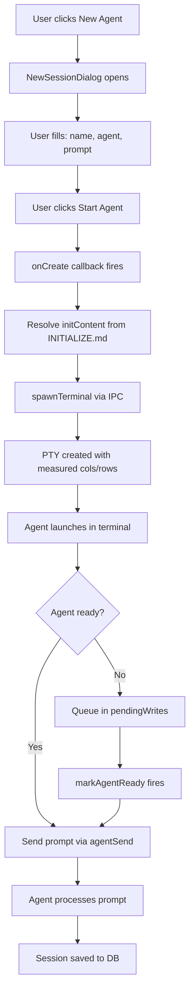
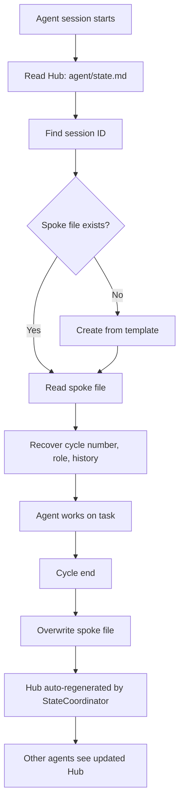
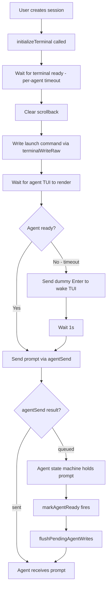
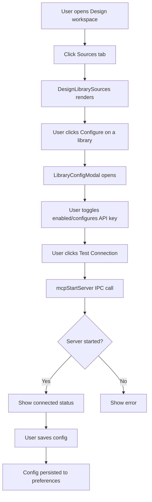

# Feature Logic Registry

> Each feature MUST have a Mermaid flowchart + gap checklist.
> Update this file after every feature implementation.

---

## Feature: Terminal Session Creation

### Flow


### Gaps Found
- [x] Prompt delivery fixed (agentSend instead of terminalWriteRaw)
- [x] Agent timeout fixed (per-agent: Claude=5s, others=1.5s)
- [x] Force-ready fallback added
- [x] Dummy Enter wake added
- [ ] Session resume flow not tested
- [ ] Error recovery for failed spawns missing

### Status: IMPLEMENTED

---

## Feature: Agent Memory System

### Flow
```mermaid
flowchart TD
    A[User sends message] --> B{Matches correction pattern?}
    B -->|Yes| C[Extract lesson content]
    B -->|No| D[Pass through]
    C --> E[Generate dedup key]
    E --> F{Existing memory?}
    F -->|Yes| G[Update importance + correction count]
    F -->|No| H[Create new MemoryEntry]
    H --> I[Score importance]
    I --> J[Assign tier: hot/warm/cold]
    J --> K[Persist to SQLite]
    K --> L[Schedule compaction]
    G --> K

    M[Agent emits save-memory tag] --> N[Parse scope|tags|lesson]
    N --> C

    O[Agent output] --> P{Self-reflection pattern?}
    P -->|Yes| C
    P -->|No| D

    Q[Context assembly] --> R[Load hot memories]
    R --> S[Format as Layer 2.5]
    S --> T[Inject into prompt]
```

### Gaps Found
- [x] User correction capture wired
- [x] [save-memory] tag parsing wired
- [x] Agent self-reflection capture wired
- [x] Hot memory injection into prompt
- [x] Memory UI in ContextMaintenanceTab
- [ ] MEMORY.md migration from old format not tested
- [ ] Compaction schedule not verified running

### Status: IMPLEMENTED

---

## Feature: Multi-Agent State System

### Flow


### Gaps Found
- [x] StateCoordinator watches agent/state/ directory
- [x] Auto-creates spoke files on terminal spawn
- [x] Hub auto-regenerated on spoke changes
- [x] State UI in ContextMaintenanceTab
- [ ] Cross-agent spoke reading not tested
- [ ] History window (3 cycles) not verified

### Status: IMPLEMENTED

---

## Feature: Session Prompt Delivery

### Flow


### Gaps Found
- [x] terminalWriteRaw → agentSend fix
- [x] Per-agent timeout
- [x] Force-ready fallback
- [x] Dummy Enter wake
- [ ] Headless mode for Claude/Gemini/Codex not implemented
- [ ] opencode serve mode not implemented

### Status: IMPLEMENTED

---

## Feature: Design Library Sources

### Flow


### Gaps Found
- [x] LibraryConfigModal crash fixed (state initialization)
- [x] Toggle offset fixed (left-0.5)
- [x] useEffect dependency fixed (removed externalConfig)
- [ ] MCP server lifecycle not fully tested
- [ ] API key persistence not verified

### Status: IMPLEMENTED
