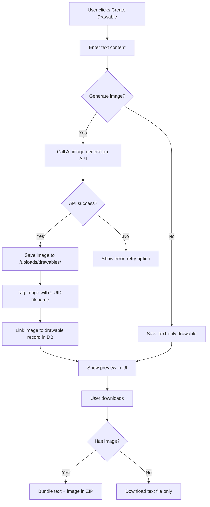
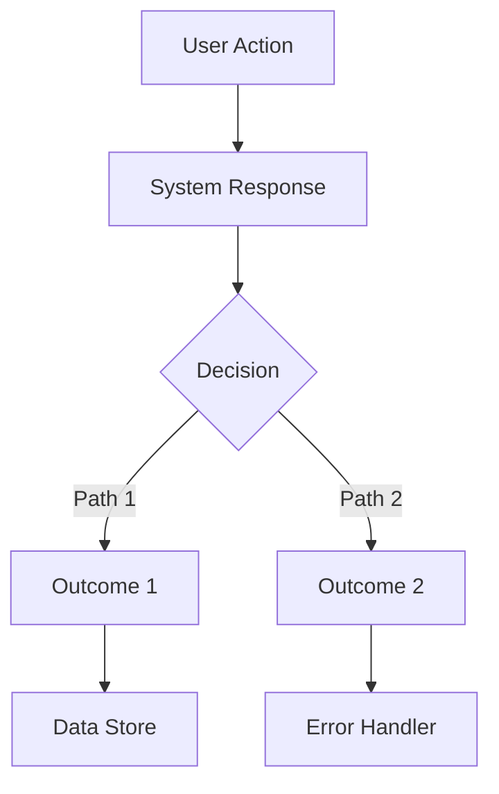

# Feature Logic Audit System — Design Plan

## Problem
AI agents implement features but miss critical logic holes:
- Image naming/separation from text (learning drawable)
- File tagging system missing
- Download flow incomplete
- Error states not handled
- Dead ends in user flow
- Missing IPC connections

## Solution: Feature Logic Registry + Gap Detection

### 1. Feature Registry (`agent/features/REGISTRY.md`)
Each feature gets a Mermaid flowchart + gap checklist:

```markdown
## Feature: Learning Drawable

### Flow


### Gaps Found
- [ ] Image naming convention not defined
- [ ] No file tagging system
- [ ] Download bundles not implemented
- [ ] Error state for API failure missing
- [ ] No retry mechanism

### Status: PARTIAL
```

### 2. Gap Detection Checklist (agent/GAP_CHECKLIST.md)
Agents run this after every feature implementation:

```markdown
## Logic Gap Detection Checklist

### Flow Completeness
- [ ] Every user action has a clear next step
- [ ] No dead ends (user gets stuck with no way forward)
- [ ] All error states have recovery paths
- [ ] All loading states have completion or timeout

### Data Flow
- [ ] Every IPC call has a handler in main.ts
- [ ] Every handler has a preload bridge
- [ ] Every database write has a corresponding read
- [ ] Every file write has a corresponding read

### File Operations
- [ ] File naming convention documented
- [ ] File storage location defined
- [ ] File cleanup/rotation policy defined
- [ ] File tagging/indexing system exists

### UI/UX
- [ ] Empty states handled
- [ ] Loading states handled
- [ ] Error states handled
- [ ] Success feedback shown
- [ ] Undo/cancel available where appropriate

### Integration
- [ ] Feature works with all agent types
- [ ] Feature works in offline mode
- [ ] Feature respects token budgets
- [ ] Feature doesn't break existing functionality
```

### 3. Sidebar UI — Feature Logic Panel
New section in workspace sidebar showing:
- List of all features with status indicators
- Click to expand Mermaid diagram
- Gap count badge (red/yellow/green)
- Link to full documentation

### 4. System Prompt Updates

#### AGENTS.md addition:
```markdown
## Feature Logic Audit (MANDATORY after every feature)

After implementing ANY feature, you MUST:

1. **Read the feature registry** (`agent/features/REGISTRY.md`)
2. **Run the gap checklist** (`agent/GAP_CHECKLIST.md`)
3. **Document the flow** in Mermaid format
4. **Update the registry** with gaps found
5. **Fix critical gaps** before claiming done

If you skip this, the feature WILL have logic holes that break the user experience.
```

#### DEFAULT_SYSTEM_PROMPT.md addition:
```markdown
## 9. Feature Logic Audit (post-implementation)

After every feature implementation:
1. Draw the complete user flow as a Mermaid diagram
2. Check every node for: next step, error path, loading state
3. Check every edge for: data flow, IPC call, file operation
4. Document gaps in agent/features/REGISTRY.md
5. Fix critical gaps (dead ends, missing error handling)
6. Report gaps that need Architect decision
```

### 5. Implementation Files

| File | Purpose |
|------|---------|
| `agent/features/REGISTRY.md` | Feature registry with Mermaid diagrams |
| `agent/GAP_CHECKLIST.md` | Gap detection checklist |
| `src/components/workspace/FeatureLogicPanel.tsx` | Sidebar UI component |
| `AGENTS.md` | Updated with audit protocol |
| `agent/DEFAULT_SYSTEM_PROMPT.md` | Updated with audit protocol |

### 6. Mermaid Diagram Standards

Every feature MUST have:
- **Flowchart** — user actions → system responses → data flow
- **Decision nodes** — every branch point documented
- **Error paths** — every failure mode with recovery
- **Data stores** — every DB/file/IPC operation

Format:

