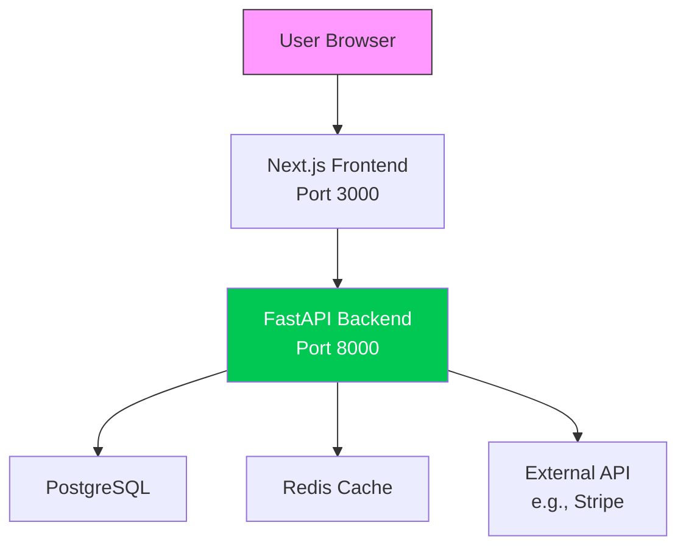
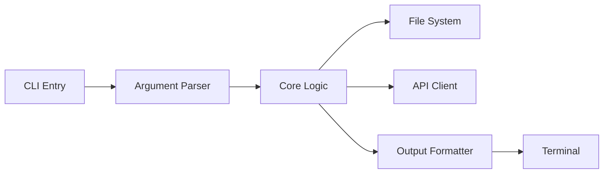
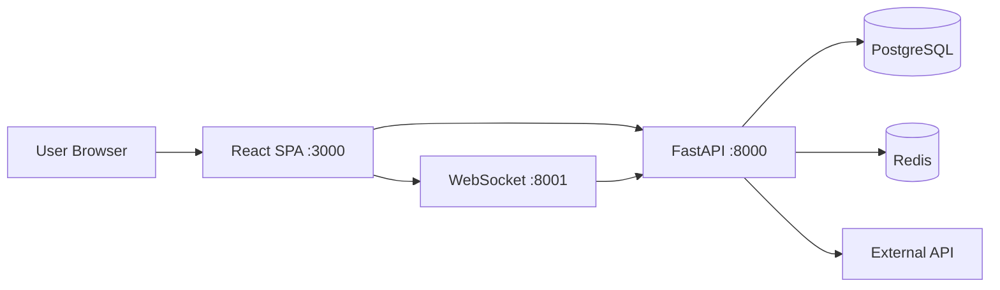

---
id: readme-generator
name: README Generator
category: documentation
applicable_to: [readme, documentation]
version: 1.0.0
created: 2026-04-19
tags: [documentation, readme, markdown]
---

# README Generator Skill

## When to Activate

Use this skill when the user says:
- "Create a README for this project"
- "Generate documentation"
- "Make my project look professional on GitHub"
- "Add badges and diagrams to the README"
- "Improve the existing README"

## Output

A single file: `README.md` at the project root, replacing or enhancing any existing README.

---

## Workflow

### Step 1: Project Analysis

Run the following analysis to gather all necessary information:

```bash
# 1. Detect primary language and framework
ls -la | grep -E "package.json|requirements.txt|go.mod|Cargo.toml|pyproject.toml|setup.py|Gemfile|composer.json"

# 2. Read dependency files
cat package.json 2>/dev/null || cat requirements.txt 2>/dev/null || cat go.mod 2>/dev/null || cat Cargo.toml 2>/dev/null

# 3. Find entry point / main file
ls -la | grep -E "main\.|index\.|app\.|cli\.|server\."

# 4. Detect test framework
grep -i "jest|pytest|unittest|mocha|vitest|go test|cargo test" * 2>/dev/null | head -5

# 5. Identify project type (web app, CLI, library, API, etc.)
grep -i "express|fastapi|django|flask|spring|next|react|vue|angular" * 2>/dev/null | head -3
```

From the output, extract:
- **Primary language** (Python, JavaScript, Go, Rust, etc.)
- **Framework** (FastAPI, React, Next.js, etc.)
- **Database** (PostgreSQL, MongoDB, Supabase, etc.)
- **ORM/ODM** (Prisma, SQLAlchemy, etc.)
- **Testing library** (Jest, Pytest, etc.)
- **Project type** (web app, CLI tool, library, API, mobile app)
- **Existing scripts** (from package.json or Makefile)
- **License** (check LICENSE file or detect from package.json)

### Step 2: Determine Core Complexity & CS Topics

Based on the codebase, identify:

- **Complexity level** (Beginner / Intermediate / Advanced)
- **Computer Science topics** used (e.g., LSTM neural networks, Bayesian inference, Graph algorithms, Real-time WebSockets, Caching strategies, etc.)
- **Core understanding** required (e.g., "Understanding of event-driven architecture", "Familiarity with attention mechanisms")

These will appear in the badges or a dedicated "CS Topics" section.

### Step 3: Generate Badges

Create a set of badges at the top of the README using the following pattern:

```markdown
[](https://<language>.org/)
[](https://<framework>.com/)
[](https://<database>.com/)
[](LICENSE)
```

Common badge mappings:

| Technology | Logo | Color |
|------------|------|-------|
| Python 3.12 | python | 3776AB |
| PyTorch | pytorch | EE4C2C |
| TensorFlow | tensorflow | FF6F00 |
| FastAPI | fastapi | 009688 |
| Django | django | 092E20 |
| React | react | 61DAFB |
| Next.js | next.js | 000000 |
| Vue.js | vue.js | 4FC08D |
| Node.js | node.js | 339933 |
| Go | go | 00ADD8 |
| Rust | rust | 000000 |
| PostgreSQL | postgresql | 4169E1 |
| MongoDB | mongodb | 47A248 |
| Supabase | supabase | 3ECF8E |
| Prisma | prisma | 2D3748 |
| TypeScript | typescript | 3178C6 |
| JavaScript | javascript | F7DF1E |
| Docker | docker | 2496ED |
| Kubernetes | kubernetes | 326CE5 |
| Redis | redis | DC382D |

If a technology is not in this table, use a neutral color (e.g., `blue`, `green`, `orange`) and the official logo name from [Simple Icons](https://simpleicons.org/).

Add custom badges for:
- **Complexity**: `[](https://github.com/yourproject)`
- **CS Topics**: `[](https://en.wikipedia.org/wiki/Neural_network)`

### Step 4: Create Mermaid Architecture Diagram

Based on the project structure, build a `mermaid` graph that visualises:

- Data flow (frontend → backend → database → external APIs)
- Component relationships
- Key modules and their connections

Example for a web app:



For a CLI tool:



Use the analysis from Step 1 to determine the correct nodes and edges.

### Step 5: Write the README Sections

Generate the following sections in order:

#### Title & Tagline
```markdown
# 🚀 Project Name

> One‑line description of what the project does and its key value proposition.
```

#### Badges Row
(Insert the badges from Step 3)

#### Features
Create a table with:
- **Icon** (emoji or simple text)
- **Feature name**
- **Description**

Example:
```markdown
| Feature | Description |
|---------|-------------|
| **📊 Real‑time Dashboard** | Live updates via WebSocket with <1s latency |
| **🤖 AI Predictions** | LSTM‑based forecasting with uncertainty estimation |
```

#### Architecture Diagram
(Insert the mermaid diagram from Step 4)

#### Quick Start
Include:
- Prerequisites (language version, package manager)
- Clone command
- Installation steps
- Environment setup (`.env.example` instructions)
- Run commands (both backend and frontend if applicable)

#### API Reference (if applicable)
List endpoints with method, path, description, and example response (JSON).

#### Project Structure
Show a tree view of important directories and files:

```markdown
```
project/
├── src/
│   ├── core/       # Business logic
│   ├── api/        # Route handlers
│   └── utils/      # Helpers
├── tests/
├── config/
└── README.md
```
```

#### Tech Stack Table
```markdown
| Component | Technology |
|-----------|------------|
| **Backend** | FastAPI (Python) |
| **Frontend** | Next.js (React) |
| **Database** | PostgreSQL |
| **ORM** | Prisma |
| **Testing** | Jest + Pytest |
```

#### CS Topics & Core Understanding
Add a section explaining the advanced concepts used:

```markdown
## 🧠 CS Topics Covered

| Concept | Application |
|---------|--------------|
| **LSTM Networks** | Time‑series price prediction |
| **Bayesian Fusion** | Combining multiple signal sources with uncertainty |
| **Hidden Markov Models** | Market regime detection |
| **Kelly Criterion** | Optimal position sizing under uncertainty |
```

#### License
Link to LICENSE file or state the license.

#### Acknowledgments
Optional – thank third‑party services, libraries, or contributors.

#### Footer
```markdown
<div align="center">

**Built with ❤️ using [Tech Stack Name]**

[Report Bug](link/issues) · [Request Feature](link/issues)

</div>
```

### Step 6: Write or Overwrite README.md

Use the `Write` tool to create the file at the root of the project. If a `README.md` already exists, suggest replacing it (ask user for confirmation unless the skill is invoked with `--force`).

### Step 7: Completion Notification

After successfully generating the README, run:

```bash
python complete.py --speak "README generated with badges and diagram" --project "[PROJECT_NAME]"
```

And update `agents/STATE.md` to reflect the task completion.

---

## Examples

### Example Badge Row for a Python + FastAPI + React Project

```markdown
[](https://python.org)
[](https://fastapi.tiangolo.com)
[](https://reactjs.org)
[](https://postgresql.org)
[](LICENSE)
```

### Example Mermaid Diagram for a Full‑Stack App



### Example CS Topics Table

```markdown
## 🧠 Core Computer Science Concepts

| Concept | Where It's Used |
|---------|------------------|
| **Event‑Driven Architecture** | WebSocket market data pipeline |
| **Caching Strategies** | Redis for price candles (LRU) |
| **Concurrent Programming** | Async/await in FastAPI for parallel LLM calls |
| **Finite State Machines** | Paper trading engine state transitions |
```

---

## Tips for a Great README

- **Keep the title concise** but descriptive.
- **Use emojis sparingly** – one per feature is enough.
- **Ensure all badges link** to the relevant official website or documentation.
- **Test the mermaid diagram** – it must render correctly on GitHub.
- **Include real example responses** in the API reference.
- **Write the quick start so that a new developer can go from zero to running in under 5 minutes** (if possible).
- **Add a “Live Demo” section** if the project is deployed.
- **Use tables for features and tech stack** – they are easy to scan.

---

## Fallback Behaviour

If the project has no clear structure (e.g., a single script), generate a simpler README with:
- Title and description
- Installation (if any)
- Usage examples
- Basic badges (language, license)
- A simple mermaid flowchart of the script's logic.

Always ask the user to review the generated README and suggest improvements. The skill can be run multiple times; subsequent runs should update the existing README in place, preserving any custom sections the user added (by detecting markers like `<!-- CUSTOM START -->` and `<!-- CUSTOM END -->`).

---

## Required Tools

This skill uses:
- `Read` – to examine existing files
- `Write` – to create the README.md
- `Bash` – to run analysis commands
- `Glob` / `Grep` – to search for patterns

No external APIs are required.

---

**Version:** 1.0  
**Last updated:** 2026-04-07
```

---

## How to Use This Skill

1. Place the above content in a file:  
   `/agents/skills/readme-generator/SKILL.md`

2. The AI agent will automatically discover it if you have set up `agents/TOOLS.md` and `agents/AGENTS_MAP.md` (as described in the earlier master prompt).

3. To invoke the skill, say:  
   *“Use the readme-generator skill to create a README for this project.”*

4. The agent will analyse your project, generate the README with badges, mermaid diagrams, and all recommended sections, and then play a completion sound.

The skill produces a README that matches the quality and style of the NeuroQuant example you provided – with tags, badges, diagrams, and deep technical insights.