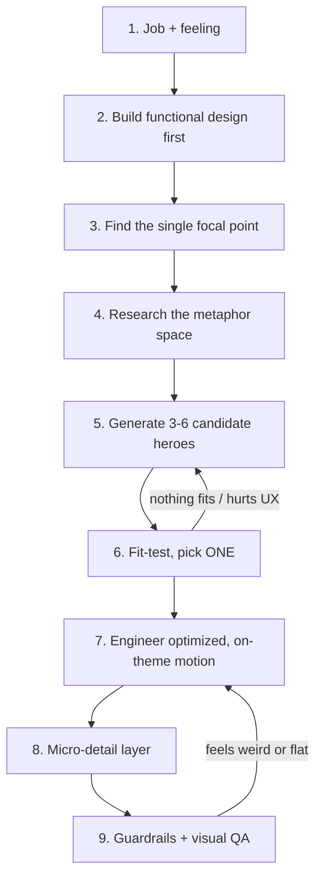

<aside>
🧩

This page is the entry file (`SKILL.md`) for the **signature-design** skill, written in the standard agent-skills format (YAML frontmatter + concise body + bundled reference files). Copy the frontmatter block into `signature-design/SKILL.md`, keep the body under it, and place the three reference files in `signature-design/references/`. The deep material and all code live in those references (loaded only when needed — progressive disclosure).

</aside>

```yaml
---
name: signature-design
description: Use when building or redesigning a page, app, dashboard, or product UI that should feel memorable and delightful instead of generic. A design-first method for finding ONE concept-true "signature" centerpiece (e.g. a living fire for a streak, a film-strip for a photo gallery), engineering its animation to be smooth, optimized, and on-theme, and integrating it without harming usability. Includes a research process, a fit rubric, a coded pattern library, motion-performance rules, and animation-tool selection. Trigger when the goal is a UI people smile at, when a design feels boring/template-y, or when asked for a unique hero element. Pair with artifact-design for the build.
metadata:
  role: design
  visibility: computer
---
```

## What this skill is for

Most UI work stops at *competent*: nice spacing, a gradient, smooth transitions. That looks like **a tool** — forgettable. This skill pushes to *memorable*: give the product **one signature element** — a concept-true centerpiece people screenshot and remember — while keeping it just as easy to use.

> Core belief: every product has one idea at its heart. Find the **visual metaphor** for that idea, make it the hero, and let everything else stay quiet.
> 

The hero is never random flair. It is derived from what the product *means*, engineered to run smoothly, and toned to *fit its surroundings*. Decoration that fights usability, feels weird, or ignores the existing design is a bug.

## Design first — order of operations

The signature element comes **after** a working design, not instead of one. Never start with the effect.

1. **Name the job + the feeling.** One sentence: what does this screen do, and what should the user feel at the key moment (pride, momentum, nostalgia, mastery, calm)?
2. **Build the functional design first.** Real structure, hierarchy, real content, clean spacing and type — follow `artifact-design`. It must already be good and usable *before* any flair.
3. **Find the focal point.** The single most important number/object/moment on the screen (the streak count, the photo, the balance). This is the *only* place the hero may attach.
4. **Choose the big thing that complements the design.** Pick the one concept-true metaphor that amplifies that focal point and fits the existing layout, color, and tone. It should look like it *grew from* the design, not landed on it.
5. **Engineer the motion** to be optimized and on-theme (see references).
6. **Add a thin micro-detail layer**, then run guardrails + QA.

## The pipeline



### Research the metaphor space (step 4) — don't design blind

Uniqueness comes from research, not imagination. Before choosing, gather:

- **The metaphor itself:** how does the real thing look/move/glow (fire, film reel, tide, candle)?
- **Proven references:** Awwwards, Godly, Mobbin, Dribbble, CodePen — note *how* they achieve delight (usually physical metaphor + responsive motion + a satisfying state change).
- **Concrete vocabulary:** shapes, materials, physics, color behavior, and the idle vs. active vs. milestone states.

### Generate + fit-test (steps 5–6)

Brainstorm 3–6 candidates (at least one safe, one bold, one weird). Score each 1–5 on the rubric; pick **exactly one** hero. More than one hero = no hero.

| Criterion | Question |
| --- | --- |
| **On-concept** | Does it express what the product actually *means*, not just a trendy effect? |
| **Complements the design** | Does it fit the existing layout, color, and tone — like it belongs? |
| **Usability-safe** | Does it preserve or improve clarity, speed, and accessibility? |
| **Data-alive** | Does it react meaningfully to real state/data, not sit as static garnish? |
| **Feasible + optimized** | Can it be built to run at 60fps on the target platform? |

Reject anything scoring low on **On-concept**, **Complements the design**, or **Usability-safe**, no matter how cool it looks.

## Reference files (load when you reach that step)

- **references/motion-engineering.md** — how to make motion smooth, optimized, and *not weird*: animate only `transform`/`opacity`, easing/duration tokens, `prefers-reduced-motion`, the `requestAnimationFrame` loop, canvas DPR setup, `will-change` hygiene, and the "not weird" fit test. Read at steps 7–9.
- **references/pattern-library.md** — concept → signature-element mappings with real, optimized code (streak→fire canvas, gallery→film-strip, goal→filling vessel, + a mapping table and empty/milestone states). Read at steps 4–6 for ideas and step 7 for implementation.
- **references/tool-selection.md** — pick the lightest tool that delivers the hero: CSS, WAAPI, Motion, GSAP, Lottie, Rive, Canvas, WebGL, SVG — with a decision matrix and heuristics. Read at step 7.

## UX guardrails (non-negotiable, step 9)

- **Clarity survives:** a first-timer still instantly understands the screen and how to act.
- **Function first:** primary actions and readability are untouched or improved; the hero never blocks input.
- **Optimized:** steady 60fps; only `transform`/`opacity` on the hot path; capped particle counts; lazy-loaded libraries.
- **On-theme / not weird:** motion is motivated, physically consistent, and matches the design language (see the fit test in motion-engineering).
- **Accessible:** WCAG-AA contrast, not color-only meaning, keyboard/screen-reader friendly, reduced-motion fallback, no seizure-risk flashing.
- **Restraint:** one hero + a thin detail layer. Calm at rest; big motion only on meaningful events.

## Anti-patterns (this is the "AI slop" to avoid)

- **Effect-first design:** picking a flashy animation, then bolting it onto an unrelated product. Metaphor must come from the concept.
- **Pasted-in demo look:** copying a pattern without recoloring/re-scaling it to the host design. The hero must share the design's tokens.
- **Unmotivated / weird motion:** movement that communicates nothing, mixes physics, or loops distractingly.
- **Layout-property animation:** animating width/height/top/margin → jank. Use transforms.
- **Multiple heroes:** competing centerpieces → visual noise, no memorability.
- **Skipping empty & milestone states:** design the zero state and the payoff, not just the happy path.
- **Decoration over usability:** anything that delays input, covers content, or hurts readability.

## Output expectations

When this skill is applied, deliver in order: (1) the concept essence + chosen metaphor; (2) a short research summary with references; (3) the candidate list + fit-rubric scores with the selected hero justified; (4) the integration plan (placement, hierarchy, states incl. empty/milestone, micro-detail layer); (5) the confirmed guardrail checklist; (6) the built artifact via `artifact-design` with visual QA notes.

---

### Bundled reference files

references/[tool-selection.md](https://app.notion.com/p/references-tool-selection-md-d0729c2d8aad46f78d9b54c8b2a023ec?pvs=21)

references/[pattern-library.md](https://app.notion.com/p/references-pattern-library-md-d470f2da9cb24fdaa078ee174aad6ff3?pvs=21)

references/[motion-engineering.md](https://app.notion.com/p/references-motion-engineering-md-5e3413f5e7464bb082f4deed405a50e7?pvs=21)